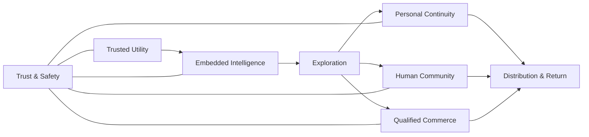
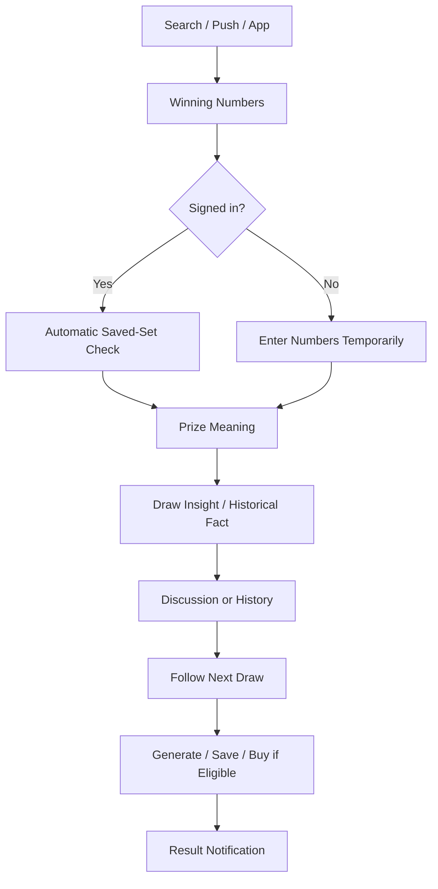
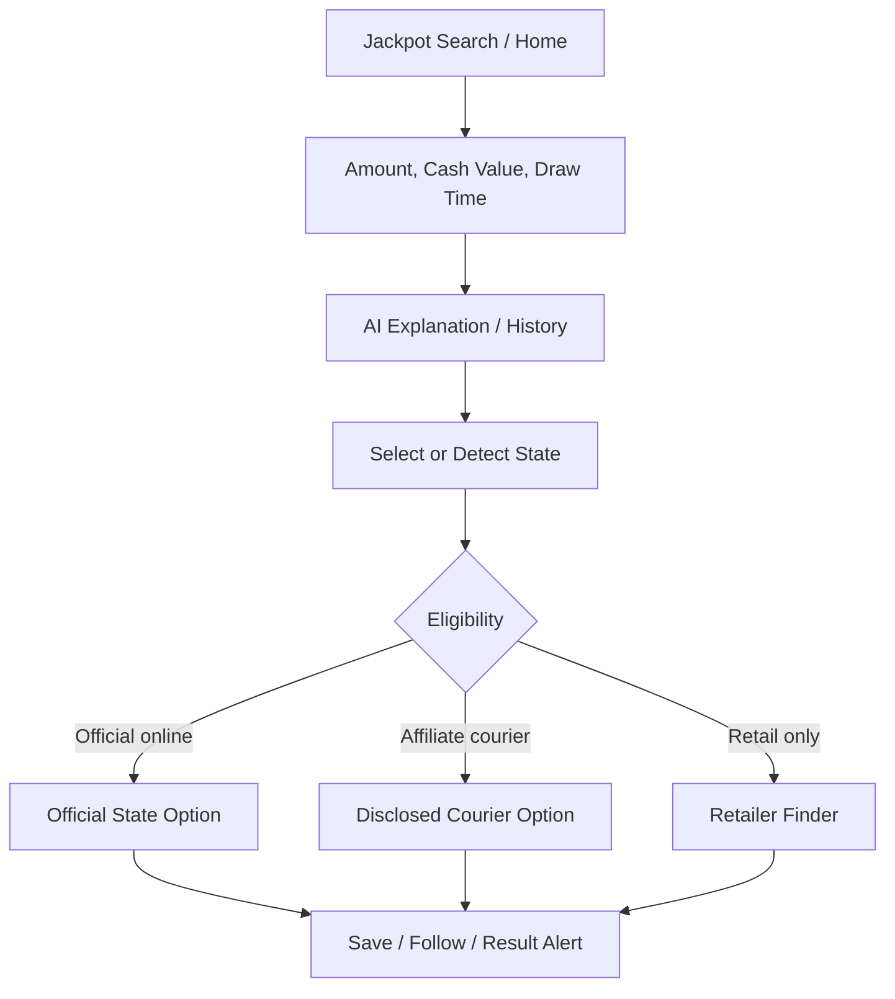
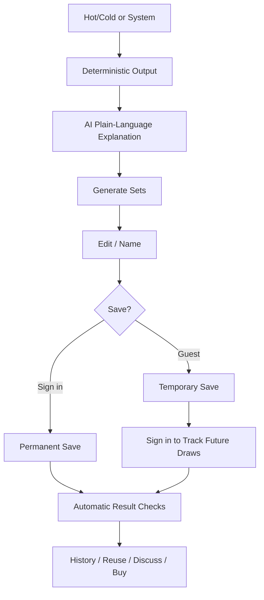
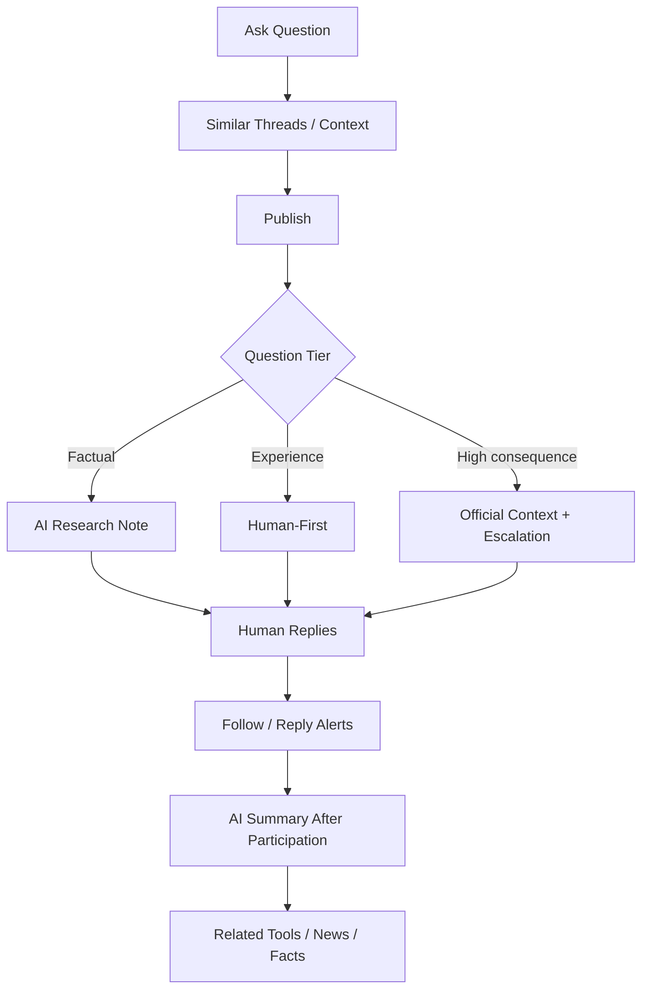
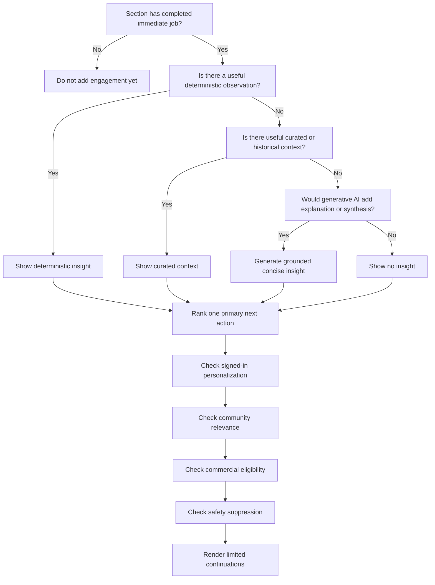

# LotteryCorner Experience Architecture

**Document:** `01-lotterycorner-experience-architecture.md`  
**Internal codename:** LuckReGenerator  
**Product:** LotteryCorner.com  
**Document type:** Product and experience architecture  
**Version:** 1.1  
**Status:** Final approved and frozen experience architecture  
**Approved date:** July 23, 2026  
**Primary authority:** `00A-v2.1-luckregenerator-product-constitution-FROZEN.md`  
**Research scope:** United States lottery ecosystem first; U.S. official state lotteries and high-traffic independent lottery products as primary benchmarks  
**Explicit exclusions:** Final UI design, final page copy, software architecture, API contracts, database schemas, code, URL migration decisions, final legal conclusions, and implementation estimates

---

## 0. Authority and Purpose

This document translates the frozen LuckReGenerator Product Constitution into a complete **LotteryCorner experience system**.

It defines:

- the full page-family universe;
- the experience zones that make LotteryCorner one connected ecosystem;
- the reusable section library;
- the intelligence contract for every section;
- how AI appears throughout the product;
- how pages connect to one another;
- how anonymous, signed-in and Insider experiences differ;
- how community, editorial content, tools and commerce connect;
- how advertising and affiliate opportunities are governed by user intent;
- how mobile, app, email, notifications and Google distribution return users;
- what every future visual blueprint must contain before implementation;
- the mandatory behind-the-screen SEO, social metadata, schema, crawler and AI-discovery contract for every page family;
- and the mandatory content-operations contract governing how every dynamic section is sourced, refreshed, reviewed, expired and corrected.

This document does **not** decide the final visual layout of any page. It defines the architecture from which page blueprints and desktop/mobile visual templates will be produced.

### 0.1 Product authority hierarchy

1. Explicit founder decision.
2. Frozen Product Constitution v2.1.
3. This Experience Architecture.
4. Approved page-family and section blueprints.
5. Approved product and architecture decision records.
6. Supporting research.
7. Implementation plan.
8. Existing implementation.

### 0.2 Core experience promise

> **Answer first. Add intelligence. Create meaningful momentum. Preserve human trust. Earn the return.**

### 0.3 Product model

LotteryCorner is not a collection of unrelated pages.

It is a **nonlinear intelligent experience graph** in which a user can enter through any relevant page and move naturally among:

- trusted utility;
- AI-assisted understanding;
- exploration;
- tools;
- human discussion;
- saved personal activity;
- notifications;
- news and stories;
- and state-aware ticket-purchase options.

---

# PART I — RESEARCH BASIS

## 1. Benchmark Scope

### 1.1 Primary U.S. benchmark set

This architecture uses the following product categories as the main evidence base:

1. **Official U.S. state lottery websites and applications**
   - Florida Lottery
   - Illinois Lottery
   - Michigan Lottery
   - other official state experiences where needed for state-specific validation

2. **High-traffic U.S. independent lottery destinations**
   - LotteryPost
   - LotteryUSA
   - Lottery.net
   - Lottery.com / Lotto.com where relevant and directly observable

3. **National multi-state game destinations**
   - Powerball and related Multi-State Lottery Association experiences

4. **U.S. regulatory, consumer and publisher standards**
   - National Council on Problem Gambling
   - Federal Trade Commission
   - Coalition for Better Ads
   - Google Search and Google News publisher guidance

### 1.2 Secondary benchmark set

Global lottery aggregators may be consulted only for general interaction patterns such as:

- cross-game discovery;
- result presentation;
- global jackpot comparison;
- notification organization;
- and generic data exploration.

They must not determine:

- U.S. state terminology;
- purchase eligibility;
- claim rules;
- age requirements;
- tax treatment;
- responsible-play pathways;
- or U.S. user language.

### 1.3 Explicitly excluded benchmark behavior

This document does not use unrelated Indian lottery-result publishers, financial-news lottery pages or regional foreign result portals as product benchmarks for LotteryCorner.

They may rank for their own local markets, but they do not represent the U.S. lottery player, U.S. game system, U.S. purchase environment or LotteryCorner’s target ecosystem.

## 2. Current Evidence Observations

### 2.1 LotteryPost demonstrates the ecosystem effect

LotteryPost’s current site map combines:

- results;
- active and daily forum topics;
- specialist forums;
- prediction boards;
- member profiles;
- favorites;
- systems;
- charts;
- wheels;
- quick picks;
- odds tools;
- news;
- blogs;
- historical features;
- and paid membership capabilities. [R1] [R2] [R3] [R4]

**Architecture implication:** LotteryCorner must not treat information, tools, community, identity and archives as separate products. Their interaction creates long-term engagement.

### 2.2 LotteryUSA demonstrates state-hub breadth

LotteryUSA state pages combine current results with state-specific:

- games;
- claims;
- tax information;
- anonymity questions;
- purchase limitations;
- contact details;
- and news. [R5]

**Architecture implication:** A state page is a local ecosystem hub, not a short directory.

### 2.3 Official state apps establish mobile expectations

Official applications currently train U.S. lottery users to expect capabilities such as:

- latest results and jackpots;
- favorite-game alerts;
- ticket scanning;
- promotional entry;
- online purchase in eligible states;
- player dashboards;
- account activity;
- and game favorites. Illinois and Michigan provide strong examples. [R8] [R9] [R10]

**Architecture implication:** A LotteryCorner app cannot justify installation merely by wrapping the website. It must add saved continuity, notifications, scanning assistance, deep links and personalized return.

### 2.4 National game sites show task-focused result experiences

Multi-state game pages combine:

- latest winning numbers;
- next drawing;
- jackpot and cash value;
- winners;
- prize and odds links;
- and number-checking actions. [R11]

**Architecture implication:** The urgent result, next event and prize meaning form one task cluster.

### 2.5 Preferred Sources creates a new distribution opportunity

Google’s Preferred Sources feature allows users to choose websites they want to see more prominently in Top Stories. Google has expanded preferred-source visibility into AI Overviews and AI Mode. Google also provides publisher guidance for encouraging users to select a site. [R12] [R13]

**Architecture implication:** “Prefer LotteryCorner on Google” becomes a valid audience-investment action on news, editorial, email and logged-in surfaces, but not an intrusive universal pop-up.

### 2.6 Affiliate disclosure must be contextual

FTC guidance says affiliate relationships should be disclosed clearly and conspicuously, close to the recommendation. It also notes that “affiliate link” or a Buy Now button alone may not adequately communicate that the publisher receives compensation. [R14]

**Architecture implication:** Purchase modules require plain-language compensation disclosure near the CTA, not only a global footer statement.

### 2.7 Ad experience affects user trust and retention

The Coalition for Better Ads identifies disruptive formats such as pop-ups, countdown prestitials, autoplay sound, high mobile ad density and large sticky formats as poor consumer experiences. [R15] [R16]

**Architecture implication:** Advertising inventory must be designed by page sensitivity and task completion, not added uniformly.

### 2.8 Responsible-play controls are part of product architecture

NCPG’s Internet Responsible Gambling Standards address informed decision-making, assistance, self-exclusion, advertising, promotion and game/site features. The standards emphasize plain language and player control. [R17] [R18]

**Architecture implication:** Responsible-play access, marketing suppression and help pathways must exist at the experience-system level, not only in a footer policy.

---

# PART II — EXPERIENCE SYSTEM MODEL

## 3. The Eight Experience Zones

LotteryCorner consists of eight connected experience zones.



### Z1 — Trusted Utility

Completes the immediate job:

- winning numbers;
- jackpot;
- next draw;
- prize meaning;
- history;
- rules;
- claims;
- calculators;
- purchase eligibility;
- retailer/claim-center lookup.

### Z2 — Embedded Intelligence

Adds context inside the current task:

- what this means;
- interesting fact;
- historical match;
- unusual draw property;
- AI quick take;
- saved-number match;
- changed-since-last-visit summary;
- community sentiment;
- state-specific explanation.

### Z3 — Exploration

Provides relevant continuation:

- related draw;
- hot/cold;
- statistics;
- jackpot history;
- news;
- blog;
- tools;
- similar question;
- related game;
- historical event.

### Z4 — Human Community

Creates human participation and identity:

- questions;
- replies;
- draw reactions;
- systems discussions;
- local knowledge;
- member profiles;
- reputation;
- follows;
- durable archives.

### Z5 — Personal Continuity

Turns a temporary visit into a relationship:

- saved games;
- saved states;
- saved numbers;
- saved systems;
- followed threads;
- match history;
- AI memory;
- alert preferences;
- personal timeline.

### Z6 — Qualified Commerce

Serves genuine transaction intent:

- official state online purchase;
- official state app;
- official subscription;
- independent courier or affiliate;
- retailer finder;
- purchase cutoff;
- generated-number handoff;
- post-purchase return.

### Z7 — Distribution and Return

Brings the user back to an exact context:

- push;
- email;
- app inbox;
- direct traffic;
- widgets;
- search;
- AI search;
- social sharing;
- Google Preferred Sources;
- followed-topic updates.

### Z8 — Trust, Safety and Governance

Protects every zone:

- independent-publisher identity;
- source and verification context;
- corrections;
- AI disclosure;
- affiliate disclosure;
- ad labeling;
- responsible-play controls;
- privacy;
- community moderation;
- high-consequence escalation.

## 4. Experience Graph Principles

### EG-01 — Any page may be an entry point

Every deep page must provide enough orientation to answer:

- what this is;
- which state/game/draw/topic it concerns;
- whether the information is current or historical;
- what the user can do;
- and what useful actions follow.

### EG-02 — Immediate task before momentum

The experience graph activates only after the first job is complete.

Examples:

- winning numbers before AI insight;
- calculator result before save prompt;
- article before related content;
- forum question before research note;
- purchase eligibility before commercial CTA.

### EG-03 — One primary continuation

Each completed task should normally expose:

- one primary next action;
- up to three secondary options;
- and a clear exit.

### EG-04 — Context beats popularity

A relevant small discussion is better than an unrelated trending thread.

A state-specific purchase option is better than a national generic affiliate link.

A historical draw connected to the current numbers is better than an arbitrary old article.

### EG-05 — Signed-in state enriches; it does not replace

Core public content remains visible.

Signed-in users gain:

- relevance;
- memory;
- saved results;
- personal comparisons;
- fewer repeated prompts;
- and better return paths.

### EG-06 — AI is contextual

AI prompts and outputs are derived from the current page, section and user job.

The product must not depend on one floating generic chatbot.

### EG-07 — Human discussion remains open

AI can answer and organize facts, but it must not make every thread feel completed before members participate.

### EG-08 — Commercial continuation requires eligibility

No purchase CTA is displayed as universally available without state/game/provider validation.

---

# PART III — USER AND CONTEXT ARCHITECTURE

## 5. User States

### US-01 — Anonymous Visitor

Capabilities:

- access complete core public facts;
- use public tools;
- enter temporary numbers;
- read community;
- ask one complete contextual AI question;
- view qualified purchase options;
- receive a temporary guest state where technically practical.

Primary conversion principle:

> Ask for registration only when the user has created or requested something worth preserving.

### US-02 — Guest Progress State

Temporary device/session continuity may preserve:

- entered number sets;
- generated sets;
- selected state/game;
- unfinished tool configuration;
- one AI context;
- notification interest before confirmation.

This state must be:

- privacy-conscious;
- temporary;
- clearly explained;
- and easy to clear.

### US-03 — Registered User

Adds:

- save/follow;
- number and system history;
- match checking;
- replies and posting;
- notification preferences;
- AI conversation continuity;
- cross-device use;
- personal dashboard.

### US-04 — Insider

Insider is the richer personal continuity experience.

It may remain free and ad-supported.

Adds:

- deeper system tracking;
- personal timeline;
- advanced saved-play management;
- richer AI memory;
- personalized digest;
- performance history;
- advanced tools;
- account-wide recommendations.

### US-05 — Contributor

Adds community identity and creation:

- questions;
- answers;
- comments;
- systems;
- predictions or picks where permitted;
- blog/contributor activity where approved;
- reputation.

### US-06 — Trusted Contributor / Specialist

Earned through:

- helpfulness;
- source quality;
- long-term participation;
- accepted corrections;
- specialist knowledge;
- respectful newcomer support.

The role does not automatically confer authority over unrelated topics.

### US-07 — Moderator / Editorial / Operator

Separate controlled responsibilities for:

- community moderation;
- editorial review;
- source verification;
- correction handling;
- AI review;
- affiliate availability;
- support.

### US-08 — High-Protection Context

This is a context state, not a permanent user label.

Triggered by:

- winner/claim workflow;
- spending concern;
- responsible-play request;
- fraud report;
- legal/tax dispute;
- ticket privacy;
- minor/youth concern.

Effects:

- suppress purchase CTAs;
- suppress promotional ads where appropriate;
- limit AI scope;
- prioritize official/human help;
- increase privacy.

## 6. Session Intent Modes

The same person may move among modes during one visit.

| Mode | Primary question | Immediate architecture priority |
|---|---|---|
| Check | Did I win / what happened? | Result speed and certainty |
| Prepare | What should I know before the draw? | Jackpot, cutoff, how-to, saved numbers |
| Explore | What is interesting here? | Insights, history, statistics, news |
| Discuss | What do people think? | Threads, identity, replies, follow |
| Learn | How does this work? | Plain steps, examples, AI explanation |
| Organize | How do I save or track this? | Account investment, saved play |
| Transact | Can I buy this online? | Eligibility and disclosure |
| Claim | What do I do after a win? | Calm high-consequence guidance |
| Control | How do I pause or get help? | Safety and marketing suppression |

## 7. Context Envelope

Every intelligent section and next-action decision must receive a structured context envelope.

### 7.1 Page context

- page family;
- page purpose;
- canonical subject;
- current/historical state;
- content lifecycle state;
- section ID.

### 7.2 Lottery context

- jurisdiction/state;
- official lottery organization;
- game brand;
- state-specific offering;
- draw;
- draw variant;
- draw date/time/timezone;
- result status;
- jackpot;
- rule version.

### 7.3 User context

Only where available and consented:

- anonymous/registered/Insider state;
- favorite states/games;
- saved numbers/systems;
- followed threads;
- notification preferences;
- recent relevant actions;
- app/web surface;
- accessibility and language preferences.

### 7.4 Event context

- before/after draw;
- result pending/verified/corrected;
- jackpot rollover;
- rule change;
- article publication;
- reply;
- saved-number match;
- source degradation;
- purchase cutoff.

### 7.5 Commercial context

- state eligibility;
- game eligibility;
- provider availability;
- affiliate relationship;
- official option;
- cutoff;
- age/geolocation;
- disclosure requirement;
- safety suppression.

### 7.6 Safety context

- high-consequence page;
- distress/help intent;
- minor-risk context;
- uncertain result;
- legal/tax/claim limits;
- community abuse risk.

---

# PART IV — GLOBAL EXPERIENCE SHELL

## 8. Global Navigation Architecture

Navigation should expose user intentions, not internal system names.

### 8.1 Primary navigation families

Recommended conceptual destinations:

- Results
- States
- Games
- Jackpots
- Tools
- News
- Community
- Ask LotteryCorner
- Insider / My LotteryCorner

Final labels are decided in visual and language testing.

### 8.2 Context navigation

On state/game/result pages, provide compact context-aware navigation such as:

- Latest
- Results
- History
- How to Play
- Statistics
- News
- Discussion
- Buy / Where to Play

The set varies by page family and availability.

### 8.3 Account navigation

Signed-in navigation prioritizes:

- My Games
- My Numbers
- Matches
- Following
- Notifications
- Ask LotteryCorner
- Settings

### 8.4 Mobile navigation

Mobile must prioritize no more than four or five frequent destinations plus a clear “More” path.

Likely high-frequency concepts:

- Home
- Results
- My Numbers
- Community
- Ask AI

This remains a hypothesis for visual/user testing.

## 9. Global Search and Ask Architecture

LotteryCorner should support three complementary modes.

### 9.1 Direct navigation search

Find:

- state;
- game;
- draw;
- article;
- thread;
- tool;
- member.

### 9.2 Answer search

Plain-language questions routed to:

- direct canonical answer;
- page-aware AI;
- official/verified sources;
- related pages.

### 9.3 Community search

Find:

- current and historical discussions;
- posts by member;
- state/game topics;
- systems;
- answered/unanswered questions.

Search results should clearly classify:

- LotteryCorner fact;
- guide;
- news;
- community;
- tool;
- AI answer.

## 10. Global Trust Layer

A consistent trust layer supports:

- LotteryCorner independent-publisher identity;
- source/last-checked context where useful;
- correction link;
- AI identity;
- affiliate compensation disclosure;
- advertisement labeling;
- responsible-play access;
- privacy controls.

The layer must be proportionate. It should not turn every page into a disclaimer wall.

## 11. Global AI Entry Pattern

A contextual AI entry may appear as:

- a compact question box;
- a suggested question;
- an “Explain this” action;
- a “Research this question” action;
- an “Ask about this draw/state/game” action;
- or an AI Quick Take.

Required behavior:

1. Context is preloaded.
2. The first answer is complete and useful.
3. Sources or governed data are identified.
4. Relevant pages/tools are linked.
5. Sign-in is requested only for continuity, memory, saving or longer use.

## 12. Global Distribution Actions

Depending on surface, users may be invited to:

- follow a game;
- follow a state;
- follow a thread;
- install the app;
- enable push;
- choose email digest;
- save to home screen;
- add LotteryCorner as a Google Preferred Source;
- share a result, fact, tool or discussion.

These actions are investments and must appear only after value.

---

# PART V — REUSABLE SECTION LIBRARY

## 13. Section Architecture Rules

Every section has a stable section type and a page-specific configuration.

A section blueprint must define:

- section ID and name;
- user job;
- canonical data/source;
- lifecycle states;
- content priority;
- intelligence type;
- interesting-fact eligibility;
- next actions;
- community relationship;
- anonymous/signed-in behavior;
- monetization tier;
- mobile behavior;
- accessibility;
- measurement;
- correction behavior.

## 13.1 Mandatory Section Intelligence Matrix

Every page-family blueprint must include a completed Section Intelligence Matrix with one row for every visible or conditionally visible section.

| Section ID | Section | Immediate job | Data/source owner | Update method | Deterministic insight | AI insight | Interesting fact | Primary next action | Signed-in change | Affiliate | Ad tier | Expiry/stale rule |
|---|---|---|---|---|---|---|---|---|---|---|---|---|

Rules:

1. No section may be omitted from the matrix.
2. “Not applicable” is an acceptable decision only when the reason is recorded.
3. Deterministic intelligence must be preferred for calculations, matching, eligibility, frequency and historical comparisons.
4. Generative AI must identify its source/data basis, lifecycle and correction behavior.
5. Interesting facts must be truthful, relevant and connected to evidence or a deeper destination.
6. A section does not require AI merely because AI is the product differentiator; empty or repetitive AI commentary must be rejected.
7. Each section must define anonymous and signed-in behavior, even when there is no difference.
8. Affiliate and advertising decisions must be explicit, including suppression.
9. Expiry and stale behavior are mandatory for dynamic content.
10. The matrix becomes a review checklist for product, design, editorial, SEO, AI, monetization and engineering.

## 13.2 Content Operations Contract

Every dynamic section must define how it is operated after launch.

Required fields:

- canonical source or data owner;
- content class: official/source-derived, calculated, editorial, community, AI-generated, personal or commercial;
- update method: live retrieval, scheduled batch, event-driven update, editorial publication, manual review or agent-assisted review;
- expected update frequency;
- freshness target;
- stale threshold;
- expiry or removal rule;
- verification/review owner;
- source-change monitoring;
- degraded-state behavior;
- correction propagation;
- historical retention;
- downstream consumers such as AI, schema, email, push, tools or community banners.

Dynamic content includes, at minimum:

- results and jackpots;
- schedules and cutoffs;
- claims, taxes and anonymity;
- purchase availability;
- scratcher snapshots;
- unclaimed prizes;
- retailer/claim-center data;
- news and blog updates;
- AI insights;
- community summaries;
- affiliate offers;
- and notification eligibility.

A section cannot be approved for implementation if there is no sustainable owner or update mechanism.

## 14. Core Utility Sections

### SL-U01 — Page Identity Header

Used on:

- state;
- game;
- result;
- article;
- forum;
- tool;
- personal pages.

Contains:

- clear subject;
- state/game/date where relevant;
- lifecycle status;
- primary action;
- follow/save state;
- optional contextual AI prompt.

### SL-U02 — Latest Result Card

Contains:

- game;
- variant;
- draw date/time;
- winning values;
- status;
- link to stable draw;
- optional saved-number match.

Must appear before ads and long-form intelligence on urgent result pages.

### SL-U03 — Multi-Game Results Grid

Used on Home and State pages.

Supports:

- priority ordering;
- game/variant clarity;
- direct stable/current links;
- compact status;
- signed-in favorite prioritization.

### SL-U04 — Jackpot Card

Contains:

- game;
- advertised jackpot;
- cash option where available;
- next draw;
- rollover/won/reset state;
- follow;
- purchase eligibility action.

### SL-U05 — Next Draw and Schedule

Contains:

- date;
- time;
- timezone;
- draw variant;
- cutoff when verified;
- delayed/cancelled state;
- reminder option.

### SL-U06 — Prize and Match Explanation

Contains:

- prize tiers;
- match logic;
- add-on effects;
- state-specific caveats;
- plain-language explanation.

### SL-U07 — History Collection

Contains:

- stable draw list;
- date filters;
- bounded pagination;
- data coverage note;
- direct member links.

### SL-U08 — Stable Draw Record

Contains:

- draw identity;
- result;
- applicable rule version;
- correction state;
- previous/next;
- related insight/community/news.

### SL-U09 — Claim Summary

Contains:

- claim method;
- threshold;
- deadline;
- required destination;
- last verified;
- official source;
- high-consequence suppression rules.

### SL-U10 — Tax / Anonymity Summary

Contains:

- state/federal scope;
- assumptions;
- effective date;
- limitation;
- calculator/guide path;
- no purchase CTA.

### SL-U11 — Purchase Eligibility Result

Contains:

- selected/physical state;
- game;
- legal option type;
- provider classification;
- cutoff;
- age/geolocation;
- fees/material terms;
- compensation disclosure;
- fallback retailer action.

### SL-U12 — Retailer / Claim Center Locator

Contains:

- search input;
- result confidence;
- capability;
- status;
- official-source link;
- directions handoff.

### SL-U13 — Scratcher Snapshot

Contains:

- game/ticket identity;
- price;
- status;
- top prizes remaining;
- snapshot time;
- odds;
- uncertainty;
- follow/discuss.

### SL-U14 — Unclaimed Prize Card

Contains:

- game/draw;
- amount;
- location where available;
- deadline;
- claim state;
- source;
- follow/reminder.

### SL-U15 — Calculator Output

Used for tax, odds, prize and other deterministic tools.

Contains:

- result first;
- assumptions;
- inputs;
- explanation;
- save/share;
- guide/AI continuation.

## 15. Intelligence Sections

### SL-I01 — LotteryCorner AI Trial

Purpose:

- demonstrate specialized lottery AI immediately;
- preload page context;
- allow one complete answer;
- show relevant follow-up paths.

Must not be a generic empty chat box when a contextual prompt is possible.

### SL-I02 — AI Quick Take

A short grounded explanation of:

- a result;
- article;
- rule change;
- jackpot;
- tool output;
- or community discussion.

Maximum initial display should remain brief, with expansion available.

### SL-I03 — What This Means

Plain-language significance.

Examples:

- effect of a game change;
- prize interpretation;
- why a jackpot reset;
- how a new ticket price affects play.

Can be deterministic, editorial or AI-assisted.

### SL-I04 — Interesting Fact

A truthful low-friction curiosity block.

Examples:

- historical coincidence;
- state milestone;
- prior jackpot context;
- uncommon draw property;
- related winner story.

It must link to evidence or a relevant deeper destination.

### SL-I05 — Historical Match

Deterministically finds:

- exact or partial repeated combinations;
- previous similar distribution;
- prior same jackpot range;
- related historical event.

Must explicitly avoid predictive framing.

### SL-I06 — Draw Pattern Insight

Deterministic observations such as:

- odd/even;
- high/low;
- sum;
- consecutive numbers;
- repeats from prior draw;
- frequency-window classification.

Generative AI may explain, not calculate.

### SL-I07 — What Changed

Used for:

- signed-in home;
- state/game pages;
- rules;
- news;
- app inbox.

Shows changes since:

- last visit;
- last verified version;
- last draw;
- selected period.

### SL-I08 — Community Pulse

Summarizes:

- active related threads;
- questions;
- sentiment with caution;
- disagreement;
- unanswered topics.

Must not fabricate consensus.

### SL-I09 — Thread Summary

Appears only after meaningful participation.

Contains:

- main viewpoints;
- factual resolution;
- unresolved disagreement;
- updated facts;
- key contributors/links.

### SL-I10 — AI Research Note

A clearly labeled factual contribution inside a thread.

Contains:

- concise answer;
- sources checked;
- uncertainty;
- related official/current facts;
- invitation for human experience.

### SL-I11 — Related Question

Surfaces a real or generated question closely tied to the current task.

Generated questions must not create fake social proof.

### SL-I12 — Personalized Insight

For signed-in users:

- saved-number match;
- followed-game change;
- system performance;
- relevant thread reply;
- personal next action.

Must rely on consented data.

### SL-I13 — Eligibility Explanation

Explains why:

- online purchase is or is not available;
- a provider differs from official lottery service;
- location/cutoff affects the action.

### SL-I14 — AI Confidence / Source Detail

Expandable trust element showing:

- source/dataset;
- time;
- calculation class;
- uncertainty;
- correction/report action.

## 16. Exploration and Momentum Sections

### SL-M01 — Primary Next Action

One most relevant continuation.

Examples:

- check saved numbers;
- see the stable draw;
- generate numbers;
- read the discussion;
- view legal purchase options.

### SL-M02 — Explore More Rail

Up to three secondary paths from controlled classes:

- understand;
- explore;
- participate;
- save/follow;
- transact.

### SL-M03 — Related History

Curated or deterministic historical destinations.

### SL-M04 — Related News

Relevant by state/game/draw/topic and freshness.

### SL-M05 — Related Guides

Claims, rules, purchase, tax, anonymity, how-to.

### SL-M06 — Related Tools

Statistics, generator, checker, calculator, wheel.

### SL-M07 — Related Community

Thread or hub relevant to the current object.

### SL-M08 — Next Draw Continuation

Next event, reminder, follow and eligible purchase.

### SL-M09 — Return Trigger Offer

After value:

- notify me;
- follow;
- email me;
- app install;
- Google Preferred Source.

### SL-M10 — Shareable Object

Creates a safe share card/link for:

- result;
- fact;
- tool output;
- article;
- thread;
- saved pool summary.

## 17. Personal Investment Sections

### SL-P01 — Save Number Set

Supports:

- guest temporary save;
- name;
- game;
- method;
- notes;
- sign-in handoff.

### SL-P02 — Generate Numbers

Supports:

- quick pick;
- fixed numbers;
- constraints;
- hot/cold mix;
- wheels/systems;
- AI natural-language configuration.

### SL-P03 — Follow Game / State

Defines:

- which events;
- channel preference;
- threshold;
- frequency.

### SL-P04 — Follow Thread / Member

Creates reply/update return loop.

### SL-P05 — Match History

Shows exact outcomes without near-miss manipulation.

### SL-P06 — Personal Timeline

Combines:

- saved sets;
- matches;
- follows;
- AI conversations;
- posts;
- meaningful updates.

### SL-P07 — Registration Value Prompt

Explains exactly what will be preserved.

Examples:

- “Save these five sets and we’ll check them after every Powerball draw.”
- “Sign in to get the answer and future replies.”

### SL-P08 — App Install Prompt

Appears after an app-relevant value moment:

- saved numbers;
- notification request;
- ticket scanning interest;
- followed game.

### SL-P09 — Notification Preference Control

Allows:

- channel;
- event;
- threshold;
- quiet hours;
- pause;
- unsubscribe.

### SL-P10 — Google Preferred Source Prompt

Used primarily in:

- news pages;
- newsletter;
- editorial home;
- Insider dashboard.

Message:

- explain value;
- do not imply ranking guarantee;
- provide clear action.

## 18. Community Sections

### SL-C01 — Community Hub Header

Shows:

- scope;
- active members/topics;
- ask/post action;
- rules;
- follow.

### SL-C02 — Active Discussions

Prioritized by:

- relevance;
- recency;
- human participation;
- quality;
- user follows;
- not raw reply volume alone.

### SL-C03 — Unanswered Questions

Supports community contribution and selective AI research.

### SL-C04 — Ask a Question

Pre-post assistance may suggest:

- state/game/topic;
- similar threads;
- clarity improvements;
- factual source.

It must not rewrite the user’s voice without consent.

### SL-C05 — Human Replies

Human content remains the primary community layer.

### SL-C06 — Contributor Identity

Shows:

- profile;
- expertise context;
- helpful history;
- no false official authority.

### SL-C07 — Reputation Signal

Rewards helpfulness, not spend or paid status.

### SL-C08 — Draw Reaction

A recurring object tied to one draw/event.

### SL-C09 — Community Correction Banner

When a thread contains superseded facts, show current verified context without deleting history.

### SL-C10 — Moderation / Report

Visible, understandable and mobile-accessible.

## 19. Editorial Sections

### SL-E01 — Article Header

Contains:

- headline;
- purpose;
- author;
- published/updated;
- related state/game/draw;
- correction state.

### SL-E02 — Article Summary

Human or AI-assisted summary with editorial accountability.

### SL-E03 — Why It Matters

Connects article to the player’s likely job.

### SL-E04 — Current Fact Card

Shows current governed fact so an older article does not become the owner of current truth.

### SL-E05 — Timeline

Useful for rules, jackpots, lawsuits, game changes and winner stories.

### SL-E06 — Historical Context

Links prior events and data.

### SL-E07 — Community Reaction

Links discussion or summarizes after real participation.

### SL-E08 — Article Discussion

Creates durable conversation.

### SL-E09 — Update / Correction Note

Visible when meaning materially changes.

### SL-E10 — Author / Contributor

Shows accountability and related work where justified.

## 20. Commerce Sections

### SL-X01 — Official Purchase Option

Used when an official state service exists.

### SL-X02 — Affiliate Courier Option

Must show:

- independent provider;
- LotteryCorner compensation;
- eligibility;
- key terms;
- last verification.

### SL-X03 — Retail Purchase Option

Retailer finder and cutoff.

### SL-X04 — Purchase Comparison

Compares official, courier, subscription and retail without hiding commercial relationships.

### SL-X05 — Generated Number Handoff

Preserves selected numbers and explains partner limitations.

### SL-X06 — Post-Click Return Setup

Before leaving, offer:

- save numbers;
- follow game;
- result alert.

### SL-X07 — Contextual Affiliate Disclosure

Plain language near the recommendation:

> “LotteryCorner may earn a commission if you use this link.”

Do not rely only on “affiliate link.”

## 21. Advertising Sections

### SL-A01 — Utility Ad Slot

Displayed only after urgent primary content.

### SL-A02 — In-Content Editorial Ad

Used in long articles with layout stability and clear separation.

### SL-A03 — Community Feed Ad

Clearly labeled; frequency-controlled; not styled as member content.

### SL-A04 — Tool Completion Ad

After output, not between input and result.

### SL-A05 — Insider Ad

May be personalized by page context, not vulnerability.

### SL-A06 — Sticky Ad

Allowed only when it does not obscure navigation, core numbers, input controls or responsible-play access, and remains within current Better Ads expectations.

### SL-A07 — Prohibited Ad Experience

No:

- countdown prestitial;
- deceptive close;
- autoplay sound;
- result-like creative;
- high-density clutter;
- full-screen interruption of urgent tasks.

## 22. Trust and Safety Sections

### SL-T01 — Source / Verification

Compact metadata:

- source checked;
- result verified;
- last updated;
- report issue.

### SL-T02 — Independent Publisher

Contextual, not repeated as a banner on every card.

### SL-T03 — AI Disclosure

Explains system role where material.

### SL-T04 — Correction Notice

Shows corrected state and material impact.

### SL-T05 — Responsible Play

Contextual help and permanent global access.

### SL-T06 — High-Protection Mode

Suppresses commercial and engagement content.

### SL-T07 — Privacy / Memory Control

Used near saved data and personal AI.

### SL-T08 — Community Safety

Rules, report, block and appeal.

---

# PART VI — PAGE-FAMILY ARCHITECTURE

## 23. Page-Family Registry and Delivery Classification

The complete page-family universe remains part of the product vision, but it is not one launch scope.

### Delivery classifications

- **Core rebuild:** required to restore and improve LotteryCorner’s fundamental public information experience.
- **Early engagement release:** required soon after, or alongside selected core pages, to prove AI, saved continuity, community and return loops.
- **Second phase:** valuable after the core loop is stable.
- **Conditional:** built only when data quality, regulation, commercial availability, user demand or operating capacity is proven.
- **Future:** strategically valid but not required for the initial transformation.

| ID | Page family | Delivery class |
|---|---|---|
| PF-01 | Public Home | Core rebuild |
| PF-02 | State Hub | Core rebuild |
| PF-03 | Game Hub | Core rebuild |
| PF-04 | Current Result | Core rebuild |
| PF-05 | Stable Draw Record | Core rebuild |
| PF-06 | Results / History Collection | Core rebuild |
| PF-07 | Jackpot and Jackpot History | Core rebuild |
| PF-08 | Schedule | Core rebuild |
| PF-09 | How to Play | Core rebuild |
| PF-10 | Prize and Odds | Core rebuild |
| PF-11 | Claim Guide | Core rebuild |
| PF-12 | Tax Guide / Tax Calculator | Early engagement release |
| PF-13 | Anonymity Guide | Early engagement release |
| PF-14 | Purchase Guide / Eligibility | Core rebuild |
| PF-15 | Retailer and Claim-Center Locator | Conditional |
| PF-16 | Scratcher Collection | Second phase |
| PF-17 | Scratcher Detail | Second phase |
| PF-18 | Unclaimed Prize Collection | Conditional |
| PF-19 | Unclaimed Prize Detail | Conditional |
| PF-20 | Statistics Overview | Core rebuild |
| PF-21 | Hot / Cold / Frequency Tool | Early engagement release |
| PF-22 | Systems and Wheels | Early engagement release |
| PF-23 | Number Generator | Early engagement release |
| PF-24 | Ticket Checker | Early engagement release |
| PF-25 | Dataset / Methodology | Second phase |
| PF-26 | News Home | Core rebuild |
| PF-27 | News Category / Archive | Core rebuild |
| PF-28 | News Article | Core rebuild |
| PF-29 | Blog Home | Core rebuild |
| PF-30 | Blog Category / Archive | Core rebuild |
| PF-31 | Blog Article | Core rebuild |
| PF-32 | Forum / Community Home | Early engagement release |
| PF-33 | State / Game / Topic Community Hub | Early engagement release |
| PF-34 | Question / Thread | Early engagement release |
| PF-35 | Draw Discussion | Early engagement release |
| PF-36 | News Discussion | Early engagement release |
| PF-37 | User Profile | Early engagement release |
| PF-38 | Member Activity / Reputation | Second phase |
| PF-39 | Community Search | Second phase |
| PF-40 | Public AI Entry | Early engagement release |
| PF-41 | Page-Aware AI | Early engagement release |
| PF-42 | Signed-In Personal AI | Second phase |
| PF-43 | Sign Up / Sign In | Core rebuild |
| PF-44 | Insider Dashboard | Early engagement release |
| PF-45 | Saved Games / States | Early engagement release |
| PF-46 | Saved Numbers | Early engagement release |
| PF-47 | Saved Systems | Second phase |
| PF-48 | Saved Tickets / Match History | Early engagement release |
| PF-49 | Following | Early engagement release |
| PF-50 | Notification Center | Early engagement release |
| PF-51 | Email Preferences | Early engagement release |
| PF-52 | AI Conversation History | Second phase |
| PF-53 | Private Pool Workspace | Future |
| PF-54 | Account / Privacy / Memory | Core rebuild |
| PF-55 | Responsible-Play Controls | Core rebuild |
| PF-56 | About / Trust / Methodology | Core rebuild |
| PF-57 | Editorial / AI / Affiliate / Ad Policies | Core rebuild |
| PF-58 | Privacy / Terms / Cookies / Accessibility | Core rebuild |
| PF-59 | Contact / Support / Corrections | Core rebuild |
| PF-60 | App Install / App Onboarding | Second phase |

### Classification rule

The delivery class defines sequencing, not importance. Conditional and future families remain governed by this architecture and must use the same section, intelligence, lifecycle, metadata and visual-approval contracts when activated.

## 24. PF-01 — Public Home Architecture

### Primary jobs

- orient the visitor;
- expose current jackpots/results;
- find state/game;
- demonstrate LotteryCorner AI;
- reveal current community/editorial activity;
- create first follow/save/purchase opportunity.

### Anonymous section clusters

1. Global identity and task entry.
2. Current jackpots.
3. Latest priority results.
4. State/game discovery.
5. Contextual LotteryCorner AI trial.
6. Worth knowing / what changed.
7. Trending community.
8. News and stories.
9. Tools and systems.
10. Qualified purchase discovery.
11. Trust/responsible-play/footer.

### Signed-in transformation

Prioritize:

- followed results/jackpots;
- saved-number matches;
- what changed since last visit;
- replies;
- personal AI prompt;
- upcoming followed draws;
- relevant purchase eligibility;
- personal notification settings.

### AI opportunities

- personal or general daily brief;
- interesting draw fact;
- current question suggestions;
- explain current jackpot;
- “show me what changed.”

### Monetization

- moderate ads after initial current utility;
- affiliate opportunity tied to selected state/game;
- no generic national Buy Now.

## 25. PF-02 — State Hub Architecture

### Primary jobs

- understand the state’s lottery ecosystem;
- check state games/results;
- find claims, purchase, scratchers, taxes, community and news.

### Required section clusters

1. State identity and lottery organization context.
2. Latest state results.
3. State game portfolio.
4. Jackpots / next draws.
5. State purchase eligibility.
6. LotteryCorner AI state prompt.
7. Claims overview.
8. Tax and anonymity overview.
9. Scratchers.
10. Statistics/tools.
11. State news.
12. State community.
13. Retailers/claim centers.
14. Responsible-play resources.
15. Explore/follow.

### Signed-in transformation

- follow state;
- favorite games first;
- saved matches;
- state-specific alert summary;
- followed state discussions;
- personal purchase eligibility.

### AI opportunities

- “What changed in this state?”
- state rule explanation;
- result insight;
- current claim/purchase answer;
- state news summary.

## 26. PF-03 — Game Hub Architecture

### Primary jobs

- understand and follow one game;
- see jackpot, next draw and result;
- explore history/statistics;
- generate/save/buy.

### Required clusters

1. Game identity/status.
2. Jackpot and next draw.
3. Latest result.
4. Follow/save.
5. LotteryCorner AI game prompt.
6. How to play.
7. Prize and odds.
8. History.
9. Draw/statistical insights.
10. Hot/cold and tools.
11. Generate numbers.
12. Saved-number relationship.
13. News.
14. Community.
15. Participating states.
16. Qualified purchase.
17. Responsible-play / source context.

### Signed-in transformation

- saved sets;
- match history;
- followed-game brief;
- system continuation;
- alert controls;
- personal AI memory.

## 27. PF-04 — Current Result Architecture

### Primary job

Show the correct current result immediately.

### Required sequence

1. Game/state/draw identity.
2. Winning numbers and status.
3. Saved-number/ticket check.
4. Prize meaning.
5. Ask LotteryCorner about this draw.
6. Draw insight.
7. Interesting fact / historical match.
8. Stable draw link.
9. Related statistics/history.
10. Draw discussion.
11. Related news.
12. Next draw/follow.
13. Generate/save.
14. Purchase eligibility for the next draw.
15. Ads only after the result task.

### Signed-in transformation

- automatic saved-set comparison;
- personal match history;
- followed thread;
- personal next action;
- notification confirmation.

## 28. PF-05 — Stable Draw Record Architecture

### Primary job

Provide a permanent citable record.

### Clusters

- stable identity;
- result/status/corrections;
- prize breakdown;
- rule version;
- source/verification;
- historical insight;
- related article/discussion;
- previous/next;
- dataset/statistics;
- optional current-game continuation.

No pressure to buy from a historical record unless the user deliberately moves to the next draw.

## 29. PF-06 — Results / History Collection Architecture

### Primary jobs

- browse and verify historical results;
- reach stable draw records;
- use bounded filters.

### Intelligence

- coverage summary;
- notable period fact;
- selected-range statistics;
- related tool;
- Ask AI about this history.

### Monetization

Moderate ads without interrupting result navigation.

## 30. PF-07 — Jackpot Architecture

### Primary jobs

- current amount;
- cash value;
- next draw;
- status;
- history;
- purchase eligibility.

### Intelligence

- jackpot growth context;
- previous similar jackpot;
- winner history;
- plain-language cash/annuity explanation;
- Ask LotteryCorner.

### Investment

- threshold alert;
- follow game;
- save/generate;
- app/push.

## 31. PF-08 to PF-15 — Guides and Local Utility

### Shared architecture

1. Direct answer/utility.
2. State/game scope.
3. Assumptions/effective date.
4. Plain-language explanation.
5. official or governing source.
6. AI question constrained to page context.
7. relevant tool/checklist.
8. community experience only where appropriate.
9. high-consequence monetization suppression.
10. correction/report.

### Special rules

- Claim, tax and anonymity require heightened review.
- Purchase is commercially relevant but eligibility-first.
- Retailer/claim-center results require location freshness.
- Schedules need timezone/cutoff precision.

## 32. PF-16 and PF-17 — Scratchers

### Collection

- active/ending/archive;
- price and top prize;
- snapshot time;
- filters;
- AI comparison;
- community reports;
- follow.

### Detail

- ticket identity;
- odds/prizes remaining;
- snapshot caveat;
- claim deadline;
- second chance;
- community availability;
- related tickets;
- scan/app continuation.

Do not present prize-remaining ratios as guaranteed strategy.

## 33. PF-18 and PF-19 — Unclaimed Prizes

### Collection/detail

- amount;
- game/draw;
- location if supported;
- deadline;
- status;
- official source;
- reminder;
- related claim guide;
- community/news only when useful.

No unrelated purchase promotion.

## 34. PF-20 to PF-24 — Statistics, Systems and Tools

### Common sequence

1. Explain what the tool does.
2. Inputs/filter.
3. Result/output.
4. Methodology.
5. AI/plain-language interpretation.
6. interesting fact.
7. generate/apply.
8. save.
9. discuss.
10. purchase where eligible and natural.
11. follow/notify.

### Signed-in transformation

- saved configurations;
- personal system history;
- automatic future checks;
- AI memory;
- comparison over time.

### Safety

No “best numbers” claim.

## 35. PF-26 to PF-31 — News and Blog

### Home/archive architecture

- latest/important stories;
- state/game filters;
- trending discussion;
- AI topic brief;
- archives;
- contributor/author trust;
- Preferred Source invitation after engagement.

### Article architecture

1. Headline and story.
2. AI Quick Take.
3. Why it matters.
4. Current governed fact card.
5. timeline/history.
6. related state/game/draw.
7. official/source links.
8. community discussion.
9. related tool/guide.
10. update/correction.
11. Preferred Source/follow/email.
12. ads at Tier 3 but controlled.

### Blog distinction

Blogs may be:

- analysis;
- tutorial;
- opinion;
- systems content;
- contributor story.

The visible purpose determines sections, not the URL label alone.

## 36. PF-32 to PF-39 — Community

### Community home

- active topics;
- unanswered;
- followed topics;
- state/game hubs;
- systems/tools;
- draw/news discussions;
- contributor discovery;
- beginner entry;
- ask question;
- AI community explainer.

### Thread

1. Question/topic.
2. context facts.
3. AI Research Note when tier permits.
4. human replies.
5. reply/follow.
6. current-fact banner.
7. summary after participation.
8. related tools/news/history.
9. contributor identity.
10. moderation/report.
11. controlled ads.

### Signed-in transformation

- reply;
- follow;
- notifications;
- profile identity;
- draft assistance;
- related personal contexts.

## 37. PF-40 to PF-42 — AI Experiences

### Public AI Entry

- clear sample questions;
- state/game context selection when absent;
- one full useful answer;
- linked pages/tools;
- sign-in continuation.

### Page-Aware AI

- current page preloaded;
- contextual suggested questions;
- answer with sources/data;
- actions such as save, open, compare, generate.

### Personal AI

- user-controlled memory;
- saved numbers/systems;
- followed games/topics;
- notification management;
- personal timeline;
- conversation history;
- privacy/deletion.

AI is a navigation and action layer, not only text response.

## 38. PF-43 to PF-55 — Account and Insider

### Sign-up architecture

The value statement must match the trigger.

Examples:

- save numbers;
- continue AI;
- receive reply;
- track system;
- get match alert.

Avoid generic “Join now.”

### Insider dashboard

Default modules:

1. what changed;
2. saved-number matches;
3. upcoming followed draws;
4. saved systems;
5. replies/following;
6. personal AI;
7. notification control;
8. purchase eligibility;
9. personal timeline;
10. recommended exploration.

### Personal pages

Keep:

- edit/delete;
- privacy;
- notification control;
- clear history;
- ad tier;
- responsible-play controls.

## 39. PF-56 to PF-59 — Trust, Policy and Support

Required families:

- About;
- independent-publisher explanation;
- sources and verification;
- correction policy;
- editorial policy;
- AI policy;
- community rules;
- affiliate and ad policy;
- privacy;
- terms;
- cookies;
- accessibility;
- responsible play;
- contact/corrections.

These pages should be written for ordinary users first, with legal detail layered where needed.

## 40. PF-60 — App Install and Onboarding

### Install trigger

Only after app-relevant value:

- saved numbers;
- requested alerts;
- scanning interest;
- followed game/thread;
- AI continuity.

### Onboarding

Ask progressively for:

- state;
- favorite games;
- desired alerts;
- optional saved numbers;
- sign-in;
- notification permission after explaining value.

Do not request every permission on first launch.

---

# PART VII — CROSS-PAGE EXPERIENCE FLOWS

## 41. Result Checker Journey



## 42. Jackpot-to-Purchase Journey



## 43. Statistics-to-Saved-Play Journey



## 44. Forum Question Journey



## 45. News-to-Community Journey

Headline → article → AI Quick Take → current fact/timeline → discussion → follow topic → update notification → related tool/state/game.

## 46. Anonymous-AI-to-Account Journey

Contextual prompt → complete answer → linked page/tool → second useful action → explain continuity value → sign in → memory/save/follow → event-based return.

## 47. App Retention Journey

Web value → save/follow/alert request → install app → deep-linked onboarding → push value → exact return destination → personal continuity.

## 48. Winner/Claim Journey

Result confirmation → calm claim summary → official destination → checklist → privacy/tax guide → human professional reminder → no purchase promotion.

## 49. Spending-Control Journey

Search/account/help → immediate support/control → pause marketing and alerts → human resources → persistent suppression preference → no engagement continuation.

---

# PART VIII — AI EXPERIENCE ARCHITECTURE

## 50. AI Placement Matrix

| Surface | AI role | Default visibility |
|---|---|---|
| Home | What changed, discovery, public trial | Prominent but below urgent utility |
| State | State-specific questions and change summary | Contextual |
| Game | Explain, compare, generate, explore | Prominent |
| Result | Explain draw and history | After winning numbers |
| History | Query and summarize selected period | Contextual |
| Statistics | Explain output and configure tools | Prominent after output |
| News | Quick Take, why it matters, timeline | Prominent but editorially labeled |
| Blog | Summary, related evidence, ask | Contextual |
| Forum | Research note, summary, moderation assist | Tiered |
| Insider | Personal briefing and continuity | Core |
| Purchase | Eligibility explanation | Contextual and deterministic-first |
| Claim/tax | Restricted, source-first | Limited |
| Responsible play | Human/help pathways | Not a routine engagement assistant |

## 51. AI Response Composition

A normal page-aware answer should contain:

1. Direct answer.
2. Scope: state/game/draw/date.
3. Source or data basis.
4. One relevant explanation.
5. One best next action.
6. Optional second/third paths.
7. Uncertainty where material.

## 52. AI Action Types

AI may trigger user-approved actions:

- open page;
- apply tool filter;
- generate number sets;
- save/follow;
- create notification preference;
- summarize thread;
- draft question;
- compare games;
- show purchase eligibility.

AI must request confirmation before:

- saving personal data;
- enabling notifications;
- posting publicly;
- changing account settings;
- leaving for an affiliate partner.

## 53. AI Content Lifecycle

Every material AI output must have a lifecycle class:

- real-time ephemeral;
- cached for page/session;
- precomputed reusable;
- editorially approved;
- community summary;
- personal memory output;
- high-consequence restricted.

Invalidation triggers include:

- result correction;
- rule change;
- source update;
- article correction;
- deleted community content;
- changed purchase eligibility.

## 54. AI Failure Experience

If AI is unavailable:

- core facts/tools remain functional;
- deterministic insights remain;
- contextual links remain;
- user sees a clear retry or alternative;
- no empty AI block consumes space.

---

# PART IX — COMMUNITY EXPERIENCE ARCHITECTURE

## 55. Community Object Model at the Experience Level

Community centers around durable contexts:

- state;
- game;
- draw;
- system/tool;
- scratcher;
- news event;
- question;
- member.

A generic feed may summarize activity but must not replace durable objects.

## 56. Community Cold-Start Strategy

Do not open every possible category.

Initial wedges:

1. Draw reaction linked from result pages.
2. State/game factual Q&A.
3. Pick 3/Pick 4 ongoing discussions.
4. Systems and tool discussions.
5. News reactions.
6. Scratcher availability/intelligence in selected states.
7. Beginner questions.

AI can reduce unanswered factual questions but must not fabricate activity.

## 57. Human Visibility Rules

- Human replies are visually primary.
- AI Research is visually distinct.
- System banners do not count as replies.
- AI-generated summaries identify that they summarize real participation.
- Contributor profiles retain durable history.

## 58. Community and Current Facts

Old threads may remain historically valuable.

When facts change:

- retain original posts;
- show current fact banner;
- link canonical guide/result;
- note correction;
- prevent stale answer snippets from appearing as current truth.

## 59. Community Monetization

Forum list and long threads can carry controlled higher ad inventory.

Rules:

- never style ads as posts;
- do not insert ads between a question and its first useful answer on small threads;
- reduce ads in distress/winner/legal contexts;
- no deceptive guru or prediction ads;
- affiliate links by members require policy and disclosure.

---

# PART X — COMMERCE AND ADVERTISING ARCHITECTURE

## 60. Purchase Eligibility Decision

The product must decide among:

1. Official state online purchase.
2. Official state app.
3. Official subscription.
4. Licensed/authorized courier.
5. Retailer only.
6. Not available.
7. Unknown/unverified — suppress.

The decision may depend on:

- physical location;
- selected state;
- game;
- age;
- geolocation;
- cutoff;
- provider;
- device;
- current provider status.

## 61. Affiliate Conversion Architecture

Qualified conversion is:

> A user with valid state/game intent receives an accurate option, understands LotteryCorner’s compensation, and intentionally leaves for the provider.

It is not merely a click.

### Pre-click

- confirm eligibility;
- preserve generated numbers;
- show compensation disclosure;
- show official alternative;
- offer save/follow.

### Post-click return

Where direct partner confirmation is unavailable, LotteryCorner can still:

- remember the number set if user saved it;
- follow the draw;
- send result alert;
- compare after draw;
- invite discussion.

## 62. Advertising Decision Framework

Each section/page receives an ad tier.

| Tier | Meaning | Examples |
|---|---|---|
| 0 | No promotional interruption | responsible play, severe claim, privacy controls |
| 1 | Minimal | winning numbers before answer, ticket checker, purchase decision |
| 2 | Moderate | home, state, game, history, tools after output |
| 3 | Higher controlled | news, blogs, long forums, extended Insider/tools |

### Page ad plan must define

- above/below primary task;
- desktop/mobile slot;
- sticky rules;
- density;
- layout reservation;
- conflict with affiliate CTA;
- signed-in behavior;
- suppression states.

---

# PART XI — MOBILE, APP, EMAIL AND RETURN ARCHITECTURE

## 63. Responsive Web and App Relationship

The app and website share:

- public page content;
- accounts;
- saved data;
- AI context;
- community identity;
- eligibility;
- notifications.

The app adds:

- push;
- persistent sign-in;
- deep linking;
- camera;
- widgets;
- shortcuts;
- biometric protection;
- offline saved content.

## 64. Deep-Link Contract

Every notification, email, widget and shared object must resolve to:

- exact page;
- exact state/game/draw/thread/tool context;
- authenticated enhancement when available;
- safe public fallback.

No generic homepage landing for a specific event unless the destination no longer exists.

## 65. Notification Event Registry

### Result events

- result verified;
- result corrected;
- saved set matched.

### Game events

- jackpot threshold;
- next draw reminder;
- rule/schedule change.

### Community events

- reply;
- mention;
- followed thread update;
- AI research complete.

### Editorial events

- followed topic/state/game update;
- article correction;
- meaningful digest.

### Personal events

- system tracking update;
- app/account/security notice;
- preference reminder.

## 66. Channel Selection

- Push: immediate event and deep-link task.
- Email: digest, longer explanation and account recovery.
- App inbox: durable notification history.
- Web notification: optional browser return.
- SMS: not a default; future only for high-value user-requested cases.

## 67. Google Preferred Sources Experience

LotteryCorner should create a deliberate preferred-source program for its news and editorial ecosystem.

Possible placements:

- news home;
- article footer after value;
- email footer;
- Insider dashboard;
- onboarding for news followers.

Copy should explain:

- selecting LotteryCorner may make its stories more visible in Google’s news and AI search experiences;
- users control the setting;
- it does not guarantee ranking.

---

# PART XII — SEO, AI DISCOVERY AND EXPERIENCE RELATIONSHIP

## 68. Search Entry Principle

Search users often land directly on:

- state;
- game;
- result;
- article;
- claim;
- tax;
- tool;
- forum.

Every blueprint must therefore include:

- direct answer;
- context;
- identity;
- related stable objects;
- internal continuation;
- AI-readable visible content;
- source and correction behavior;
- and the complete Behind-the-Screen Page Contract defined below.

## 68.1 Mandatory Behind-the-Screen Page Contract

Every page-family blueprint must specify both what appears to users and what is emitted for browsers, search engines, social platforms and AI systems.

Required fields:

### Search identity

- page title strategy;
- meta description strategy;
- canonical URL responsibility;
- index, noindex and robots behavior;
- duplicate/alternate handling;
- language and regional signals where applicable;
- pagination and filtered-state behavior;
- not-found, removed, redirected and archived behavior.

### Social sharing

- Open Graph title, description, image and type;
- X/Twitter card metadata;
- share-image content rules;
- shareable deep-link target;
- correction or stale-state effect on shared previews.

### Structured data and semantic projection

- eligible Schema.org page type;
- primary entity and supporting entities;
- publisher/author/source relationships;
- dates such as draw, published, updated, verified and corrected;
- BreadcrumbList responsibility;
- Article/NewsArticle, Dataset, DiscussionForumPosting, FAQ or other types only when the visible purpose and current search policies support them;
- JSON-LD data owner and correction behavior.

The blueprint defines the semantic contract. Final production JSON-LD is produced during implementation design and validation.

### Crawlers and server-visible content

- facts and navigation that must be present in reliable HTML without user interaction;
- content that may be enhanced client-side;
- rendering and hydration fallback;
- mobile/desktop content parity;
- crawler-accessible pagination;
- image/video text alternatives;
- AI-bot access policy where separately controlled;
- protection of private, personal, tool-session and account data.

### Sitemap and discovery

- sitemap inclusion;
- news-sitemap eligibility;
- image/video sitemap needs;
- meaningful `lastmod` trigger;
- removal behavior;
- internal-link source pages;
- orphan-prevention rule;
- Preferred Source opportunity where relevant.

### Provenance and AI-search readiness

- visible source/verification context;
- last-checked or effective date where useful;
- stable subject identity;
- concise answer block;
- reusable factual statements supported by governed objects;
- correction trail;
- distinction among LotteryCorner facts, editorial analysis, AI output, community opinion and commercial content;
- citation/deep-link targets for external AI answer engines.

### Quality and validation

- metadata fallback when dynamic content fails;
- schema validation owner;
- social-preview validation;
- indexability QA;
- production log/monitoring requirement;
- correction propagation to HTML, metadata, schema, sitemap and AI indexes.

A page family cannot be visually approved without this contract, even though the user cannot see most of it directly.

## 69. AI Search Resilience

AI search may answer simple facts without a click.

LotteryCorner must create click-worthy first-party value that generic answer engines cannot fully replace:

- saved numbers;
- personal matches;
- detailed tools;
- current community;
- state-aware eligibility;
- interactive history;
- personalized AI;
- notifications;
- reputation and identity.

## 70. Preferred Source and Direct Audience Strategy

Search optimization and loyalty are connected.

The experience should turn search visitors into:

- direct returners;
- followers;
- saved-number users;
- app users;
- email subscribers;
- community members;
- Google Preferred Source selectors.

---

# PART XIII — LIFECYCLE AND DEGRADED EXPERIENCE

## 71. Universal Experience States

Every dynamic section must support:

- loading;
- fresh;
- stale;
- unavailable;
- incomplete;
- conflicting;
- pending verification;
- corrected;
- archived;
- no data;
- not applicable;
- restricted.

## 71.1 Content Operations Review Gate

For every dynamic section, the blueprint must confirm:

1. Named source/data owner.
2. Named editorial or operational reviewer where needed.
3. Update method and frequency.
4. Freshness target and stale threshold.
5. Visible stale/degraded behavior.
6. Correction propagation.
7. Historical retention.
8. AI, metadata, schema, email, push and community dependencies.
9. Monitoring or alerting for failed refresh.
10. Safe suppression when continued accuracy cannot be maintained.

No dynamic section may depend on an unspecified future agent, batch job or manual process.

## 72. AI States

- ready;
- researching;
- partial source coverage;
- unable to answer;
- source conflict;
- restricted high-consequence;
- corrected/updated;
- sign-in required for continuity.

## 73. Community States

- no human reply;
- AI research available;
- active;
- resolved;
- outdated facts;
- locked;
- removed;
- under moderation;
- archived.

## 74. Commercial States

- official option available;
- affiliate available;
- retail only;
- cutoff passed;
- geolocation required;
- unavailable;
- verification stale;
- provider suspended.

## 75. Empty-State Principle

An empty community, news, tool or personal section should:

- explain value;
- offer a relevant first action;
- avoid fake content;
- avoid showing meaningless blank shells.

---

# PART XIV — MEASUREMENT ARCHITECTURE

## 76. Experience Event Taxonomy

### Core task events

- result viewed;
- result understood;
- number checked;
- calculator completed;
- eligibility determined;
- guide completed.

### Intelligence events

- AI tried;
- AI answer completed;
- insight expanded;
- historical fact opened;
- recommendation accepted;
- AI correction reported.

### Investment events

- guest saved;
- registered after value;
- game/state followed;
- numbers saved;
- thread followed;
- alert enabled;
- app installed;
- Preferred Source action.

### Community events

- question posted;
- human first reply;
- AI research note;
- reply;
- follow;
- helpful mark;
- moderation report.

### Commerce events

- eligibility success;
- official option click;
- affiliate option click;
- disclosure viewed;
- outbound after save;
- post-click return.

### Safety events

- responsible-play opened;
- promotion suppressed;
- notification paused;
- AI restricted;
- correction acknowledged.

## 77. Core Experience Metrics

- time to immediate answer;
- task completion;
- trusted continuation rate;
- dead-end rate;
- AI trial rate;
- first-answer usefulness;
- save/follow conversion;
- draw-cycle retention;
- community human participation;
- qualified affiliate conversion;
- revenue per trusted session;
- ad-related abandonment;
- notification retained opt-in.

## 78. Section Scorecard

Every section is evaluated on:

1. Primary task completion.
2. Comprehension.
3. Relevance.
4. Insight usefulness.
5. Continuation quality.
6. Registration timing.
7. Monetization fit.
8. Trust.
9. Safety.
10. Performance/mobile usability.

---

# PART XV — VISUAL BLUEPRINT HANDOFF

## 79. Required Visual Deliverables Before Coding

Every page family must produce:

1. Desktop full-page low-fidelity wireframe.
2. Mobile full-page low-fidelity wireframe.
3. High-fidelity desktop template/mockup.
4. High-fidelity mobile template/mockup.
5. Anonymous-state screenshot/template.
6. Signed-in-state screenshot/template.
7. Insider-state screenshot/template where relevant.
8. Loading state.
9. Empty state.
10. Stale/unavailable state.
11. Error state.
12. Corrected state where relevant.
13. AI collapsed and expanded states.
14. Community collapsed and expanded states.
15. Purchase-eligible, retail-only, unavailable and verification-stale states.
16. Ad-free/suppressed and normal ad-slot states.
17. Section-to-section navigation annotations.
18. Behind-the-screen Page Contract annotation.
19. Section Intelligence Matrix.
20. Content Operations Contract.

High-fidelity templates should be visually close enough to the intended product for the founder to judge:

- hierarchy;
- section density;
- AI prominence;
- community visibility;
- affiliate conversion placement;
- advertising pressure;
- anonymous versus signed-in differences;
- mobile readability;
- and whether the overall page feels engaging rather than documentary.

The founder must be able to review the complete intended page experience before implementation begins.

## 80. Blueprint Document Format

Each page-family blueprint must state its delivery class and contain:

- page purpose;
- primary personas;
- entry points;
- immediate jobs;
- section order;
- complete section specifications;
- anonymous/signed-in/Insider differences;
- AI touchpoints;
- interesting-fact opportunities;
- next actions;
- community links;
- monetization;
- notifications/email;
- lifecycle states;
- content operations contract;
- complete behind-the-screen SEO/social/schema/crawler/AI-discovery contract;
- Section Intelligence Matrix;
- low-fidelity and high-fidelity desktop/mobile visuals;
- measurement;
- acceptance criteria.

## 81. Section Annotation Format

Every section in a visual blueprint should be labeled with:

```text
Section ID
Purpose
Data/source owner
Update method and frequency
Freshness/expiry rule
AI/intelligence
Interesting fact
Primary next action
Secondary actions
Anonymous behavior
Signed-in behavior
Affiliate
Ads
Mobile behavior
Behind-the-screen metadata/schema responsibility
Metrics
```

---

# PART XVI — BLUEPRINT PROGRAM

## 82. Blueprint Packages

### BP-01 — Global Shell and Section Library

Covers:

- navigation;
- search/ask;
- trust layer;
- AI entry;
- account states;
- global ad/affiliate patterns;
- section components.

### BP-02 — Home

Public and signed-in home.

### BP-03 — State Template

All state-hub sections and variants.

### BP-04 — Game Template

National and state-context behavior.

### BP-05 — Results and History

Current result, stable draw, collections, jackpot.

### BP-06 — Guides and Local Utility

How-to, prize, claim, tax, anonymity, purchase, retailer/claim centers.

### BP-07 — Statistics, Systems and Tools

Hot/cold, frequency, wheels, generators, ticket checker, calculators.

### BP-08 — News and Blog

Home, archive, article, author and discussion integration.

### BP-09 — Community

Home, hubs, threads, draw/news discussion, profiles, reputation, moderation.

### BP-10 — Public and Personal AI

Public AI, page-aware AI, signed-in AI, memory and conversation history.

### BP-11 — Insider and Account

Dashboard, saved objects, follows, notifications, pool, privacy.

### BP-12 — Scratchers and Unclaimed Prizes

Collections/details and state-specific lifecycle.

### BP-13 — Trust, Policy and Support

About, methodology, corrections, AI, affiliate, advertising, responsible play, privacy, terms, accessibility and support.

### BP-14 — Mobile App Experience

Onboarding, push, deep links, scanner assistance, widgets, inbox and app-specific navigation.

## 83. Recommended Blueprint Order

1. Global Shell and Section Library.
2. Home.
3. State.
4. Game.
5. Results and History.
6. Statistics, Systems and Tools.
7. Public and Personal AI.
8. Community.
9. News and Blog.
10. Insider and Account.
11. Guides and Local Utility.
12. Scratchers and Unclaimed Prizes.
13. Trust, Policy and Support.
14. Mobile App.

This order may be adjusted by founder priority, but page blueprints must share the same approved section library and experience rules.

---

# PART XVII — OPEN DECISIONS AND EVIDENCE NEEDS

## 84. Founder Decisions Still Needed During Blueprints

- Final primary navigation labels.
- Home emphasis between national jackpots, states and personalized content.
- Public AI naming and visual prominence.
- Whether one or more anonymous AI questions are free.
- Guest save duration.
- Insider naming and free/premium boundary.
- Community launch states/games.
- Prediction-board role and terminology.
- Initial affiliate states/providers.
- Ad-density targets by page family.
- App wrapper versus store timing at product level.
- Ticket-camera scope.
- Public profile privacy defaults.

## 85. First-Party Evidence Needed

- Current LotteryCorner top landing pages.
- Returning-user behavior by draw cycle.
- State/game traffic and revenue.
- Current affiliate clicks and conversion context.
- Ad revenue by page family and device.
- Search Console query/page data.
- mobile versus desktop behavior.
- current app-wrapper usage.
- Insider usage.
- existing systems/tools usage.
- user interviews.
- saved-number interest.
- notification interest.
- AI trial usability.
- LotteryPost multi-homing interviews.

## 86. Experiments Required Before Scaling

- Number of insights per result page.
- AI invitation wording.
- One versus multiple public AI questions.
- AI forum response timing.
- human reply impact.
- guest save versus immediate signup.
- purchase CTA timing.
- ad tier tolerance.
- Preferred Source prompt placement.
- app install prompt timing.
- personalized home module order.

---

# PART XVIII — EXPERIENCE ARCHITECTURE DECISIONS

## 87. Accepted Directions

1. LotteryCorner is a nonlinear intelligent experience graph.
2. Every page may be an acquisition and relationship entry point.
3. Every major section follows the Section Intelligence Contract.
4. AI is embedded, visible and contextual.
5. Deterministic intelligence powers factual calculations.
6. Community uses durable topics, identity and archives.
7. Saved numbers/systems are core investment loops.
8. Purchase is a state-aware product capability.
9. Advertising is governed by task sensitivity.
10. The app is the same ecosystem with device advantages.
11. Google Preferred Sources is a valid news-distribution investment.
12. Every page family must be visually reviewed before coding.
13. Every page family has a complete behind-the-screen Page Contract.
14. Every dynamic section has a sustainable Content Operations Contract.
15. Every blueprint includes a completed Section Intelligence Matrix.
16. Every page family is classified by delivery phase.

## 88. Rejected Directions

1. A website plus one generic chatbot.
2. AI commentary after every section regardless of value.
3. One linear funnel for all users.
4. Generic Buy Now links across all states.
5. AI-generated fake forum participation.
6. Infinite-feed replacement of durable forums.
7. Forced registration before immediate value.
8. App wrapper without push/deep-link/personal continuity.
9. Uniform ad density across all page types.
10. Foreign-market lottery experiences defining U.S. product behavior.
11. Search-only traffic dependence.
12. Coding before visual page-family approval.

## 89. Conditional Directions

1. AI first response in factual forum questions.
2. Public prediction boards.
3. public member blogs.
4. ticket-image reading.
5. public retailer detail pages.
6. premium Insider tier.
7. pool workspaces.
8. personalized recommendation ordering.
9. native app features beyond wrapper.
10. multiple affiliate partners per state.

---

# PART XIX — ACCEPTANCE CRITERIA

This Experience Architecture is ready to freeze when:

1. The founder confirms the complete page-family universe.
2. The founder confirms AI is represented throughout the product, not only in chat.
3. The founder confirms every major section must evaluate AI insight and interesting-fact opportunities.
4. The founder confirms human community remains core.
5. The founder confirms anonymous, signed-in and Insider transformation.
6. The founder confirms state-aware affiliate purchase as a core capability.
7. The founder confirms ad-sensitivity tiers.
8. The founder confirms web/app as one ecosystem.
9. The founder confirms visual templates are required before code.
10. The blueprint packages and sequence are accepted.
11. No foreign-market product has been used to define U.S. lottery rules or player language.
12. Research sources and product inferences are clearly separated.
13. The Behind-the-Screen Page Contract is mandatory.
14. The Content Operations Contract is mandatory.
15. The Section Intelligence Matrix is mandatory.
16. Low-fidelity and high-fidelity desktop/mobile templates are mandatory.
17. Every page family has an accepted delivery classification.

---

# APPENDIX A — PAGE FAMILY TO ZONE MATRIX

| Page family | Utility | Intelligence | Exploration | Community | Personal | Commerce | Return | Trust |
|---|---:|---:|---:|---:|---:|---:|---:|---:|
| Home | High | High | High | High | High | Medium | High | Medium |
| State | High | High | High | High | High | High | High | High |
| Game | High | High | High | High | High | High | High | High |
| Current result | Very high | High | High | Medium | High | Medium | High | Very high |
| Stable draw | Very high | Medium | High | Medium | Low | Low | Medium | Very high |
| History | High | High | High | Medium | Medium | Low | Medium | High |
| Jackpot | High | High | High | Medium | High | Very high | High | High |
| Claim/tax | Very high | Medium | Medium | Low | Low | None | Low | Very high |
| Statistics/tool | High | High | High | High | Very high | Medium | High | High |
| News/article | High | High | High | High | Medium | Low-medium | High | High |
| Forum/thread | Medium | High | High | Very high | High | Low | Very high | High |
| Public AI | High | Very high | High | Medium | Medium | Contextual | High | High |
| Insider | High | Very high | High | High | Very high | High | Very high | High |
| Responsible play | Very high | Low | Low | Low | Medium | None | Low | Very high |

---

# APPENDIX B — SECTION INTELLIGENCE DECISION TREE



---

# APPENDIX C — SOURCE REGISTER

## Internal authority

**[R0]** LuckReGenerator Product Constitution v2.1, frozen July 23, 2026.

## U.S. lottery and competitor observations

**[R1]** LotteryPost Site Map — feature inventory including results, forums, predictions, systems, charts, wheels, blogs, member settings and tools.  
https://www.lotterypost.com/sitemap

**[R2]** LotteryPost Lottery Systems Forum — durable specialist discussion and large archive.  
https://www.lotterypost.com/forum/10

**[R3]** LotteryPost Lottery Charts — reference data tied to forum/blog exploration.  
https://www.lotterypost.com/charts

**[R4]** LotteryPost Premium Memberships — integrated tools, data, analysis and account value.  
https://www.lotterypost.com/memberships

**[R5]** LotteryUSA state-page example — results, claims, tax, anonymity, purchase limits and state information.  
https://www.lotteryusa.com/south-dakota/

**[R6]** LotteryUSA AI and lottery article — current audience interest in AI-number claims and independent-publisher disclosure.  
https://www.lotteryusa.com/news/why-people-think-ai-can-help-them-win-lottery

**[R7]** Florida Lottery — official result, game, scratcher, responsible-play and communication patterns.  
https://floridalottery.com/  
https://floridalottery.com/games/winning-numbers

**[R8]** Illinois Lottery App — game purchase, results, jackpot, scanning and alerts.  
https://www.illinoislottery.com/useful-information/illinois-lottery-app

**[R9]** Michigan Lottery Mobile App — dashboard, favorites, ticket scanning and online play.  
https://www.michiganlottery.com/resources/mobile-app

**[R10]** Michigan Lottery App FAQ and Ticket Scanner — account dashboard, favorite games, purchases and barcode scanning.  
https://faq.michiganlottery.com/mobile-app-information-052d5f4e/general-mobile-app-faq-8406c09a/michigan-lottery-mobile-app-faq-673b607c  
https://faq.michiganlottery.com/mobile-app-information-052d5f/ticket-scanner-9466e5/ticket-scanner-general-information-16c1f2

**[R11]** Powerball Lotto America page — winning numbers, check-your-numbers, next draw, jackpot, winners and prize/odds continuation.  
https://www.powerball.com/lotto-america

## Distribution, monetization and safety standards

**[R12]** Google Search Preferred Sources developer guidance.  
https://developers.google.com/search/docs/appearance/preferred-sources

**[R13]** Google Preferred Sources expansion into AI Overviews and AI Mode.  
https://blog.google/products-and-platforms/products/search/original-high-quality-content-search/

**[R14]** FTC Endorsement Guides FAQ — clear and conspicuous affiliate disclosures near recommendations.  
https://www.ftc.gov/business-guidance/resources/ftcs-endorsement-guides-what-people-are-asking

**[R15]** Coalition for Better Ads standards.  
https://www.betterads.org/standards/

**[R16]** Coalition for Better Ads updated desktop/mobile standards.  
https://www.betterads.org/blog/cba-updates-desktop-mobile-web-standards

**[R17]** National Council on Problem Gambling Internet Responsible Gambling Standards.  
https://www.ncpgambling.org/responsible-gambling/internet-standards/

**[R18]** NCPG Internet Responsible Gambling Standards 2023 PDF.  
https://www.ncpgambling.org/wp-content/uploads/2024/01/Internet-Responsible-Gambling-Standards-Rev.-12-2023-FINAL.pdf

---

# APPENDIX D — APPROVAL AND FREEZE RECORD

## D.1 Founder-Approved Enhancements

Before freeze, the following enhancements were approved:

1. Every page blueprint must define a complete behind-the-screen contract for SEO, social metadata, canonical behavior, robots, sitemaps, structured data, server-visible content, crawlers and AI discovery.
2. Every dynamic section must define a sustainable content-operations contract covering source ownership, update method, review, freshness, degradation and correction.
3. Every blueprint must include a completed Section Intelligence Matrix evaluating deterministic insight, AI insight, interesting facts, next actions, personalization, monetization and expiry for every section.
4. Every page family requires both low-fidelity wireframes and high-fidelity desktop/mobile templates for anonymous, signed-in and relevant lifecycle states before coding.
5. The complete page-family universe is classified into Core rebuild, Early engagement release, Second phase, Conditional and Future delivery groups.

## D.2 Freeze Status

This Experience Architecture is accepted and frozen as Version 1.1.

Future blueprints may refine page-specific order, wording and visual execution, but they may not omit the mandatory Page Contract, Content Operations Contract, Section Intelligence Matrix or visual-approval gate.

---

# APPENDIX E — FINAL EXPERIENCE STATEMENT


LotteryCorner must be understandable as one living product from any entry point.

A user checking one result should be able to:

- understand the draw;
- discover something relevant;
- ask LotteryCorner AI;
- check personal numbers;
- explore history or statistics;
- join the discussion;
- save or follow;
- receive the next useful update;
- and buy legally where appropriate.

A user reading one article should be able to:

- understand why it matters;
- see the current facts;
- explore related history;
- hear the community;
- ask a question;
- and return when the story changes.

A user using one tool should be able to:

- understand the output;
- apply it;
- save it;
- track it;
- discuss it;
- and continue to the next draw.

The architecture therefore treats every page and section as part of a connected experience graph.

> **Every entry point answers. Every useful surface can become intelligent. Every intelligent surface can create meaningful momentum. Every relationship must be earned.**
