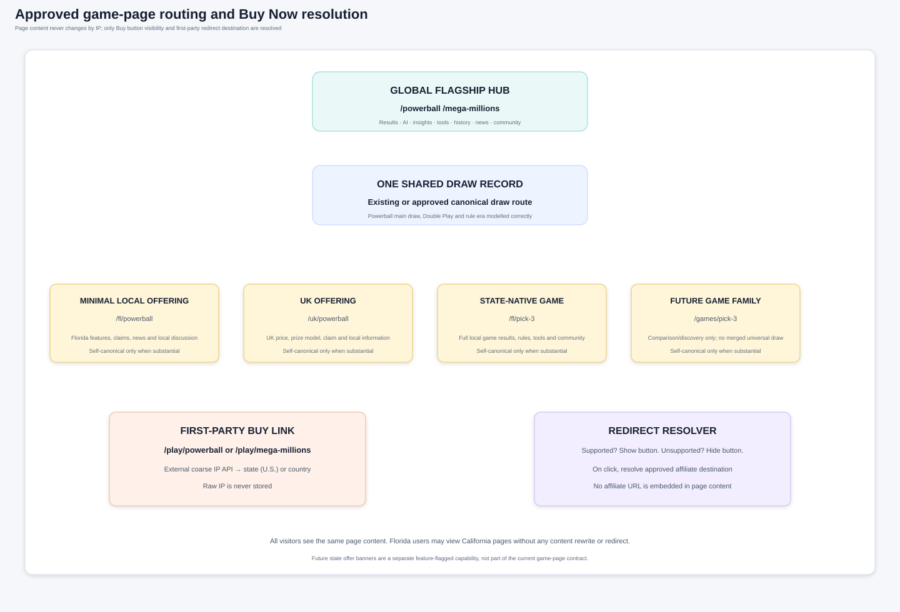
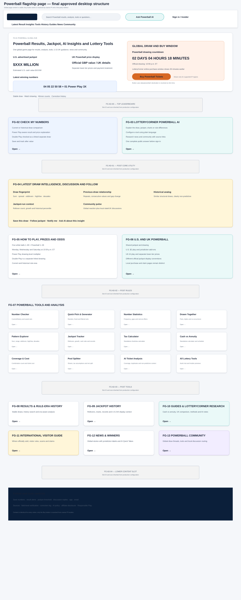
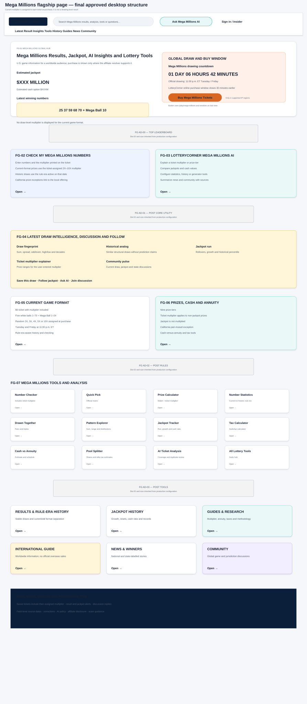

# LotteryCorner Flagship Game Page Blueprint — Final Approved

**Document:** `05A-lotterycorner-flagship-game-page-blueprint-FINAL-APPROVED.md`  
**Internal codename:** LuckReGenerator  
**Product:** LotteryCorner.com  
**Blueprint package:** BP-04A — Flagship Game Brand Hub  
**Primary page family:** PF-03 — Flagship Game Hub  
**Version:** 1.1  
**Status:** Final approved and frozen blueprint  
**Approved date:** July 24, 2026  
**Delivery class:** Core rebuild plus early engagement  
**Initial implementations:** Powerball and Mega Millions  
**Supporting blueprint:** `05C-lotterycorner-tools-and-ai-insights-blueprint-FINAL-APPROVED.md`

---

## 0. Approved Decision

Powerball and Mega Millions receive international-quality root hubs:

```text
/powerball
/mega-millions
```

The root hub owns the complete global experience:

- latest result and jackpot;
- one official ET countdown;
- simple Buy button using a first-party redirect;
- Check My Numbers;
- LotteryCorner Game AI;
- draw intelligence;
- results and jackpot history;
- statistics, generators and systems;
- tax, annuity and planning-tool discovery;
- guides and LotteryCorner Research;
- news, winners and global community;
- save, follow and notifications;
- U.S./UK or international visitor guidance.

The page content is identical for all visitors.

Only the Buy button is affected by coarse IP resolution.

### 0.1 Product promise

> **Check the result, understand the draw, explore the tools, ask the AI, join the discussion and use Buy Tickets when it is supported for your location.**

### 0.2 Scope boundary

This document fully blueprints the root Flagship Game Hub.

It defines the canonical ownership and integration contract for result, history, jackpot and tool child pages, but does not replace their later detailed page blueprints.

### 0.3 Visual boundary

The visuals approve:

- page hierarchy;
- countdown and Buy-button simplicity;
- tools and AI prominence;
- U.S./UK and international guidance;
- anonymous structure.

They do not approve live values, final styling, logos or production ad sizes.

---

# PART I — VERIFIED GAME MODEL

## 1. Powerball Current Model

Powerball:

- draws Monday, Wednesday and Saturday at 10:59 p.m. ET;
- uses five white balls from 1–69 and one Powerball from 1–26;
- has Power Play as a drawing-level multiplier for eligible U.S. tickets;
- has Double Play as a separate drawing held after the main drawing;
- expanded to the UK in July 2026;
- shares only the jackpot between U.S. and UK participation;
- keeps lower-tier prize structures and administration separate;
- uses different official U.S. and UK advertised prize conventions.

### Data decision

```text
PowerballDrawEvent
- official draw timestamp
- five white balls
- Powerball
- Power Play multiplier
- U.S. advertised jackpot
- U.S. cash value
- result status
- winner summaries
- video
- correction trail

DoublePlayDrawEvent
- linked Powerball draw
- separate numbers
- separate prize structure
- participating jurisdictions
- result status

PowerballUKJackpotDisplay
- official UK advertised value
- currency
- payment treatment
- source/effective time
```

## 2. Mega Millions Current Model

Mega Millions:

- draws Tuesday and Friday at 11:00 p.m. ET;
- costs $5 per play;
- uses five white numbers from 1–70 and one Mega Ball from 1–24;
- assigns a random 2X, 3X, 4X, 5X or 10X multiplier to each play at purchase;
- does not have one current-format draw-level multiplier;
- is officially sold only in U.S. selling jurisdictions;
- has California pari-mutuel lower-tier prize exceptions;
- changed to its current format in April 2025.

### Data decision

```text
MegaMillionsDrawEvent
- official draw timestamp
- five white numbers
- Mega Ball
- jackpot
- cash option
- winner summaries
- result status
- video
- correction trail

MegaMillionsTicketPlay
- selected numbers
- assigned multiplier
- purchase jurisdiction
- rule era
```

Historic pre-April-2025 draws retain their historic Megaplier data under the applicable rule era.

## 3. Game Rule Era

Every game supports:

```text
GameRuleEra
- effectiveFrom
- effectiveTo
- number matrix
- ticket price
- prize matrix
- odds
- multiplier/add-ons
- jurisdiction participation
- source
```

Rules:

- checking uses the rule era of the selected draw;
- statistics default to the current era;
- all-history analysis discloses mixed eras;
- generators use the current active matrix by default;
- historic pages show the applicable era;
- UK Powerball cannot be implied for pre-launch draws.

---

# PART II — IP, BUY BUTTON AND COUNTDOWN

## 4. Approved IP Use

An external service resolves:

- U.S. state for a likely U.S. visitor;
- country for a likely non-U.S. visitor.

The result is used only for:

- Buy-button visibility;
- affiliate redirect destination.

It is not used to alter:

- results;
- jackpot;
- tools;
- news;
- community;
- claims;
- page language;
- U.S./UK content;
- canonical or metadata.

Raw IP addresses are never stored.

## 5. First-Party Buy Route

```text
/play/powerball
/play/mega-millions
```

The page contains only this LotteryCorner URL.

The click resolver:

- evaluates the coarse location;
- selects an approved active partner;
- redirects;
- returns a safe unavailable page when no partner exists.

Affiliate destination URLs are not embedded in the page, schema, social metadata or AI answer.

## 6. Buy Visibility States

Keep the public model simple:

```text
BUY_VISIBLE
BUY_HIDDEN_UNSUPPORTED
BUY_WINDOW_CLOSED
BUY_RESOLUTION_FAILED
```

### BUY_VISIBLE

- supported game/region mapping exists;
- campaign is active;
- game-level handoff window is open.

### BUY_HIDDEN_UNSUPPORTED

No Buy button is rendered.

### BUY_WINDOW_CLOSED

Show the next drawing and hide the button.

### BUY_RESOLUTION_FAILED

Do not expose a broken partner URL. Offer results, tools and reminders.

## 7. Global Countdown

The root page shows:

- official ET draw countdown;
- official draw days/time;
- one LotteryCorner online-purchase countdown.

Configuration:

```text
officialDrawAt
purchaseWindowClosesAt
purchaseWindowBufferMinutes
```

Approved initial direction:

- 30-minute buffer before draw;
- validate against active affiliate partners;
- configure once per game;
- label it as LotteryCorner’s online purchase window;
- never call it the official state cutoff.

Use `America/New_York` for daylight-saving correctness.

Optional browser-local time may be shown from the browser timezone, not IP, but ET remains primary.

---

# PART III — URL, CANONICAL AND QUERY OWNERSHIP

## 8. Root Routes

Preserve:

```text
/powerball
/mega-millions
```

## 9. Child Routes

Examples such as:

```text
/powerball/results
/powerball/statistics
/powerball/generator
/tools/tax-calculator
```

describe semantic ownership.

They do not authorize a migration until the current URL inventory is reviewed.

## 10. Query Ownership Matrix

| Intent | Owner |
|---|---|
| Powerball/Mega Millions latest result | Root hub/current-result owner |
| Specific draw | Stable draw page |
| Past results | History collection |
| Statistics | Game-scoped statistics tool |
| Generator | Game-scoped generator |
| Tax/annuity | Standalone `/tools` calculator |
| Florida Powerball | `/fl/powerball` |
| Powerball UK | `/uk/powerball` |
| International play question | International guide |
| Global news/community | Root game ecosystem |

## 11. Internal Anchor Contract

Root page fragments:

- `#latest-result`
- `#buy-tickets`
- `#check-numbers`
- `#ask-ai`
- `#draw-insights`
- `#how-to-play`
- `#prizes-and-odds`
- `#tools`
- `#results-history`
- `#jackpot-history`
- `#jurisdictions`
- `#international`
- `#guides`
- `#news`
- `#community`

---

# PART IV — FLAGSHIP PAGE ORDER

## 12. Anonymous Sequence

| Order | ID | Section |
|---:|---|---|
| 1 | FG-01 | Game Identity, Jackpot, Latest Result, Draw Countdown and Buy |
| 2 | AD-FG00 | Top Advertisement |
| 3 | FG-02 | Check My Numbers |
| 4 | FG-03 | LotteryCorner Game AI |
| 5 | AD-FG01 | Post-Core Advertisement |
| 6 | FG-04 | Latest Draw Intelligence, Discussion and Follow |
| 7 | FG-05 | How to Play, Prizes and Odds |
| 8 | FG-06 | Game-Specific Jurisdiction Differences |
| 9 | AD-FG02 | Post-Rules Advertisement |
| 10 | FG-07 | Tools and Analysis Launcher |
| 11 | FG-08 | Results and Rule-Era History |
| 12 | FG-09 | Jackpot History |
| 13 | AD-FG03 | Post-Tools Advertisement |
| 14 | FG-10 | Jurisdictions and International Guide |
| 15 | FG-11 | Guides and LotteryCorner Research |
| 16 | FG-12 | News and Winners |
| 17 | FG-13 | Community |
| 18 | FG-14 | Save, Follow, Alerts and App |
| 19 | FG-15 | Trust, Scam Awareness and Responsible Play |
| 20 | AD-FG04 | Lower Advertisement |
| 21 | Footer | Game/global destinations |

## 13. Adaptive Priority

- correction precedes continuation;
- live/pending draw appears in FG-01;
- possible saved-number win moves checker/claim guidance above ads and Buy;
- Responsible Play suppresses Buy and promotional alerts;
- Buy window closure updates without changing page content.

## 14. Content Budget

Initial root view:

- one current result;
- one countdown/Buy action;
- one checker;
- one AI entry;
- up to five draw insights;
- selected tool cards;
- compact rules;
- three Guides/Research items;
- three News/Winner items;
- three discussions.

Full history, calculators and analysis live on canonical tool/child pages.

---

# PART V — SECTION SPECIFICATIONS

## 15. FG-01 — Identity, Result, Countdown and Buy

Required:

- game identity/H1;
- current jackpot/cash where applicable;
- Powerball U.S. and UK official display distinction;
- latest numbers;
- Power Play for Powerball;
- no current draw-level Mega Millions multiplier;
- official draw time/countdown;
- LotteryCorner buy-window countdown;
- first-party Buy button when supported;
- stable result;
- watch video;
- correction status.

### Powerball display

The page does not switch by IP.

Show a stable global presentation:

- U.S. advertised annuity and cash;
- UK official advertised value or a clear UK details card;
- statement that values are not directly comparable.

### Mega Millions display

Show:

- jackpot and cash;
- latest numbers;
- no multiplier beside the drawn numbers;
- note that the multiplier is printed/assigned per ticket.

## 16. FG-02 — Check My Numbers

### Powerball

- main draw;
- Power Play result;
- linked Double Play;
- date range;
- saved sets;
- rule era.

### Mega Millions

- drawn numbers;
- user’s assigned ticket multiplier;
- selected draw/rule era;
- California exception link.

The deterministic result appears before AI explanation or sign-in.

## 17. FG-03 — LotteryCorner Game AI

AI may:

- explain a draw;
- explain a chart;
- summarize jackpot run;
- configure a generator/statistics query;
- compare U.S./UK Powerball;
- explain the Mega Millions ticket multiplier;
- route tax/annuity questions to tools;
- summarize news/community;
- create a sourced Research Note.

AI does not calculate official matches or taxes itself; it calls deterministic tools.

## 18. FG-04 — Draw Intelligence, Discussion and Follow

This section contains the intelligence previously scattered across a lower “Worth Knowing” module.

### Deterministic insight catalog

- sum;
- spread/range;
- odd/even;
- high/low;
- decades/tens distribution;
- consecutive numbers;
- repeats from previous draw;
- main-ball and special-ball gaps;
- current gap versus historical median/percentile;
- pair/triple co-occurrence;
- current jackpot roll count;
- jackpot growth;
- cash-to-annuity ratio;
- rule-era context.

### AI layer

- plain-language explanation;
- historical structural analog;
- “why this is interesting”;
- myth correction such as overdue-number misconceptions;
- links to the supporting tool.

### Community and return

- global draw thread;
- local-offering discussions;
- Save this draw;
- Follow game/jackpot;
- Notify me;
- Generate numbers from selected filters.

## 19. FG-05 — How to Play, Prizes and Odds

Compact root summary with child-page links.

Neutral, non-predictive and rule-era-aware.

## 20. FG-06 — Game-Specific Jurisdiction Differences

### Powerball

- shared U.S./UK jackpot;
- U.S. ticket and add-ons;
- UK ticket/lower tiers/payment;
- California U.S. prize exception;
- Double Play participating jurisdictions;
- local claims and taxes.

### Mega Millions

- U.S. selling jurisdictions;
- ticket-level multiplier;
- California pari-mutuel exception;
- local claims, taxes and online availability;
- worldwide information but no official overseas sale.

## 21. FG-07 — Tools and Analysis Launcher

Show selected game-relevant tools from 05C.

Powerball default:

- Number Checker;
- Quick Pick/Generator;
- Statistics;
- Drawn Together;
- Pattern Explorer;
- Jackpot Tracker;
- Tax Calculator;
- Cash vs Annuity;
- Annuity Schedule;
- Coverage/Cost;
- Pool Splitter;
- AI Ticket Analysis.

Mega Millions default additionally prioritizes:

- Ticket Multiplier Prize Calculator.

## 22. FG-08 — Results and Rule-Era History

- stable draw records;
- date search;
- videos;
- rule-era filters;
- current versus all-history views;
- crawlable pagination.

## 23. FG-09 — Jackpot History

- run/rollovers;
- resets;
- top jackpots;
- cash ratio;
- U.S./UK display distinction;
- winner links;
- charts on child page.

## 24. FG-10 — Jurisdictions and International Guide

No IP-based content switching.

Powerball:

- U.S. offerings;
- UK offering;
- other-country visitor guidance;
- scams;
- local offering links.

Mega Millions:

- U.S. offerings;
- no official sales outside U.S.;
- global result/tool access;
- scam guidance.

## 25. FG-11 — Guides and LotteryCorner Research

Separate from News.

Examples:

- Cash vs annuity;
- Powerball U.S. vs UK;
- Power Play and Double Play;
- Mega Millions ticket multiplier;
- Understanding lottery statistics;
- Jackpot taxes;
- Claim and international visitor guides;
- LotteryCorner system methodology;
- AI Research Notes.

## 26. FG-12 — News and Winners

Current events and human stories with jurisdiction labels.

No claim that a system caused a win.

## 27. FG-13 — Community

Ownership:

| Discussion | Owner |
|---|---|
| Current draw reaction | Stable global draw thread |
| General game/tools | Global game community |
| State purchase/claim | Local offering community |
| UK purchase/prize | UK offering community |
| Local winner | Local state/game discussion |

No fabricated members or replies.

## 28. FG-14 — Save, Follow, Alerts and App

- saved numbers;
- saved tools;
- result;
- jackpot threshold;
- draw reminder;
- news;
- discussion reply;
- app/email.

## 29. FG-15 — Trust, Scams and Responsible Play

- sources;
- field-level verification;
- corrections;
- independent publisher;
- AI policy;
- affiliate disclosure;
- official game links;
- scam warnings;
- Responsible Play.

---

# PART VI — SECTION INTELLIGENCE MATRIX

## 30. Flagship Matrix

| Section | Immediate job | Source/owner | Update | Deterministic intelligence | AI role | Interesting fact | Primary next action | Signed-in change | Affiliate | Ad tier | Stale behavior |
|---|---|---|---|---|---|---|---|---|---|---|---|
| FG-01 | result/jackpot/draw | Data Ops | event | result, countdown, Buy state | explain | jackpot milestone | result/check/Buy | saved match | first-party button | 0 | pending/corrected |
| FG-02 | check ticket | Tool/Data | request | exact match/prize | explain | prior match | save/claim | saved history | after safe output | 0 | rule-era block |
| FG-03 | ask AI | AI Product | request/cache | tool routing | core | suggested question | cited action | memory | contextual | 0 | deterministic fallback |
| FG-04 | understand draw | Data/Community | event/hour | pattern/jackpot metrics | synthesize | historical analog | tool/follow/thread | personal match | contextual | 0 | invalidated on correction |
| FG-05 | learn rules | Game Content | rule change | odds/prize | plain-language | rule history | guide | preferred context | none | 1 | effective date |
| FG-06 | jurisdiction differences | Offering Ops | weekly/change | rule comparison | explain | expansion/change | offering page | preferred links | contextual | 1 | mark/suppress |
| FG-07 | find tools | Tool Product | release/data | tool eligibility | configure | sample analysis | tool | recent/saved | selected tools | 1 | per tool |
| FG-08 | find history | Draw Data | event | history/search | explain | on-this-day | draw | saved search | none | 2 | complete/corrected |
| FG-09 | jackpot history | Jackpot Data | event | rollovers/growth | explain | record | chart/guide | threshold | contextual | 2 | source timestamp |
| FG-10 | location guidance | Content Ops | change | offering matrix | explain | game expansion | local guide | preferred links | Buy resolved separately | 1 | effective date |
| FG-11 | durable learning | Editorial/Research | publish/update | cited analysis | summary/research | method insight | guide/tool | saved guide | contextual | 2 | updated date |
| FG-12 | current stories | Editorial | publish | entity match | Quick Take | winner/history | article | relevance | contextual | 2-3 | dated |
| FG-13 | discuss | Community Ops | real time | activity rank | summary/research | human context | thread | following/replies | minimal | 2 | timestamp |
| FG-14 | return | Lifecycle | real time | event settings | assistant | none | save/follow | full controls | contextual | 1 | user config |
| FG-15 | trust/help | Trust | review/change | suppression | constrained | none | source/help | controls | disclosures | 0 | effective date |

---

# PART VII — TOOLS ACCESS

## 31. Public and Insider Rule

All tools are publicly discoverable.

Tool-specific access patterns:

- **Public Complete** — the tool completes without sign-in.
- **Public Preview** — inputs, explanation and sample output are visible; Run asks for sign-in.
- **Signed-In** — saving, history and comparison.
- **Insider** — advanced filters, batch analysis, systems and AI research.

Do not hide an Insider tool entirely.

---

# PART VIII — DATA, PROVENANCE AND OPERATIONS

## 32. Game Brand Manifest

- game ID/name;
- current rule era;
- draw schedule/ET timezone;
- result model;
- jackpot model;
- tool capabilities;
- child routes;
- source URLs;
- owners;
- correction status.

## 33. Field-Level Provenance

High-risk fields carry:

```text
value
sourceRef
effectiveFrom
lastVerifiedAt
freshnessThreshold
correctionStatus
```

Required for:

- draw time;
- jackpot/cash;
- UK display;
- ticket price;
- add-ons;
- prize exceptions;
- tax/claim;
- purchase support;
- affiliate campaign status.

## 34. Monitoring

| Data | Frequency |
|---|---|
| Result/jackpot | Event-driven |
| Draw countdown | Schedule-driven |
| Affiliate region mapping | Daily/change alert |
| Affiliate campaign | Health check and click-time validation |
| Game rules | Official-source alert |
| Rule eras | Version-controlled |
| Statistics | After verified draw |
| News/community | Continuous |
| Tax/annuity inputs | Scheduled legal/financial review |

## 35. Correction Propagation

- root hub;
- stable draw;
- local previews;
- checker;
- AI;
- saved matches;
- notifications;
- insights;
- metadata/schema;
- social images;
- community fact banners.

---

# PART IX — SEO, SOCIAL AND DISCOVERY

## 36. Search Identity

Powerball:

`Powerball Results, Jackpot, Winning Numbers & Tools | LotteryCorner`

Mega Millions:

`Mega Millions Results, Jackpot, Numbers & Tools | LotteryCorner`

## 37. Structured Data

Conceptual:

- `CollectionPage`/`WebPage`;
- `Organization` and `WebSite` linkage;
- `BreadcrumbList` on children;
- `VideoObject` for visible drawing video;
- `Dataset` only on dataset pages;
- Article/thread types on their pages;
- no unsupported lottery or general Offer schema.

## 38. Open Graph and X

### Root hub

- evergreen game identity image;
- optional current result/jackpot image only with reliable correction;
- no IP-personalized Buy claim;
- canonical root URL.

### Stable draw

- game;
- official draw date;
- numbers;
- corrected image replacement.

### Saved shares

Never expose private numbers or match status without explicit action.

## 39. Server-Visible Content

- game identity;
- result/jackpot;
- countdown;
- key rules;
- tools/child links;
- international/jurisdiction links;
- Guides/News/Community links;
- trust.

The Buy button may hydrate after coarse resolution without altering indexable content.

## 40. URL Migration Gate

All proposed child routes remain conceptual until the accepted URL inventory approves them.

---

# PART X — RETIREMENT AND FUTURE GAME FAMILIES

## 41. Game Retirement

For rename, suspension, retirement or matrix change:

- preserve historical records;
- show transition;
- use rule eras;
- redirect only to a genuine successor;
- do not erase old game search value.

## 42. Future Game Family Hubs

Potential:

```text
/games/pick-3
/games/pick-4
/games/cash-5
```

They compare state offerings and route discovery.

They never merge separate state draws into one game result.

---

# PART XI — ADVERTISING, ACCESSIBILITY AND METRICS

## 43. Ad Contract

Tier 2.

Protected:

- result;
- countdown/Buy clarity;
- check input/output;
- AI answer;
- possible-win/claim flow.

Production slot IDs and sizes require current-code audit.

## 44. Accessibility

WCAG 2.2 AA:

- numbers as text;
- Power Play/Double Play labels;
- ticket multiplier input;
- ET timezone;
- keyboard tools;
- captions/transcripts;
- accessible tables;
- focus-safe Buy/ad elements.

## 45. Metrics

- time to result;
- checker completion;
- AI answer/action;
- insight/tool continuation;
- Buy-button impressions/clicks/resolver success;
- countdown use;
- history/guides/community;
- sign-in after tool value;
- Insider tool conversion;
- draw-cycle retention;
- SEO by root/child query.

## 46. Guardrails

- no IP-based content rewrite;
- no raw IP storage;
- no wrong affiliate destination;
- no draw-level current Mega Millions multiplier;
- no merged Double Play draw;
- no mixed rule-era analysis without disclosure;
- no prediction claim;
- no ad before result;
- no private data in markup.

---

# PART XII — VISUAL REFERENCES AND FREEZE

## 47. Routing



## 48. Powerball



## 49. Mega Millions



## 50. Approval

The founder approved this blueprint with the IP simplification, global ET countdown, tools expansion, AI-insight expansion and all factual/governance corrections.

This blueprint is frozen as Version 1.1.
