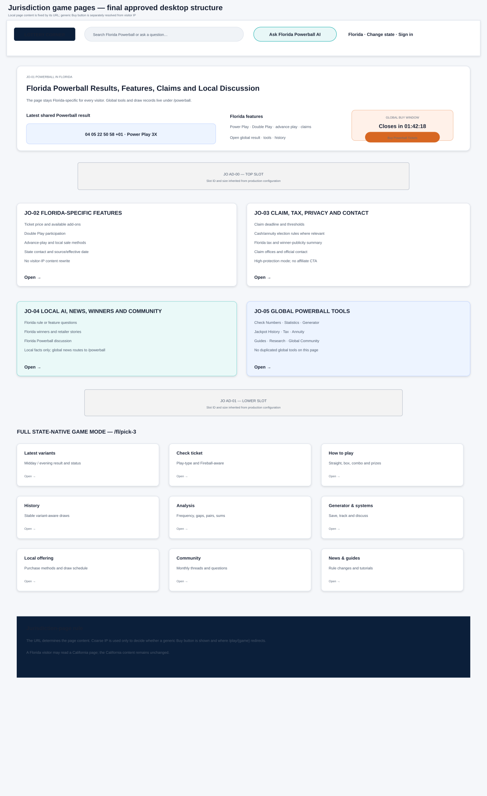

# LotteryCorner Jurisdiction Game Page Blueprint — Final Approved

**Document:** `05B-lotterycorner-jurisdiction-game-page-blueprint-FINAL-APPROVED.md`  
**Internal codename:** LuckReGenerator  
**Product:** LotteryCorner.com  
**Blueprint package:** BP-04B — Jurisdiction Game Pages  
**Version:** 1.1  
**Status:** Final approved and frozen blueprint  
**Approved date:** July 24, 2026  
**Modes:** Minimal flagship offering, Full state-native game, Hybrid multi-jurisdiction offering

---

## 0. Approved Decision

One template family supports:

### JG-M1 — Minimal Flagship Offering

Examples:

- `/fl/powerball`
- `/fl/mega-millions`
- `/uk/powerball`

It owns only substantial local context.

Universal tools and draw history remain on the flagship ecosystem.

### JG-M2 — Full State-Native Game

Examples:

- `/fl/pick-3`
- `/ny/numbers`
- `/mi/daily-3`

It owns the complete game experience because no global game hub exists.

### JG-M3 — Hybrid

Used when a shared game needs both common and local content but does not yet justify the full Powerball/Mega Millions model.

## 0.1 Core rule

> **The URL determines page content. Visitor IP never rewrites the jurisdiction page.**

A Florida visitor can read `/ca/powerball`; the page remains about California Powerball.

The generic Buy button may still be shown or hidden according to that visitor’s coarse IP and may redirect to a supported offer for the visitor’s location.

## 0.2 Buy-link rule

The page uses:

```text
/play/{game}
```

It does not embed the affiliate destination.

The first-party resolver decides visibility and redirect.

No raw IP storage.

## 0.3 Countdown rule

For Powerball and Mega Millions, jurisdiction pages reuse the same global game countdown and LotteryCorner purchase-window deadline as the root hub.

They do not calculate or display a state-specific cutoff.

Static local sales-method information may still be presented as editorial/source content.

---

# PART I — ROUTING, CANONICAL AND CONTENT OWNERSHIP

## 1. Route

```text
/{jurisdiction-code}/{game-slug}
```

Existing routes are preserved until the URL audit approves a change.

## 2. Self-Canonical Requirement

A local flagship page must contain substantial unique information such as:

- local ticket price and features;
- add-on availability;
- claim/tax/privacy;
- local operator/contact;
- local winners/news/community;
- local Responsible Play.

A thin page containing only global numbers and generic rules must be strengthened or explicitly consolidated after SEO review.

## 3. Global Routing

From a minimal flagship offering:

| Action | Owner |
|---|---|
| Latest numbers/date | Global stable draw |
| Results history | Global history |
| Statistics | Global game tool |
| Generator | Global game tool |
| Tax/annuity | `/tools` |
| Universal rules | Root game guide |
| Global news/community | Root game ecosystem |
| Local claims/news/community | Local offering |

## 4. Query Ownership

| Query | Owner |
|---|---|
| Florida Powerball | `/fl/powerball` |
| Powerball results | `/powerball` |
| Florida Powerball Double Play | `/fl/powerball` |
| Florida Powerball winner | Local content |
| Powerball statistics | Global tool |
| Florida Pick 3 | `/fl/pick-3` |

---

# PART II — BUY BUTTON SIMPLIFICATION

## 5. Content and Visitor Location Are Separate

For `/fl/powerball`:

- content jurisdiction = Florida;
- coarse visitor region = only a Buy resolver input.

Do not show visitor-location messaging throughout the page.

## 6. Buy Component

Display:

- global game draw countdown;
- LotteryCorner online purchase-window countdown;
- generic Buy Tickets button when the resolver says supported.

Do not display:

- dynamic visitor state content;
- local visitor cutoff;
- affiliate provider name before click unless the campaign requires disclosure;
- a state switch prompt merely because IP differs.

Affiliate disclosure remains near the button.

## 7. State-Native Buy

For a state-native game:

- show `/play/{game}` only when an approved region/game mapping exists;
- otherwise show retail/general play guidance;
- game-specific countdown is configurable where applicable;
- no forced button on unsupported games.

---

# PART III — JG-M1 MINIMAL FLAGSHIP OFFERING

## 8. Section Order

| Order | ID | Section |
|---:|---|---|
| 1 | JO-01 | Local Identity and Shared Result Preview |
| 2 | JO-02 | Global Countdown and Generic Buy Button |
| 3 | AD-JO00 | Top Advertisement |
| 4 | JO-03 | Local Price, Features and Add-Ons |
| 5 | JO-04 | Local Claim, Tax, Privacy and Contact |
| 6 | JO-05 | Local AI, News, Winners and Community |
| 7 | JO-06 | Global Game Tools and Details |
| 8 | JO-07 | Follow Local Offering |
| 9 | JO-08 | Sources, Corrections and Responsible Play |
| 10 | AD-JO01 | Lower Advertisement |
| 11 | Footer | State and global navigation |

## 9. Content Budget

- one result preview;
- one global countdown/Buy bar;
- five local-feature facts;
- four claim/tax/privacy facts;
- three local content items;
- one global tools launcher.

## 10. JO-01 — Local Identity and Shared Result

Suggested H1:

`[Game] in [State]: Results, Local Features, Claims and Player Information`

Do not make local cutoff a primary keyword when it is not displayed.

Required:

- jurisdiction/game identity;
- global result preview;
- jackpot/next draw;
- global draw link;
- root game hub;
- local purpose.

## 11. JO-02 — Countdown and Buy

Reuse root component:

- official ET draw countdown;
- global LotteryCorner purchase-window countdown;
- `/play/{game}`;
- disclosure;
- hidden when unsupported/closed.

## 12. JO-03 — Local Features

Powerball:

- price;
- Power Play;
- Double Play;
- advance play;
- local sale methods;
- California or bundled-price exception.

Mega Millions:

- local sale methods;
- advance play;
- California pari-mutuel exception;
- claim/account links.

UK Powerball:

- £4 play;
- UK lower-tier prizes;
- 30-year jackpot payment;
- local operator and claim links.

## 13. JO-04 — Claim, Tax, Privacy and Contact

- claim deadline;
- claim threshold/location;
- cash/annuity election where relevant;
- tax;
- winner publicity;
- state/operator contact;
- source/effective date.

No Buy button inside this section.

## 14. JO-05 — Local AI, News, Winners and Community

AI answers the local page context.

Local content only:

- state/UK features;
- local winners;
- local rules/news;
- local discussions.

## 15. JO-06 — Global Tools

Prominent links:

- Check My Numbers;
- Results History;
- Statistics;
- Generator;
- Jackpot History;
- Tax Calculator;
- Cash vs Annuity;
- Guides/Research;
- Global News;
- Global Community;
- `/tools`.

## 16. JO-07 — Follow Local Offering

- result;
- feature/rule change;
- local winner/news;
- local discussion;
- global jackpot alert where selected.

## 17. JO-08 — Trust

- official source/operator;
- LotteryCorner role;
- corrections;
- affiliate disclosure;
- Responsible Play.

---

# PART IV — JG-M2 FULL STATE-NATIVE GAME

## 18. Section Order

| Order | ID | Section |
|---:|---|---|
| 1 | JG-01 | Game Identity, Latest Variants and Next Draw |
| 2 | JG-02 | Buy / Retail Guidance and Countdown |
| 3 | AD-JG00 | Top Advertisement |
| 4 | JG-03 | Check My Numbers |
| 5 | JG-04 | Game AI |
| 6 | JG-05 | Live and Upcoming Variants |
| 7 | JG-06 | How to Play, Prize Types and Odds |
| 8 | AD-JG01 | Post-Core Advertisement |
| 9 | JG-07 | Results History |
| 10 | JG-08 | Number History |
| 11 | JG-09 | Statistics and Patterns |
| 12 | JG-10 | Generator |
| 13 | JG-11 | Systems and Player Methods |
| 14 | AD-JG02 | Post-Tools Advertisement |
| 15 | JG-12 | Local Offering |
| 16 | JG-13 | Claim, Tax and Privacy |
| 17 | JG-14 | Draw Insights |
| 18 | JG-15 | News and Winners |
| 19 | JG-16 | Community |
| 20 | JG-17 | Save, Follow and Alerts |
| 21 | JG-18 | Sources, Methodology and Responsible Play |
| 22 | AD-JG03 | Lower Advertisement |
| 23 | Footer | State/game navigation |

## 19. Variant Contract

Every result/tool identifies:

- midday/evening or draw index;
- play type;
- add-on;
- rule era;
- draw date/time.

## 20. Check and Prize

Deterministic service understands:

- straight;
- box;
- combo;
- Fireball/wild ball;
- variant;
- rule era.

## 21. AI and Insights

AI may:

- explain the game;
- explain a current result;
- configure statistics;
- generate number sets;
- summarize a monthly thread;
- create a sourced research note.

Deterministic state-native insights:

- digit position frequency;
- pairs;
- sums;
- roots/VTrac-style transforms only if separately approved;
- repeats;
- gaps;
- straight/box history;
- variant comparison.

## 22. Neutral Game Language

Do not say:

- best game to play;
- most profitable wager;
- due number;
- better chance because a number is hot/cold.

Use:

- compare price;
- draw frequency;
- prize structure;
- odds;
- play format;
- historical data.

---

# PART V — JG-M3 AND FUTURE GAME FAMILY

## 23. Hybrid Mode

Shared data can be governed centrally before a root hub exists.

State pages remain canonical until there is enough common demand and content.

## 24. Game Family Hubs

Potential:

```text
/games/pick-3
/games/pick-4
/games/cash-5
```

Purpose:

- compare state offerings;
- educate;
- route to local pages;
- find communities.

No universal merged result.

---

# PART VI — SECTION INTELLIGENCE MATRICES

## 25. Minimal Offering Matrix

| Section | Job | Source | Update | Deterministic | AI | Fact | Action | Signed-in | Affiliate | Ad | Stale |
|---|---|---|---|---|---|---|---|---|---|---|---|
| JO-01 | local orientation | Draw + local manifest | event/review | shared result | explain local context | local feature | global draw/local info | follow state/game | no | 0 | pending/corrected |
| JO-02 | Buy opportunity | Buy resolver | click/config | visibility/window | none | none | `/play/{game}` | saved play context | core | 0 | hide |
| JO-03 | local features | Local offering ops | weekly/change | feature availability | explain | local exception | root/local guide | preferences | contextual | 1 | effective date |
| JO-04 | claim/help | Trust/Content | monthly/change | rules | constrained | none | guide/contact | saved jurisdiction | prohibited | 0 | review warning |
| JO-05 | local engagement | Editorial/Community | publish/realtime | entity/activity | summary/research | winner/change | story/thread | following | contextual | 2 | dated |
| JO-06 | global tools | Tool registry | release/data | eligibility | configure | sample | tool/root hub | recent/saved | selected tool | 1 | per tool |
| JO-07 | return | Lifecycle | real time | event config | assistant | none | follow | full controls | contextual | 1 | user config |
| JO-08 | trust | Trust | review | suppression | policy | none | source/help | controls | disclosure | 0 | effective date |

## 26. State-Native Matrix

| Section | Job | Deterministic | AI | Action | Affiliate | Stale |
|---|---|---|---|---|---|---|
| JG-01 | result | variants/status | explain | exact draw | contextual | pending/corrected |
| JG-02 | play | resolver/countdown | none | Buy/retailer | core where supported | hide/closed |
| JG-03 | check | rule-aware match | explain | save/claim | after safe output | rule-era block |
| JG-04 | ask | tool routing | core | cited action | contextual | fallback |
| JG-05 | schedule | status/time | explain | alert | before draw | event |
| JG-06 | learn | rules/odds | plain-language | guide | none | effective date |
| JG-07–11 | analyze | history/statistics/generation | explain/configure | tool/save | eligible handoff | per tool |
| JG-12 | offering | local methods | explain | play guide | core | effective date |
| JG-13 | claim | rules | constrained | guide/contact | prohibited | review |
| JG-14 | insight | patterns | synthesize | tool/thread | contextual | correction invalidation |
| JG-15 | stories | entity match | Quick Take | article | contextual | dated |
| JG-16 | community | activity rank | summary/research | thread | minimal | timestamp |
| JG-17 | return | event config | assistant | follow | contextual | user |
| JG-18 | trust | source/suppression | policy | help | disclosures | effective |

---

# PART VII — DATA AND PROVENANCE

## 27. Jurisdiction Offering Manifest

- game;
- jurisdiction;
- mode;
- route;
- local price/features;
- claim/tax/privacy;
- operator/contact;
- news/community capability;
- source/effective dates;
- owners;
- correction status.

Visitor IP is not part of this manifest.

## 28. State-Native Game Manifest

Adds:

- matrix;
- variants;
- play types;
- prize table;
- odds;
- rule eras;
- tool capabilities;
- generator constraints;
- community taxonomy.

## 29. Buy Resolver Configuration

Separate from content:

```text
gameId
coarseRegion
buttonEnabled
firstPartyRoute
affiliateDestination
campaignStatus
purchaseWindowRule
lastVerifiedAt
```

Raw IP is never stored.

---

# PART VIII — SEO, SOCIAL AND OPERATIONS

## 30. Titles

Minimal:

`Powerball in Florida: Results, Features & Local Rules | LotteryCorner`

State-native:

`Florida Pick 3 Results, Winning Numbers & History | LotteryCorner`

## 31. Structured Data

- `WebPage`/`CollectionPage`;
- `BreadcrumbList`;
- stable game and jurisdiction IDs;
- no IP-derived offer markup;
- no unsupported lottery/Product schema.

## 32. Open Graph/X

Local page:

- game + jurisdiction;
- fixed local description;
- no IP-derived Buy claim;
- no visitor-location content.

## 33. Monitoring

| Data | Frequency |
|---|---|
| Shared result | Event-driven |
| Local features | Weekly/change alert |
| Claim/tax/privacy | Monthly/change alert |
| Local news/community | Continuous |
| Buy resolver | Daily and click-time health |
| Game rules/statistics | Official change / after draw |

## 34. Retirement

Preserve historic draws and old rule eras.

Redirect only to a true successor.

---

# PART IX — ADVERTISING, ACCESSIBILITY AND METRICS

## 35. Ad Tier

Minimal: Tier 1–2.  
State-native: Tier 2.

Protected:

- result;
- checker;
- claim;
- AI answer;
- Buy clarity.

## 36. Accessibility

- WCAG 2.2 AA;
- variants as text;
- keyboard tools;
- exact times;
- no color-only add-ons;
- no content redirect by IP;
- Buy button does not obscure result.

## 37. Metrics

- local query performance;
- global tool routing;
- checker/tool use;
- Buy impressions/clicks/resolver success;
- affiliate conversion;
- local news/community;
- follow/alerts;
- ad revenue.

## 38. Guardrails

- no IP content rewriting;
- no raw IP storage;
- no thin state-name substitution;
- no duplicated global tools;
- no stale local facts;
- no prescriptive betting recommendation;
- no private data in metadata.

---

# PART X — VISUAL AND APPROVAL

## 39. Visual



## 40. Approval

The founder approved the minimal flagship offering, full state-native template, simple Buy resolver, global countdown and tools routing.

This blueprint is frozen as Version 1.1.
