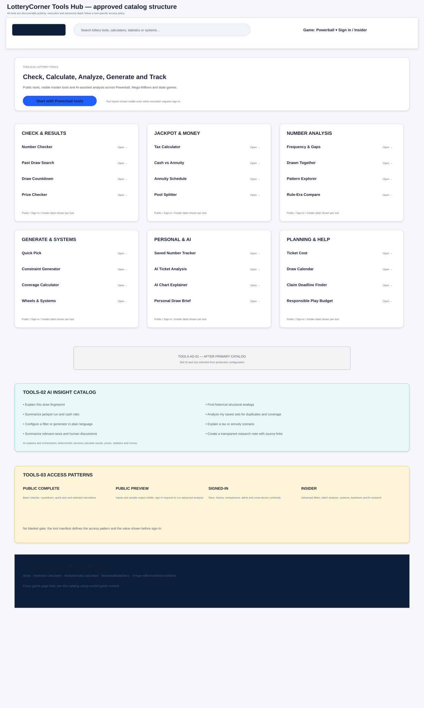

# LotteryCorner Tools and AI Insights Blueprint — Final Approved

**Document:** `05C-lotterycorner-tools-and-ai-insights-blueprint-FINAL-APPROVED.md`  
**Internal codename:** LuckReGenerator  
**Product:** LotteryCorner.com  
**Version:** 1.1  
**Status:** Final approved and frozen supporting blueprint  
**Approved date:** July 24, 2026  
**Primary routes:** `/tools`, standalone `/tools/*`, game-scoped analytical tools  
**Applies to:** Powerball, Mega Millions, state-native games, Home, State, Insider and AI

---

## 0. Decision

Lottery tools are a major LotteryCorner differentiation and acquisition/retention layer.

The product will provide:

1. a public `/tools` catalog;
2. standalone universal calculators;
3. game-scoped analytical tools;
4. visible Insider tools;
5. AI as an explainer and orchestrator over deterministic tools;
6. save, compare, track and notify loops.

### 0.1 Access principle

All tools are visible publicly.

A tool manifest chooses one access pattern:

- **Public Complete**
- **Public Preview**
- **Signed-In**
- **Insider**

For a Public Preview tool:

- the complete input form may be visible;
- examples and sample output are visible;
- the user can enter values;
- Run/advanced result may request sign-in.

This gives visibility to the capability without hiding it.

### 0.2 Constitution alignment

Core immediate-value tools should normally complete once before a registration request.

Advanced tools may use preview gating when the computation, saved context or analysis is an Insider capability.

---

# PART I — RESEARCH BASIS

## 1. Current Market Tool Patterns

Official Powerball and Mega Millions products provide:

- Check Your Numbers;
- previous drawings;
- current draw video;
- random-number generation for Mega Millions;
- prize and odds information.

High-traffic independent products expose:

- number checker;
- Quick Picks;
- endings;
- odd/even;
- high/low;
- hot/cold;
- consecutive values;
- number statistics;
- drawn-together analysis;
- sums;
- tens/decades;
- jackpot tax;
- cash/annuity converter;
- annuity payment schedule.

LotteryPost demonstrates durable demand for:

- all-game history;
- drawing search;
- statistics;
- systems;
- combination/pair analysis;
- wheels;
- cross-state Pick 3/Pick 4 analysis;
- premium access to advanced analytical depth.

## 2. LotteryCorner Opportunity

LotteryCorner should combine those established demands with:

- a cleaner tools catalog;
- rule-era correctness;
- AI explanation;
- saved work;
- personal ticket analysis;
- transparent sources/methodology;
- direct movement from insight → generator → save → Buy;
- cross-page context.

---

# PART II — TOOLS HUB

## 3. `/tools` Purpose

The hub answers:

- What can I calculate?
- What can I analyze?
- What can I generate?
- Which tools work for my game?
- Which tools require sign-in or Insider?
- What did I use recently?

## 4. Categories

### T-C1 — Check and Results

- Number Checker
- Prize Checker
- Past Draw Search
- Draw Countdown
- Draw Calendar
- On This Day
- Saved Number Match Tracker

### T-C2 — Jackpot and Money

- Lottery Tax Calculator
- Jackpot After-Tax Calculator
- Cash vs Annuity Calculator
- Annuity Payment Schedule
- Jackpot Growth Tracker
- Cash-to-Annuity Ratio
- Pool/Syndicate Splitter
- Claim Deadline Finder

### T-C3 — Number Analysis

- Frequency
- Current Gap / Skip
- Gap Percentile
- Hot and Cold
- Drawn Together
- Pair/Triple Analysis
- Endings
- Odd/Even
- High/Low
- Consecutive
- Sums
- Spread/Range
- Decades/Tens
- Repeat from Previous Draw
- Special-Ball Analysis
- Rule-Era Comparison
- Exact Number History Search

### T-C4 — Generate and Systems

- Quick Pick
- Constraint Generator
- Fixed-Number Generator
- Hot/Cold Mix Generator
- Coverage Calculator
- Combination Count
- Ticket Cost Calculator
- Full Wheel
- Abbreviated Wheel
- Key-Number Wheel
- Saved Systems
- Backtest / Paper Track

### T-C5 — Personal and AI

- AI Ticket Analysis
- AI Chart Explainer
- AI Natural-Language Tool Builder
- Personal Draw Brief
- Saved Set Coverage
- Duplicate Set Finder
- Portfolio of Number Sets
- AI Research Note

### T-C6 — Planning and Responsible Use

- Draw Time Converter
- Purchase Window Countdown
- Multi-Draw Cost Calculator
- Group Play Split
- Play Budget / Spend Tracker
- Reminder and Quiet-Hour Planner
- Responsible Play Controls

---

# PART III — CANONICAL ROUTE MODEL

## 5. Standalone Universal Tools

Recommended conceptual routes:

```text
/tools
/tools/tax-calculator
/tools/jackpot-after-tax
/tools/cash-vs-annuity
/tools/annuity-calculator
/tools/pool-splitter
/tools/ticket-cost-calculator
/tools/draw-time-converter
/tools/claim-deadline
```

These are game-neutral and accept game/state inputs.

## 6. Game-Scoped Analytical Tools

Conceptual ownership:

```text
/powerball/check-numbers
/powerball/statistics
/powerball/generator
/powerball/jackpot-history
/mega-millions/check-numbers
/mega-millions/statistics
/mega-millions/generator
/{state}/{game}/statistics
```

Exact URLs remain subject to the existing URL audit.

All tools are listed on `/tools`.

## 7. Context Transfer

A game page may open a universal tool with governed context:

```text
/tools/tax-calculator?game=powerball
```

The query is UI context; canonical remains the standalone tool URL unless a substantial game-specific page is approved.

---

# PART IV — PRIORITY TOOLS FOR FLAGSHIP GAME PAGES

## 8. Powerball Priority

### Above or near the first tools viewport

1. Check My Numbers
2. Quick Pick / Generator
3. Powerball Statistics
4. Jackpot Tracker
5. Tax Calculator
6. Cash vs Annuity
7. Annuity Schedule
8. Drawn Together
9. Pattern Explorer
10. Coverage and Ticket Cost
11. Pool Splitter
12. AI Ticket Analysis

### Powerball-specific

- Power Play prize calculator;
- Double Play checker;
- U.S./UK jackpot explainer;
- rule-era history;
- 10X availability explainer;
- jurisdiction add-on matrix.

## 9. Mega Millions Priority

1. Check My Numbers
2. Ticket Multiplier Prize Calculator
3. Quick Pick / Generator
4. Mega Millions Statistics
5. Jackpot Tracker
6. Tax Calculator
7. Cash vs Annuity
8. Annuity Schedule
9. Drawn Together
10. Pattern Explorer
11. Coverage/Ticket Cost
12. AI Ticket Analysis

### Current-format requirement

The checker asks for the multiplier assigned to the ticket.

It never reads a current draw-level multiplier.

## 10. State-Native Priority

- variant-aware checker;
- result history;
- number history;
- frequency/gaps;
- pairs/combinations;
- sums/patterns;
- generator;
- systems/wheels;
- play-cost calculator;
- AI thread/strategy explainer.

---

# PART V — ACCESS MATRIX

## 11. Recommended Initial Access

| Tool | Public | Sign-in value | Insider value |
|---|---|---|---|
| Draw Countdown | Complete | reminders | custom alerts |
| Basic Number Checker | Complete | save/history | batch checking |
| Basic Quick Pick | Complete | save | advanced constraints |
| Tax Calculator | One estimate | save scenarios | compare scenarios/export |
| Cash vs Annuity | One estimate | save | assumptions/sensitivity |
| Annuity Schedule | Public current jackpot | custom/save | advanced comparison |
| Basic Frequency | Preview/limited range | saved filters | full periods/exports |
| Drawn Together | Preview | saved pairs | advanced multi-number analysis |
| Pattern Explorer | Preview | compare/save | batch/rule-era analysis |
| Generator | Basic public | save sets | advanced AI/system filters |
| Wheels/Coverage | Form/sample | run after sign-in | advanced optimization |
| AI Ticket Analysis | Sample explanation | basic run | batch/deep analysis |
| Backtest/Paper Track | Visible | limited tracking | advanced history/report |
| Pool Splitter | Complete | save group | scenarios/export |
| Spend Tracker | Signed-in | core | advanced controls |

The final access level remains configurable without changing route visibility.

---

# PART VI — AI INSIGHT ARCHITECTURE

## 12. AI Principle

AI does not invent lottery predictions.

AI:

- explains deterministic outputs;
- combines governed facts;
- routes tools;
- summarizes sources and human discussions;
- helps configure analysis;
- preserves user context after permission.

## 13. Draw Insight Catalog

### AI-D1 — Draw Fingerprint

Deterministic inputs:

- sum;
- range;
- odd/even;
- high/low;
- decades;
- consecutive;
- cluster/spread.

Output:

- concise description;
- historical percentile;
- related tool link.

### AI-D2 — Previous-Draw Relationship

- repeated values;
- special-ball repeat;
- neighboring values;
- changed sum/range;
- no probability implication.

### AI-D3 — Historical Structural Analog

Find previous draws with:

- similar sum;
- same odd/even split;
- same decade distribution;
- same consecutive pattern;
- similar spread.

Language:

> “This draw resembles these historical draws structurally.”

Never:

> “These draws predict what comes next.”

### AI-D4 — Gap Context

- current gap;
- historical median;
- percentile;
- longest observed gap;
- overdue-number myth explanation.

### AI-D5 — Pair and Triple Context

- observed co-occurrence;
- selected period;
- rule era;
- sample size;
- no causal claim.

### AI-D6 — Jackpot Run

- rollovers;
- days/draws since last jackpot;
- growth per draw;
- historical percentile;
- cash/annuity ratio;
- prior similar runs.

### AI-D7 — Prize and Add-On Explanation

Powerball:

- Power Play;
- Double Play;
- state exception.

Mega Millions:

- ticket-assigned multiplier;
- prize range.

### AI-D8 — Rule Change Context

- old/new matrix;
- prize changes;
- ticket price;
- historical comparability.

## 14. Personal Ticket Insights

### AI-P1 — Exact Match Summary

Tool result first, AI explanation second.

### AI-P2 — Duplicate Review

- duplicate sets;
- repeated combinations;
- accidental overlap.

### AI-P3 — Coverage Summary

- distinct numbers;
- pairs covered;
- special-ball distribution;
- ticket count/cost.

Does not claim improved expected return.

### AI-P4 — Balance Description

- odd/even;
- high/low;
- decades;
- spread.

User may use it as a preference, not a prediction.

### AI-P5 — System Cost and Coverage

- total combinations;
- tickets;
- cost;
- guarantee only when mathematically valid;
- saved plan.

## 15. Editorial and Community Insights

### AI-E1 — News Quick Take

- what happened;
- why it matters;
- current fact;
- related history;
- discussion.

### AI-E2 — Community Pulse

- real activity;
- viewpoints;
- unresolved questions;
- no fake consensus.

### AI-E3 — Research Note

- sources checked;
- concise answer;
- uncertainty;
- data/tool links;
- clearly labelled LotteryCorner Research.

---

# PART VII — TOOL FLOW AND INTELLIGENT MOMENTUM

## 16. Required Flow

Every tool evaluates:

1. Result/output.
2. AI explanation.
3. Interesting fact or historical context.
4. Relevant next tool.
5. Save/follow.
6. Buy button where supported and appropriate.
7. Community or guide.

Example:

```text
Hot & Cold
→ Explain selected period
→ Generate sets using selected filters
→ Save sets
→ Buy Tickets if supported
→ Notify after draw
→ Review actual result
```

## 17. Sign-In Timing

### Core public tool

Return useful value first.

Then offer:

- save;
- alerts;
- history;
- cross-device continuity.

### Preview-gated advanced tool

- tool purpose visible;
- full input visible;
- example/sample visible;
- sign-in requested on Run;
- no misleading implication that a calculation has completed.

---

# PART VIII — TOOL DATA, PROVENANCE AND RULE ERAS

## 18. Tool Manifest

Each tool defines:

- tool ID/name;
- route;
- category;
- supported games;
- required inputs;
- deterministic service;
- AI role;
- access level;
- output;
- save object;
- source/data period;
- rule-era behavior;
- ad tier;
- metrics;
- error/freshness states.

## 19. Statistical Methodology

Every result states:

- game/variant;
- date range;
- number of draws;
- rule era;
- excluded/incomplete data;
- last updated;
- methodology link.

## 20. Financial Tools

Tax and annuity tools require:

- effective tax year;
- filing status assumptions;
- state/residency assumptions;
- purchase/claim jurisdiction caveat;
- jackpot and cash-value source;
- estimate-only disclosure;
- professional-advice recommendation;
- review owner.

## 21. Correction

A corrected draw invalidates:

- checker;
- statistics;
- AI insights;
- saved matches;
- backtests;
- social/share images;
- notifications.

---

# PART IX — SEO, SOCIAL AND ACCESSIBILITY

## 22. Search Identity

Each tool has:

- one clear calculation/analysis intent;
- direct answer/output;
- visible method;
- game links;
- canonical route;
- no thin game/state variants.

## 23. Structured Data

- `WebApplication` may be considered only when it accurately represents the visible interactive tool;
- `SoftwareApplication` should not be used casually;
- `Dataset` belongs to genuine dataset pages;
- visible FAQ may be structured only when current search eligibility and content support it;
- no prediction or review markup.

Final schema is validated during implementation.

## 24. Open Graph/X

Use evergreen tool previews.

Do not publish:

- private input;
- saved numbers;
- personal tax scenario;
- match result without explicit action.

## 25. Accessibility

- keyboard inputs;
- meaningful validation;
- accessible charts and data table alternative;
- results announced after calculation;
- no color-only frequency scales;
- downloadable/printable output where appropriate;
- mobile-friendly number entry.

---

# PART X — MEASUREMENT AND ROADMAP

## 26. Metrics

- tool discovery;
- input start;
- completion;
- sign-in at Run;
- save;
- next-tool continuation;
- AI explanation use;
- Buy click;
- draw-cycle return;
- Insider adoption;
- SEO traffic;
- correction/error rate.

## 27. Phase Priority

### Core rebuild / early engagement

- Checker;
- Quick Pick;
- Draw Countdown;
- Basic Statistics;
- Hot/Cold and Gaps;
- Drawn Together;
- Tax Calculator;
- Cash vs Annuity;
- Annuity Schedule;
- Jackpot Tracker;
- Save/alerts;
- AI chart explainer.

### Second phase

- Coverage calculator;
- Pool splitter;
- Rule-era compare;
- advanced generator;
- systems/wheels;
- personal ticket portfolio;
- backtest/paper tracking.

### Conditional/future

- optimization engines;
- exports;
- advanced cross-game analysis;
- user-created systems marketplace.

---

# PART XI — VISUAL AND APPROVAL

## 28. Visual



## 29. Approval

The founder approved:

- `/tools` as the public catalog;
- separate tax and annuity calculators;
- game-page tool launchers;
- visible Insider tools;
- public preview gating;
- extensive AI insights;
- deterministic calculation ownership;
- save, Buy and notification continuation.

This supporting blueprint is frozen as Version 1.1.
