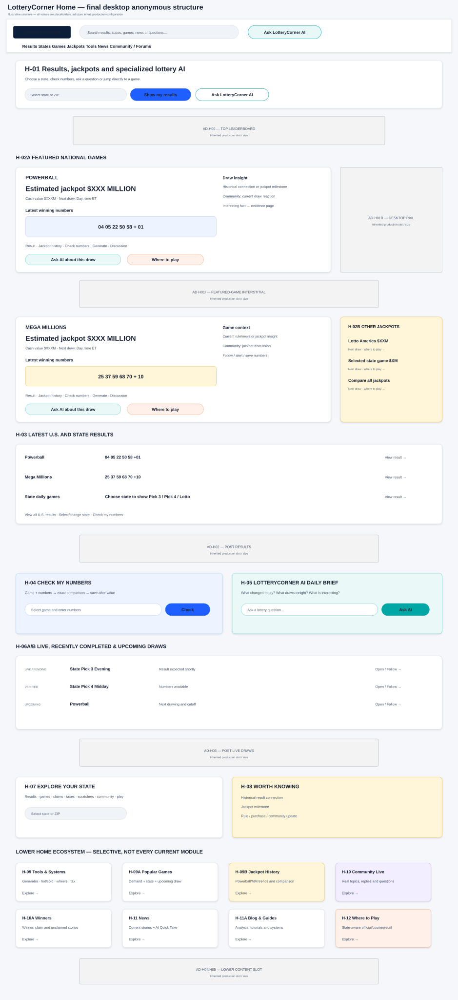
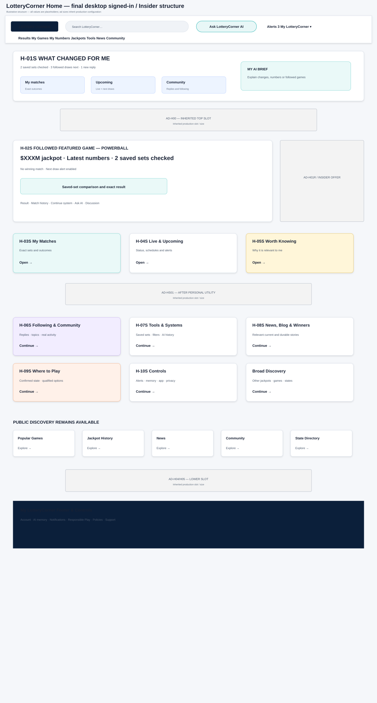
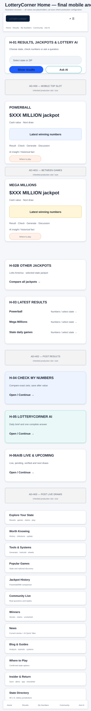
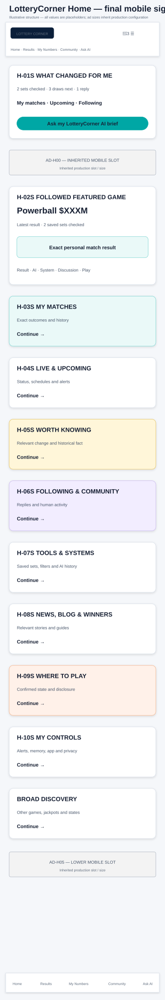

# LotteryCorner Home Page Blueprint

**Document:** `03-lotterycorner-home-page-blueprint.md`  
**Internal codename:** LuckReGenerator  
**Product:** LotteryCorner.com  
**Blueprint package:** BP-02 — Home  
**Page family:** PF-01 — Public Home  
**Version:** 1.1  
**Status:** Final approved and frozen Home blueprint  
**Approved date:** July 24, 2026  
**Delivery class:** Core rebuild  
**Primary authority:**  
- `00A-v2.1-luckregenerator-product-constitution-FROZEN.md`  
- `01-lotterycorner-experience-architecture-FINAL-APPROVED.md`  
- `02-global-shell-and-section-library-blueprint-FINAL-APPROVED.md`  

**Supporting research:**  
- `00B-lottery-player-behavior-engagement-and-ai-experience-research.md`  
- accepted SEO, information-architecture, schema, lifecycle and technical-SEO research  
- current U.S. official lottery and high-traffic independent lottery-product observation  
- founder-supplied full-page screenshot of the existing LotteryCorner desktop homepage  

---

## 0. Blueprint Decision

The LotteryCorner homepage is the broadest orientation and re-entry surface in the product, but it is not the required starting point.

It must serve two fundamentally different purposes:

### Anonymous home

> Help a visitor rapidly find current results, jackpots, a state, a game, a tool, a discussion or an AI answer—then demonstrate why LotteryCorner is worth returning to.

### Signed-in / Insider home

> Become the user’s personal lottery home: what changed, what matched, what draws next, what people replied, what to continue and where a qualified purchase option exists.

The current LotteryCorner homepage is a product and revenue input, not a layout to copy wholesale. The redesign will retain or evolve only those existing capabilities that support the new constitution: featured Powerball/Mega Millions utility, current results, live draw status, tools, jackpot history, winner/news content, Insider continuity, state discovery and established advertising inventory. Duplicated introductions, prediction-flavored wording, fragmented lower-page modules and weak hierarchy may be consolidated or removed.

The homepage must avoid becoming:

- a generic marketing hero followed by a directory;
- a wall of every U.S. result;
- one giant chatbot;
- a news portal that hides lottery utility;
- a generic affiliate landing page;
- a social feed without durable destinations;
- or a personalized dashboard that removes public discovery.

### 0.1 Visual-reference boundary

The supplied desktop and mobile visuals are page-template references for:

- section order;
- relative hierarchy;
- anonymous versus signed-in transformation;
- AI prominence;
- advertising and affiliate position;
- and mobile progression.

They do not approve final branding, typography, colors, exact card design, copy length or production data.

### 0.2 Existing-home preservation boundary

The founder-supplied current-home screenshot is used to identify valuable content and revenue assets. It does not freeze the existing section order, visual style, wording or every module.

The following current capabilities are treated as assets to retain or reorganize:

- rich Powerball and Mega Millions presentation;
- national and state latest results;
- live/recent draw status;
- lottery news and winner stories;
- tools, systems and popular-game discovery;
- jackpot history and comparisons;
- Insider/personal continuity;
- newsletter and state-directory return paths;
- and existing monetizable advertisement positions.

The following are not automatically preserved:

- duplicate introductory copy;
- every existing lower-page content block;
- the current section order;
- prediction claims or probability-implying language;
- old styling and component geometry;
- or modules that cannot be sustainably updated.

### 0.3 Binding homepage outcomes

The approved Home blueprint will determine:

1. The anonymous and signed-in section sequence.
2. Which content must appear before the first advertisement.
3. How state context is selected.
4. How LotteryCorner AI is demonstrated on Home.
5. How latest results and top jackpots are presented.
6. How saved-number checking becomes a registration loop.
7. How community, news and tools enter the Home experience.
8. How state-aware purchase discovery appears.
9. Which sections personalize and which remain public.
10. The Home metadata, schema, crawler and AI-discovery contract.
11. The Home content-operations contract.
12. Desktop/mobile visual templates and lifecycle states.
13. The Home advertising preservation and rationalization contract.

---

# PART I — RESEARCH AND CURRENT-STATE FINDINGS

## 1. Current Product Signals

### 1.1 LotteryCorner

The current LotteryCorner search presentation emphasizes U.S. lottery results, Powerball, Mega Millions and state numbers. It also uses generic promotional wording and some existing game-page language that leans toward forecasts or boosting winning chances.

**Blueprint decision:** The new homepage should preserve strong brand/result terms while replacing prediction-flavored or generic membership language with direct utility, LotteryCorner AI, community, tools and state-aware play options.

### 1.2 LotteryPost

LotteryPost demonstrates that results, jackpots, forums, predictions, systems, charts, wheels, blogs, profiles and searchable archives can reinforce one another. Its forums continue to show high-frequency state/game discussions and long-lived specialist topics.

**Blueprint decision:** Home must visibly prove that LotteryCorner is both an information destination and a living community. It should surface real discussions without becoming a feed-first product.

### 1.3 LotteryUSA

LotteryUSA’s current homepage prioritizes U.S. lottery results, top jackpots, odds, state/game discovery and where-to-play information.

**Blueprint decision:** LotteryCorner must meet the expected utility breadth but differentiate through embedded AI, saved continuity and community.

### 1.4 Official lottery sites

Official Powerball and state lottery home experiences train users to expect:

- current winning numbers;
- next drawing;
- jackpot/cash value;
- game discovery;
- checking numbers;
- where to play;
- claims/help;
- promotions or app actions.

**Blueprint decision:** The Homepage must provide these familiar jobs in independent-publisher form without repeatedly saying “official.”

### 1.5 Google Preferred Sources

Google allows readers to select eligible publications as Preferred Sources, increasing the chance that selected content is highlighted in Top Stories and potentially in AI search experiences.

**Blueprint decision:** Preferred Source is a valuable earned-distribution action after users consume news or choose editorial updates. It is not a hero-level Home CTA for first-time result checkers.

## 1.6 Current-home selective-retention findings

The founder-supplied homepage shows that LotteryCorner already has a broad information and monetization ecosystem, including:

- rich Powerball and Mega Millions modules;
- top jackpots and current numbers;
- multiple desktop advertising positions;
- national/state results;
- live draw status;
- news;
- popular games;
- prediction/system-style content;
- jackpot history and comparison;
- Insider features;
- Blog/newsletter;
- and a state-number directory.

The current strength is breadth and monetizable depth. The current weakness is that the hierarchy is fragmented and the experience does not yet behave as one intelligent graph.

**Home decision:** retain breadth selectively, consolidate repeated modules, upgrade the two major national games, and use AI, community, save/follow and purchase continuation inside the retained sections.

## 1.7 Updated competitive evidence

Current LotteryUSA presents live draws, quick picks, daily numbers, jackpots, news and Where to Play as distinct but connected Home utilities. Current Powerball result experiences combine winning numbers, jackpot/cash value, winners and number checking. Florida Lottery combines current winning numbers with game discovery, winner guidance, new games, app promotion and responsible-play access.

**Home decision:** the redesigned LotteryCorner Home should meet this expected utility set while differentiating through richer featured-game modules, embedded AI, saved continuity and human discussion.

## 2. Evidence-Based Homepage Principles

1. Current utility must dominate before brand storytelling.
2. National jackpots and latest results form the first public orientation layer.
3. State context is required for state games, legal purchase and local guidance.
4. AI must be visible in the first meaningful viewport, but not above the immediate result/jackpot task.
5. A Home AI block does not satisfy AI-everywhere; every section must make an intelligence decision.
6. Community and News need enough visibility to communicate that LotteryCorner is alive.
7. The homepage must create account value through saving, following and alerts—not a generic Join button.
8. Purchase opportunities must be qualified by state and game.
9. Signed-in Home must transform substantially while retaining public discovery.
10. The homepage should not attempt to show every state, game, article and tool at once.
11. Existing high-performing content and ad assets should be reorganized, not discarded merely because the visual design changes.
12. Existing production ad slot IDs, dimensions and breakpoints remain the implementation source of truth until an individual slot is explicitly approved for change.

---

# PART II — PAGE PURPOSE, PERSONAS AND ENTRY POINTS

## 3. Page Purpose

### Primary purpose

Orient users to current lottery activity and route them to the fastest useful next destination.

### Secondary purposes

- demonstrate LotteryCorner AI;
- create state/game preference;
- check or enter numbers;
- reveal live community and news;
- expose useful tools;
- create save/follow/notification investment;
- qualify a purchase path;
- convert search visitors into direct returners, app users, email users and Google Preferred Source selectors.

## 4. Target Personas

| Persona | Home job |
|---|---|
| Immediate checker | Reach latest result or select state |
| Regular player | See followed results, next draw and saved-number status |
| Jackpot visitor | See top amounts and where/when to play |
| First-time player | Find state/game help or ask a plain-language question |
| Number ritualist | Enter, generate or save personal number sets |
| Statistics enthusiast | Reach hot/cold, frequency, systems and history |
| Community regular | See replies, active topics and draw discussions |
| News visitor | Discover current stories and why they matter |
| Transaction-ready player | Confirm state-aware legal purchase options |
| Mobile returner | Complete a quick check from a deep link or Home |
| Spending-concerned user | Reach Responsible Play without promotional friction |

## 5. Entry Points

Although the page is Home, users may arrive through:

- direct navigation;
- brand search;
- app launch;
- browser bookmark;
- shared homepage;
- expired/removed deep-link fallback;
- email logo/header;
- account return;
- notification without a resolvable exact destination.

A specific result, article, thread or alert must deep-link to the exact destination rather than using Home as a generic landing page.

## 6. Completion Signals

Anonymous Home succeeds when the user:

- opens the correct result, state, game, tool, article or discussion;
- receives a complete AI answer;
- checks numbers;
- selects a state;
- follows or saves something;
- or reaches a qualified Where to Play option.

Signed-in Home succeeds when the user:

- understands what changed;
- reviews matches;
- opens an upcoming followed draw;
- continues a system/AI/community task;
- manages alerts;
- or completes an eligible purchase handoff.

---

# PART III — HOME CONTEXT AND PERSONALIZATION MODEL

## 7. State-Context Precedence

Use the frozen shell rule:

1. Current explicit Home state selection.
2. User-selected state in the current session.
3. Signed-in preferred or followed state.
4. Device location only after permission.
5. Manual ZIP/city/state selection.
6. IP location only as a suggestion requiring confirmation.

Home must not silently replace national orientation with an IP-inferred state.

## 8. Home Modes

### HM-01 — National anonymous

Default when no reliable state or account context exists.

Shows:

- top national jackpots;
- national results;
- state selector;
- broad AI prompt;
- national news/community/tools.

### HM-02 — State-selected anonymous

Adds:

- selected-state latest results;
- games drawing soon;
- state purchase eligibility;
- state news/community;
- temporary recent-state continuity.

The user can return to national view easily.

### HM-03 — Signed-in personal

Prioritizes:

- followed state/game results;
- saved-number checks;
- next draws;
- replies;
- what changed;
- personal AI;
- eligible purchase options.

### HM-04 — Insider enriched

Adds:

- saved systems;
- performance history;
- personal timeline;
- advanced AI memory;
- richer tool continuation;
- Insider ad/offers where appropriate.

### HM-05 — High protection

Activated by responsible-play/control context.

Suppresses:

- purchase;
- jackpot urgency;
- promotional alerts;
- conversion-focused AI;
- high-density ads.

## 9. Personalization Rules

Home may personalize based on explicit:

- followed states;
- followed games;
- saved number sets;
- saved tools/systems;
- followed discussions;
- notification choices;
- recent LotteryCorner activity.

Do not personalize from:

- inferred financial condition;
- assumed losses;
- demographic stereotype;
- sensitive browsing unrelated to LotteryCorner;
- hidden third-party gambling profiles.

## 10. Public Content Stability

Signed-in personalization may reorder or add modules, but it must not:

- change canonical current facts;
- hide access to all states/games;
- turn Home into an opaque feed;
- prevent a user from reaching national results;
- expose private saved data in server-rendered public markup.

---

# PART IV — ANONYMOUS HOME SECTION ORDER

## 11. First-Viewport Contract

Before the first normal advertisement, Home must deliver:

1. LotteryCorner identity and global shell.
2. Functional Home task entry.
3. Top jackpots / next-draw orientation.
4. Latest national results and state-results entry.

On smaller mobile screens, a compact AI action may be visible in the Home task entry, but the full AI answer module follows current utility.

## 12. Anonymous Section Sequence

| Order | ID | Section |
|---:|---|---|
| 1 | H-01 | Home Task Entry |
| 2 | AD-H00 | Existing Top Leaderboard |
| 3 | H-02A | Featured National Games — Powerball and Mega Millions |
| 4 | AD-H01 | Featured-Game Interstitial / Desktop Rail |
| 5 | H-02B | Additional Top Jackpots |
| 6 | H-03 | Latest U.S. and State Results |
| 7 | AD-H02 | Post-Results Advertisement |
| 8 | H-04 | Check My Numbers |
| 9 | H-05 | LotteryCorner AI Daily Brief |
| 10 | H-06A | Live and Recently Completed Draws |
| 11 | H-06B | Tonight and Upcoming Draws |
| 12 | AD-H03 | Post-Live-Draw Advertisement |
| 13 | H-07 | Explore Your State |
| 14 | H-08 | Worth Knowing / Intelligent Highlights |
| 15 | H-09 | Tools, Systems and Number Exploration |
| 16 | H-09A | Popular Games |
| 17 | H-09B | Jackpot History and Comparisons |
| 18 | AD-H04 | Lower Utility Advertisement |
| 19 | H-10 | Community Live |
| 20 | H-10A | Winners and Claim Stories |
| 21 | H-11 | News and Stories |
| 22 | H-11A | Lottery Blog and Guides |
| 23 | H-12 | Where to Play / Buy Online |
| 24 | H-13 | My LotteryCorner / Insider Value |
| 25 | H-14 | Return and Distribution |
| 26 | H-14A | Newsletter and Player Updates |
| 27 | H-14B | Winning Numbers by State Directory |
| 28 | AD-H05 | Bottom Content Advertisement |
| 29 | H-15 | Trust, Support and Footer |
| 30 | AD-H06 | Existing Bottom Anchor/Sticky Slot, when enabled |

Desktop may pair Community with News, Winners with Blog, or Jackpot History with Comparison in balanced rows. Mobile preserves a coherent single-column sequence and uses the approved mobile ad configuration rather than blindly duplicating desktop positions.

---

# PART V — ANONYMOUS SECTION SPECIFICATIONS

## 13. H-01 — Home Task Entry

### User job

Understand what LotteryCorner provides and choose a fast path.

### Required visible content

- one clear H1;
- concise value statement;
- state/ZIP selector;
- Search entry;
- Ask LotteryCorner AI action;
- quick links to Results, Jackpots, Check My Numbers and Community.

### Recommended copy direction

**H1 working option A:**  
`U.S. Lottery Results, Jackpots and Lottery AI`

**H1 working option B:**  
`Lottery Results, Jackpots and Help for Every U.S. State`

**Supporting line:**  
`Check results, explore games, ask LotteryCorner AI, save numbers and find where to play.`

Final wording requires title/H1 usability and search-intent testing.

### AI/intelligence

- suggested question based on current draw calendar;
- state-aware prompt after explicit selection;
- no fabricated “people are asking” label.

### Interesting fact

Not required inside the task-entry section. Preserve focus.

### Primary action

State selection or search, based on input.

### Secondary actions

- Ask AI;
- Latest Results;
- Check My Numbers.

### Anonymous

Full section.

### Signed-in transformation

Replaced by H-01S My Lottery Day, while global search and AI remain.

### Affiliate

No generic outbound Buy Now.

### Ads

Prohibited.

### Operations

- static product copy;
- current suggested question driven by verified draw/event context;
- state list from governed jurisdiction registry.

### Lifecycle states

- AI unavailable: keep Search/state/results links;
- state service unavailable: manual alphabetical state navigation;
- no upcoming major draw: use a stable useful suggested question.

### Accessibility

- visible labels;
- no placeholder-only state field;
- Enter behavior clear;
- no auto-request for location.

### Metrics

- state selection;
- search start;
- AI start;
- quick-action completion;
- first useful click.

## 14. H-02A — Featured National Games: Powerball and Mega Millions

### User job

Complete the highest-demand national-game tasks without leaving Home:

- see the current jackpot and cash value;
- see the latest winning numbers;
- know the next drawing;
- reach the stable result/game/history;
- ask AI about the game or draw;
- check or generate numbers;
- join the discussion;
- and find a qualified purchase path.

### Why these are rich Home sections

Powerball and Mega Millions are not reduced to small promotional cards. They are Home anchors because they combine the largest recurring search demand, jackpot interest, result checking, news, systems and affiliate intent.

### Required visible content for each game

- game logo and name;
- advertised jackpot;
- cash value where available;
- next draw date/time/timezone;
- latest verified winning numbers;
- draw/status label;
- current result link;
- jackpot/game link;
- Where to Play;
- follow/alert;
- check/generate numbers.

### Embedded intelligence

Each game module evaluates:

- latest-draw pattern insight;
- historical match or jackpot milestone;
- current rule/news context;
- real community discussion;
- saved-number relationship when signed in;
- AI question suggestions.

Use one or two relevant insights, not a generated paragraph after every data point.

### Interesting fact

Examples:

- previous jackpot in the same range;
- number combination appearing in a prior draw;
- unusual current rollover run;
- winner/history connection.

The fact must link to evidence and avoid probability implications.

### Community

Show one compact real discussion path:

- current draw reaction;
- jackpot discussion;
- system/tool discussion;
- or an unanswered factual question.

### Affiliate requirement

A Where to Play action is required when the user’s state/game eligibility can be resolved. It opens the state-aware eligibility experience. It must not route every user to one national partner.

### Ads

No advertisement may appear inside a featured-game module.

The desktop layout may use an existing right-side rail ad adjacent to the module, with dimensions inherited from the current production slot configuration.

### Signed-in transformation

Add:

- saved sets checked;
- follow status;
- next-draw reminder state;
- recent system;
- personal AI continuation.

### Lifecycle

- event-driven jackpot/result update;
- pending, rollover, won/reset and corrected states;
- stale commercial eligibility suppressed independently;
- AI and historical insights invalidated after material correction.

### Metrics

- result completion;
- game/jackpot click;
- AI engagement;
- number-check/generator use;
- community click;
- follow/reminder;
- purchase eligibility and qualified outbound.

## 15. AD-H01 — Featured-Game Interstitial and Rail

The existing homepage demonstrates that large national-game modules can support both inline and rail inventory.

Approved architecture:

- top leaderboard after H-01 or immediately before the featured-game region;
- desktop rail beside one or both featured-game modules;
- inline banner between the Powerball and Mega Millions experiences where the current production configuration provides it;
- no ad inside game facts or between a game’s jackpot and latest numbers.

Exact slot IDs, dimensions, responsive sizes, lazy-load settings and refresh behavior must be imported from the current production ad configuration. They must not be estimated from the screenshot.

## 16. H-02B — Additional Top Jackpots

### User job

Compare other meaningful national or state jackpots after the two featured games.

### Content

- game;
- jackpot;
- cash option where available;
- next drawing;
- state/jurisdiction;
- direct game link;
- Where to Play eligibility.

### Scope

Prefer a concise ranked set. Do not fill the page with low-interest cards merely to create inventory.

### Intelligence

One section-level comparison:

- biggest increase;
- soonest draw;
- unusual historical range;
- state-specific opportunity after explicit selection.

### Signed-in

Prioritize followed games but retain broad discovery.

### Ads

No ad styled as a jackpot card.

## 15. H-03 — Latest Results

### User job

Reach the latest winning numbers immediately.

### National content

- Powerball;
- Mega Millions;
- other selected high-demand national game.

### State content

If no state:

- visible state-selection panel.

If state selected:

- current state games ordered by recent drawing and user importance.

### Card content

- game and variant;
- exact draw date;
- winning values;
- result status;
- stable/current result link;
- Check My Numbers action.

### Intelligence

- one section-level draw insight after the factual list;
- saved-number match only when signed in;
- no AI paragraph in every card.

### Interesting fact

Optional section-level historical connection.

### Primary action

Open exact result.

### Secondary actions

- Check numbers;
- View all results;
- Select/change state.

### Ads

No ad inside the result grid. First Home ad follows this section.

### SEO/AI discovery

Core visible facts must be server rendered or reliably rendered in initial HTML and link to canonical game/draw objects.

### Operations

Event-driven verification, correction and state/game lifecycle.

### Metrics

- result task completion;
- card click;
- check-numbers start;
- wrong-state correction;
- load/verification delay.

## 18. AD-H02 — Post-Results Advertisement

### Placement

After H-03, while preserving the existing production slot’s dimensions and breakpoint behavior.

### Rules

- reserved dimensions;
- clearly labeled;
- no result, jackpot or system-lookalike creative;
- no autoplay sound;
- no layout shift;
- no personalized vulnerability targeting.

### Mobile

May be inline. A sticky ad is not activated simultaneously with a sticky purchase action.

## 17. H-04 — Check My Numbers

### User job

Enter a game and number set to compare against recent verified draws.

### Anonymous capabilities

- select game/state;
- enter numbers;
- choose latest or recent draw;
- receive exact match output.

### Registration loop

After output:

> `Save this set and LotteryCorner will check it after future draws.`

### Intelligence

- deterministic match;
- AI explanation of prize/match only when rules are governed;
- related history after the match result.

### Interesting fact

May show prior occurrences or historical context only after exact output.

### Primary action

Check.

### Secondary actions

- Save;
- View draw;
- Claim guide for potential winning outcome.

### Affiliate

Not before the check. A next-draw Where to Play option may appear after a non-winning result, but must not use “try again” or loss pressure.

### Ads

No ad between input and output. Tool-completion ad may appear after the complete result and safe actions.

### Metrics

- completion;
- result confidence;
- guest-to-save;
- sign-in after output;
- future-return activation.

## 18. H-05 — LotteryCorner AI Daily Brief

### User job

Understand what is notable today or ask an open question.

### Default content

- one short “What changed / Worth knowing” brief;
- contextual suggested questions;
- AI input;
- one complete anonymous answer.

### Data basis

May synthesize:

- verified results;
- jackpots;
- schedule/rule changes;
- current news;
- real community activity;
- state context.

### AI-everywhere rule

This module is a product demonstration. It does not replace intelligence inside H-02, H-03, H-08, H-10, H-11 or H-12.

### Primary action

Ask AI.

### Secondary actions

Open a cited result, article, thread or tool.

### Registration

Only after the complete answer, for continuity and memory.

### Failure

Show deterministic “Today at LotteryCorner” links instead of an empty AI shell.

### Metrics

- module view;
- prompt selection;
- answer completion;
- helpfulness;
- cited continuation;
- sign-in after value.

## 20. H-06A — Live and Recently Completed Draws

### User job

See which draws are happening, awaiting publication or were just completed.

### Required states

- drawing soon;
- drawing live where a reliable feed exists;
- awaiting result;
- result available;
- verified;
- delayed;
- corrected.

### Content

- state/game/variant;
- scheduled time and timezone;
- current status;
- winning values when available;
- direct current/stable draw link;
- follow/watch/result alert;
- draw discussion.

### Intelligence

Only after status/result:

- concise explanation of delay or result;
- interesting draw fact;
- related historical draw;
- real community reaction.

### AI

AI may answer “What is drawing now?” or “Why is this result pending?” using governed schedule/status objects. It does not invent live state.

### Advertising

No ad inserted between a live/pending row and its status/result. A post-section slot is permitted.

### Metrics

- status accuracy;
- current draw click;
- alert/follow;
- discussion entry;
- pending-to-result return.

## 21. H-06B — Tonight and Upcoming Draws

### User job

Know what draws next and when.

### Content

- next relevant state and national draws;
- exact time and timezone;
- cutoff only when verified;
- pending/delayed state;
- schedule link;
- reminder.

### Personalization

After state selection, prioritize local games.

### Intelligence

- “Draws tonight in your selected state”;
- schedule/rule change;
- next high-jackpot event.

### Affiliate

Where to Play is required for eligible high-intent draw rows after state confirmation.

### Notification

Natural follow/reminder moment.

### Metrics

- schedule click;
- reminder enable;
- eligibility open;
- next-draw return.

## 22. AD-H03 — Post-Live-Draw Advertisement

A desktop or mobile inline slot may follow H-06A/H-06B.

It must use the inherited production size map, reserve layout space and never resemble a live status row.

## 20. H-07 — Explore Your State

### User job

Enter the local lottery ecosystem.

### Content

- state selector/search;
- popular/recent states;
- concise preview of state value:
  - results;
  - games;
  - claims;
  - taxes;
  - scratchers;
  - community;
  - where to play.

### State-context behavior

Never claim the visitor’s state without confirmation.

### AI

Suggested state question after selection.

### Primary action

Open State Hub.

### Secondary actions

State results, Where to Play, State community.

### SEO

Links to canonical state hubs, not filtered search URLs.

## 21. H-08 — Worth Knowing / Intelligent Highlights

### User job

Discover relevant, credible reasons to explore beyond the immediate result.

### Allowed highlight classes

- historical number connection;
- unusual draw property;
- jackpot milestone;
- winner/history connection;
- rule or schedule change;
- unclaimed-prize update;
- important state change;
- active factual community question;
- new tool/data capability.

### Selection

Use:

1. materiality;
2. relevance;
3. freshness;
4. evidence;
5. novelty;
6. safe framing.

### Presentation

Maximum three highlights on Home.

Each contains:

- concise fact;
- classification where needed;
- why it is interesting;
- evidence destination;
- one action.

### AI

AI may phrase or summarize. Deterministic/editorial logic selects valid facts.

### Prohibited

- invented prediction;
- “lucky” claim;
- trivial AI filler;
- same fact repeated across visits;
- unsupported community consensus.

## 25. AD-H03B — Mid-Home Intelligent-Content Advertisement

### Placement

After H-08 or between lower utility rows on desktop; it does not replace the preserved post-live-draw slot.

### Tier

Home ad tier 2: moderate.

### Rules

May not interrupt:

- number-check input/output;
- AI answer;
- state selection;
- purchase eligibility;
- community question and first useful answer.

## 23. H-09 — Tools, Systems and Number Exploration

### User job

Discover interactive value that generic result engines cannot replace.

### Initial tools

- Number Generator;
- Hot and Cold;
- Frequency / number history;
- Systems and Wheels;
- Tax Calculator;
- Check My Numbers.

### AI

- explain a tool;
- configure a number generator;
- compare periods;
- recommend a relevant tool based on explicit page activity.

### Interesting fact

A data-driven example may appear, clearly marked as historical.

### Personalization

Signed-in users see recent/saved tools.

### Affiliate

Number Generator and saved-number flows must expose Where to Play when eligible.

### Ads

No ad between tool input and output. Home cards can carry no embedded ads.

## 27. H-09A — Popular Games

### User job

Discover high-demand state and national games without scanning every jurisdiction.

### Selection rules

Rank using:

- current user/state context;
- broad demand;
- drawing soon;
- followed/recent games;
- editorial promotion only when useful.

The module must not become a paid-placement carousel without disclosure.

### Content

- game/state;
- next draw or latest result;
- jackpot/top prize where meaningful;
- direct game link;
- one relevant action.

### AI and facts

One section-level suggested exploration may connect to history, a tool or current discussion.

## 28. H-09B — Jackpot History and Comparisons

### User job

Explore jackpot movement and historical context.

### Content options

- Powerball history;
- Mega Millions history;
- top-jackpot comparison;
- cash-versus-annuity explainer;
- prior similar jackpot events;
- winner/reset timeline.

### Architecture

Use concise previews on Home. Detailed charts and datasets live on dedicated pages.

### AI

Explain the selected comparison in ordinary language.

### Advertising

An existing lower-page banner may follow the module, using the inherited production slot.

## 24. H-10 — Community Live

### User job

See that real lottery players are active and enter a relevant discussion.

### Content classes

- active discussion;
- unanswered question;
- draw reaction;
- system/tool discussion;
- state/game topic;
- helpful contributor.

### Presentation

Show a small curated list with:

- topic;
- context;
- human reply/activity count;
- last activity;
- destination.

### AI

- Community Pulse may summarize real activity;
- AI Research Note may be indicated when available;
- no synthetic member activity;
- no generated question presented as a member post.

### Primary action

Open relevant thread/community.

### Secondary actions

Ask a question, view unanswered, follow topic.

### Ranking

Human relevance and quality outrank raw volume.

### Ads

No ad disguised as a topic.

## 30. H-10A — Winners and Claim Stories

### User job

See credible human outcomes and understand what happens after a win.

### Content mix

- recent winner story;
- anonymous winner or claim where privacy limits detail;
- unclaimed prize;
- claim deadline;
- pool/group win;
- responsible winner guidance.

### Value

This module humanizes the product and connects News, Claims, state pages and Community.

### AI

AI may summarize the verified story or explain the claim context. It must not imply that a winner’s method caused the win.

### Commerce

No Buy Now CTA inside a winner/claim story.

## 25. H-11 — News and Stories

### User job

Discover current lottery events and understand why they matter.

### Content mix

- major jackpot/winner story;
- state lottery change;
- unclaimed prize;
- game/rule update;
- LotteryCorner analysis or guide;
- selected Blog item.

### Card content

- headline;
- date;
- state/game/topic;
- AI Quick Take or why-it-matters preview;
- discussion state.

### Preferred Sources

After reading or following News, invite users to choose LotteryCorner as a Google Preferred Source. Home may show a subtle editorial preference link, not a disruptive banner.

### Schema

Home cards link to article pages with their own Article/NewsArticle markup. Home itself is not marked as a NewsArticle.

### Ads

News row may have an adjacent reserved ad on wide screens only if it does not reduce editorial clarity.

## 32. H-11A — Lottery Blog and Guides

### User job

Discover durable analysis, tutorials, systems education and player-oriented explanation.

### Difference from News

- News owns current events.
- Blog/Guides own analysis, tutorials, opinion, systems education and evergreen help.

### Home presentation

Show a small selected set with:

- purpose label;
- author;
- updated date;
- AI summary or why-it-matters;
- related tool/community action.

The Blog retains a separate Home, archive and article family even when nested under News in global navigation.

## 26. H-12 — Where to Play / Buy Online

### User job

Determine legal and practical purchase options.

### Entry behavior

Require or confirm:

- state;
- game;
- physical location where necessary.

### Option classes

- official state online service;
- official app;
- official subscription;
- licensed/authorized courier;
- retailer finder;
- unavailable online;
- unknown/unverified — suppress.

### Content

- option type;
- provider;
- game;
- eligibility;
- cutoff;
- fees/material terms;
- last verified;
- LotteryCorner compensation disclosure;
- official/retail alternative.

### Primary action

Qualified outbound or retailer finder.

### Pre-click investment

Offer:

- save numbers;
- follow game;
- receive result notification.

### Global rule

No generic national Buy Now.

## 27. H-13 — My LotteryCorner / Insider Value

### User job

Understand the value of continuity.

### Anonymous content

Use real capability examples:

- save and automatically check number sets;
- follow games/states;
- receive replies;
- preserve AI conversations;
- track systems;
- manage notifications.

### CTA

Prompt based on prior action when available.

Avoid a generic “Join our community” block disconnected from value.

### Insider

Present Insider as richer continuity and tools, currently free/ad-supported unless changed later.

## 28. H-14 — Return and Distribution

### Actions

- install LotteryCorner app;
- enable result/reply alerts;
- choose email digest;
- follow a game/state;
- add LotteryCorner as a Google Preferred Source for news;
- direct bookmark/home-screen action where useful.

### Timing

Only after value.

### User control

Explain frequency and destination.

## 36. H-14A — Newsletter and Player Updates

### User job

Choose a lower-frequency return channel.

### Options

- draw-cycle summary;
- weekly lottery brief;
- followed-state/game updates;
- news digest;
- community reply summary.

### Rules

- explain frequency;
- no preselected promotional bundle;
- one-click preference management;
- do not compete with immediate result alerts.

## 37. H-14B — Winning Numbers by State Directory

### User job

Reach any U.S. lottery state or jurisdiction through a stable crawlable directory.

### Content

- compact alphabetical/state grid;
- latest-result or game preview only when it remains readable;
- canonical state-hub links;
- U.S. territories where supported.

### SEO

This is a useful visible directory, not a keyword footer. Avoid duplicating every game link.

### Mobile

Collapsible by region/alphabet with all links available in HTML.

## 29. H-15 — Trust, Support and Footer

### Content

- independent publisher identity;
- methodology/source registry;
- corrections;
- AI policy;
- editorial policy;
- community rules;
- affiliate/ad disclosure;
- privacy/terms/cookies/accessibility;
- Responsible Play;
- contact/support;
- all states/games at appropriate hub level.

Do not repeat a large “not official” warning throughout Home.

---

# PART VI — SIGNED-IN AND INSIDER HOME

## 38. Signed-In Sequence

| Order | ID | Section |
|---:|---|---|
| 1 | H-01S | My Lottery Day |
| 2 | H-02S | Followed Results, Featured Games and Jackpots |
| 3 | H-03S | My Matches |
| 4 | H-04S | Live/Upcoming Draws and Alerts |
| 5 | AD-HS01 | Signed-In Home Advertisement / Insider Offer |
| 6 | H-05S | Worth Knowing for Me |
| 7 | H-06S | Following and Community |
| 8 | H-07S | Continue My Tools and Systems |
| 9 | H-08S | News, Blog and Winners for My Games and States |
| 10 | H-09S | Where to Play |
| 11 | H-10S | My LotteryCorner Controls |
| 12 | H-14B | State Directory / broad discovery |
| 13 | H-15 | Trust and Footer |

The signed-in page retains broad national and state discovery. Personalization changes priority, not fact ownership.

## 31. H-01S — My Lottery Day

### Purpose

Summarize meaningful changes since the user’s last relevant visit.

### Maximum initial summaries

- saved sets checked;
- upcoming followed draws;
- new replies;
- followed-game or rule change;
- personal AI brief.

### Rules

- do not celebrate near misses;
- do not use spend or purchase streaks;
- comparison period must be clear;
- no generic feed.

## 40. H-02S — Followed Results, Featured Games and Jackpots

Prioritize user-followed objects while retaining “View all results.” Powerball and Mega Millions remain rich featured experiences when followed or broadly relevant.

Shows:

- current verified result;
- next draw/jackpot;
- follow state;
- saved-set relationship.

## 33. H-03S — My Matches

Shows:

- exact set;
- exact draw;
- exact match;
- prize information when governed;
- history.

Avoid:

- “almost won” framing;
- confetti for non-winning outcomes;
- immediate purchase pressure.

## 42. H-04S — Live/Upcoming Draws and Alerts

Shows:

- live, pending and recently completed followed draws;
- followed schedule;
- current alert settings;
- cutoff where verified;
- eligible purchase.

The user can reduce/pause notifications directly.

## 35. H-05S — Worth Knowing for Me

May personalize based on followed objects and explicit saved activity.

Must state why the insight is shown.

## 36. H-06S — Following and Community

Shows:

- new replies;
- followed threads/members;
- relevant unanswered questions;
- active draw discussions.

Human content remains primary.

## 37. H-07S — Continue My Tools and Systems

Shows:

- saved number sets;
- saved systems;
- recent configurations;
- AI conversation continuity;
- match history.

## 46. H-08S — News, Blog and Winners for My Games and States

Relevant News, Blog/Guide and winner/claim stories without filtering out major national stories.

## 39. H-09S — Where to Play

Uses confirmed state and followed game.

May show:

- official;
- courier/affiliate;
- retail;
- unavailable.

Must not infer legality from account state alone if physical-location confirmation is required.

## 40. H-10S — My LotteryCorner Controls

Quick access to:

- notification center;
- AI memory;
- email digest;
- app;
- privacy;
- followed objects;
- Responsible Play controls.

## 41. Insider Enhancements

Insider may add:

- advanced system summaries;
- saved methodology;
- longer AI continuity;
- personal timeline;
- advanced statistics;
- more configurable Home modules;
- Insider-specific ad/offer placement.

Insider does not change current facts or remove accountability.

---

# PART VII — MOBILE EXPERIENCE

## 50. Anonymous Mobile Order

1. Mobile shell and task entry.
2. Preserved mobile top ad slot, if enabled by current configuration.
3. Featured Powerball experience.
4. Featured-game inline ad, if enabled.
5. Featured Mega Millions experience.
6. Additional jackpots.
7. Latest results.
8. Post-results ad.
9. Check My Numbers.
10. LotteryCorner AI.
11. Live and upcoming draws.
12. Post-live-draw ad.
13. State exploration.
14. Worth Knowing.
15. Tools and Popular Games.
16. Jackpot History/Comparison.
17. Community.
18. Winners.
19. News.
20. Blog/Guides.
21. Where to Play.
22. Insider/account value.
23. Newsletter/return.
24. State directory.
25. footer and approved mobile anchor slot.

The exact mobile ad dimensions and existing slot behavior must be imported from the current mobile production configuration when provided or audited. The blueprint does not invent mobile sizes from the desktop screenshot.

## 51. Signed-In Mobile Order

1. My Lottery Day.
2. Followed rich game/results modules.
3. My Matches.
4. AD-HS01.
5. Personal AI.
6. Live/upcoming draws and alerts.
7. Worth Knowing.
8. Following/community.
9. Tools/systems.
10. News.
11. Where to Play.
12. Controls.

## 44. Mobile Interaction Rules

- no horizontal Home carousels as the only access to results;
- compact horizontal rows may be supplemental with clear “View all”;
- no auto-advancing content;
- bottom navigation remains visible where appropriate;
- sticky ad and sticky purchase never run together;
- state selection is manual-first;
- AI keyboard does not cover send/control actions;
- user can return from AI/tool overlays without losing Home scroll.

---

# PART VIII — VISUAL REFERENCES

## 45. Desktop Anonymous

## 46. Desktop Signed-In / Insider

## 47. Mobile Anonymous

## 48. Mobile Signed-In

---

# PART IX — SECTION INTELLIGENCE MATRIX

## 57. Anonymous Home Matrix

| Section | Immediate job | Source/owner | Update | State context | Deterministic intelligence | AI role | Interesting fact | Primary next action | Signed-in change | Affiliate | Ad tier | Stale/expiry |
|---|---|---|---|---|---|---|---|---|---|---|---|---|
| H-01 Task Entry | Route visitor | Product/IA | Release + event prompts | selector/confirmed | task ranking | contextual questions | none | state/search/AI | My Lottery Day | no | 0 | prompt fallback |
| AD-H00 | inherited revenue | Monetization | production config | page only | slot rules | none | none | advertiser | frequency | n/a | 2 | collapse safely |
| H-02A Featured Games | jackpot/result/game tasks | Data/Game Ops | event | confirmed for purchase | result, jackpot, history | explain/connect | draw/jackpot fact | result/game/play | matches/follow | required if eligible | 0 inside; rail outside | suppress stale |
| AD-H01 | inherited rail/interstitial | Monetization | production config | page only | slot rules | none | none | advertiser | frequency | n/a | 2 | collapse safely |
| H-02B Other Jackpots | compare | Jackpot Ops | event | selected optional | rank/compare | explain | milestone | game/jackpot | followed priority | eligible | 1 | suppress stale |
| H-03 Results | winning numbers | Result Ops | event | national + selected | result/status | section insight | draw fact | exact result | saved matches | next-draw only | 0 inside | pending/corrected |
| H-04 Check | compare set | Tool/Data | request | game/state | match calculation | explain | history | check/save | automatic | after output | 1 after output | rule version |
| H-05 AI Brief | explain today | AI/Editorial/Data | event/cache | selected if any | candidate validation | core synthesis | selected | cited destination | personal brief | contextual | 0 | fallback |
| H-06A Live Draws | current status | Schedule/Result Ops | near-real-time | selected priority | status | explain delay/result | after result | current draw | followed state | after status | 0 inside | status expiry |
| H-06B Upcoming | next schedule | Schedule Ops | event/daily | selected priority | timing/cutoff | explain change | milestone | reminder/schedule | followed | required if eligible | 1 | suppress stale |
| H-07 State | open hub | Jurisdiction Registry | source/release | explicit | recency | state prompt | optional | state hub | preferred | contextual | 0 | registry |
| H-08 Highlights | discover | Data/Editorial/AI | event/hourly | relevance | validate/rank | phrase/summarize | core | evidence page | personalized | contextual only | 0 | event expiry |
| H-09 Tools | interactive utility | Tool owners | release/data | game/state | tool logic | configure/explain | data example | tool | recent/saved | eligible generator | 1 | per tool |
| H-09A Popular Games | discover | Product/Data | daily/event | selected | demand/draw ranking | suggest | optional | game | followed priority | eligible | 1 | daily |
| H-09B Jackpot History | understand history | Data/Editorial | event/daily | optional | comparison | explain | core | history/chart | personal followed | contextual | 2 | data period |
| H-10 Community | real activity | Community Ops | near-real-time | relevant | activity ranking | pulse | human context | thread/hub | replies/following | minimal | 2 | timestamp |
| H-10A Winners | human outcome | Editorial/Source Ops | publish/update | relevant | entity matching | summarize | story/history | story/claim | followed relevance | prohibited inside claim | 2 | dated |
| H-11 News | current stories | Editorial | publish/update | relevant | entity matching | Quick Take | history | article | followed news | contextual | 2-3 | dated |
| H-11A Blog | durable help | Editorial/Contributors | publish/update | relevant | topic matching | summary | evidence | article/tool | followed topics | contextual | 2-3 | updated |
| H-12 Purchase | legal option | Commerce Ops | daily/event | mandatory | eligibility | explain | none | qualified option | saved continuity | core | 1 | suppress stale |
| H-13 Account | continuity | Product | release | n/a | trigger | explain value | none | sign in/save | controls | contextual | 1 | versioned |
| H-14/H-14A Return | channel choice | Lifecycle | config/event | followed | eligibility/frequency | explain | none | enable | settings | contextual | 1 | config |
| H-14B State Directory | reach state | IA/Content | registry | explicit | alphabetical/region | none | none | state hub | preferred shortcut | no | 1 | registry |
| H-15 Trust | support | Trust/Policy | editorial/legal | jurisdiction | n/a | policy disclosure | none | support | account controls | disclosures | 0 | effective date |

## 58. Signed-In Matrix Additions

| Section | Immediate job | Intelligence | AI | Primary action | Commerce | Safety |
|---|---|---|---|---|---|---|
| H-01S My Lottery Day | understand changes | event comparison | personal brief | highest-value item | not dominant | no near-miss manipulation |
| H-02S Featured/Followed Games | check favorites and rich national games | followed ranking + current demand | explain/connect | exact result/game | eligible next draw | facts unchanged |
| H-03S My Matches | exact outcomes | deterministic match | explain rules | match history | delayed/contextual | no loss pressure |
| H-04S Live/Upcoming | check status and prepare | live status + schedule/alerts | explain change/delay | current draw/manage | eligible after status | easy pause |
| H-05S Worth Knowing | personal relevance | explicit signals | summarize | evidence | contextual | explain why shown |
| H-06S Following | social return | human activity | summary | reply/open | minimal | human primary |
| H-07S Tools | continue investment | saved state | configure/explain | continue | eligible | non-predictive |
| H-08S News/Blog/Winners | relevant current and durable story | entity matching | Quick Take/summary | article/story | contextual | maintain major news and claim safety |
| H-09S Where to Play | eligible option | deterministic rules | explain | outbound | core | state/location confirmation |
| H-10S Controls | user control | status | assistant entry | manage | n/a | privacy/Responsible Play |

---

# PART X — CONTENT OPERATIONS CONTRACT

## 59. Operational Table

| Section | Primary owner | Source/data | Frequency | Freshness target | Stale behavior | Correction propagation |
|---|---|---|---|---|---|---|
| H-01 | Product/IA | config + draw calendar | release/event | current | fallback prompt | copy/config |
| AD-H00–H06 | Monetization | current production ad config | config/campaign | current policy | collapse/reserve safely | all templates/breakpoints |
| H-02A/H-02B | Lottery Data/Game Ops | result, jackpot, schedule, history | event-driven | draw/jackpot SLA | mark/suppress | cards, AI, alerts, metadata |
| H-03 | Lottery Data Ops | governed results | event-driven | draw SLA | pending/stale | all result consumers |
| H-04 | Tool/Data | result + rule versions | request | current rule | disable uncertain prize | saved checks/history |
| H-05 | AI Product | results/news/community/events | event/cache | event-defined | deterministic fallback | invalidate cache |
| H-06A/H-06B | Schedule/Result Ops | draw schedule/status | near-real-time/event | status SLA | pending/delayed | alerts, AI, purchase |
| H-07 | Content Ops | jurisdiction registry | source/release | current | manual list | state links/search |
| H-08 | Editorial/Data/AI | governed facts | event/hourly | event-specific | expire | page, AI, digest |
| H-09/H-09A/H-09B | Tool/Data/Product | tools, demand, jackpot history | release/daily/event | per module | explain limitation | saved configs/charts |
| H-10 | Community Ops | posts/activity | near-real-time | minutes/hour | timestamp | summaries/ranking |
| H-10A | Editorial/Source Ops | verified winner/claim sources | publish/update | dated/current | retain date | cards, claim links |
| H-11/H-11A | Editorial | CMS/source | publish/update | dated | retain date/update | feeds, sitemap |
| H-12 | Commerce Ops | provider/state rules | daily/event | strict | suppress | all purchase CTAs |
| H-13 | Product | account capabilities | release | current | hide unavailable | prompts |
| H-14/H-14A | Lifecycle | channels/preferences | real-time/config | current | disable channel | preferences |
| H-14B | IA/Content | state registry | release/source | current | stable list | links/sitemap |
| H-15 | Trust/Legal | policies/help | review cycle | effective date | escalation | footer/policies |

## 60. Home Publishing and Review Workflow

1. Data events update governed objects.
2. Home modules consume objects; they do not copy facts into unowned text.
3. Deterministic highlight candidates are generated.
4. AI/editorial systems phrase or select only valid candidates.
5. Commercial eligibility is resolved independently.
6. Rendered Home is monitored for:
   - stale modules;
   - repeated insights;
   - failed AI;
   - ad overlap;
   - state-context errors;
   - private-data leakage.
7. Material correction invalidates affected modules and outbound notifications.

---

# PART XI — ADVERTISING AND AFFILIATE PLAN

## 61. Home Ad Tier

**Tier 2 — Moderate, with established production inventory preserved selectively.**

Home is high traffic and commercially important. The redesign must not accidentally remove revenue capacity, but advertising remains subordinate to result, live-status, AI-answer, tool-output and purchase-eligibility tasks.

## 62. Existing Production Ad Preservation Contract

The current homepage screenshot shows multiple monetizable placements, including a top leaderboard, desktop rail inventory, inline banners between major content groups, lower-page banners and a bottom anchor/sticky position.

Binding rule:

> Existing Home production ad slot IDs, configured dimensions, responsive size mappings and approximate content-relative positions must be preserved during the rebuild unless an individual slot is explicitly reviewed and approved for removal, resizing, merging or relocation.

The screenshot is not used to guess exact pixels. Implementation must audit:

- current template/HTML slot IDs;
- ad-server unit names;
- allowed desktop/tablet/mobile sizes;
- breakpoint mappings;
- CSS reservation dimensions;
- lazy-load thresholds;
- refresh rules;
- sticky/anchor behavior;
- viewability and consent dependencies;
- and exclusions.

## 63. Approved Home Ad Position Map

| Blueprint slot | Intended position | Current-slot relationship | Rules |
|---|---|---|---|
| AD-H00 | below Home task entry / header region | preserve current top leaderboard | no overlay; reserve height |
| AD-H01R | desktop rail beside featured Powerball/Mega Millions | preserve current right rail | never inside game facts |
| AD-H01I | between featured Powerball and Mega Millions | preserve current inline banner if configured | no visual resemblance to game content |
| AD-H02 | after latest results | preserve/merge current post-result banner | first normal inline ad |
| AD-H03 | after live/upcoming draws | preserve current mid-page banner | not between status and result |
| AD-H04 | after tools/popular games/jackpot history | preserve lower utility banner | tool output protected |
| AD-H05R | optional rail beside winners/news/blog | preserve lower rail where configured | not styled as story |
| AD-H05 | before state directory/footer | preserve lower banner | clearly labeled |
| AD-H06 | bottom anchor/sticky | preserve current anchor if enabled | must not conflict with mobile nav/purchase |

## 64. Mobile Ad Contract

The provided screenshot does not establish mobile placements or sizes.

The final product requirement is:

- import the existing production mobile ad units and responsive mappings unchanged during initial rebuild;
- place them only in the approved content-relative zones;
- suppress conflicts with bottom navigation, AI input, number-check input/output and sticky purchase actions;
- document the mobile map after the founder supplies the mobile screenshots or the implementation team audits the current templates.

This is an implementation-preservation dependency, not permission to invent new mobile sizes.

## 65. Prohibited Home Ad Placements

- before immediate task orientation when the current top slot is not already part of the approved production shell;
- inside featured-game facts;
- inside result or jackpot cards;
- between number-check input and output;
- inside AI answer;
- inside live draw row/status;
- styled as news/community/result;
- inside purchase eligibility;
- over mobile bottom navigation;
- simultaneous mobile sticky ad and sticky purchase bar.

## 66. Home Affiliate Opportunities

Required where eligible:

- featured Powerball/Mega Millions Where to Play;
- additional jackpot cards;
- upcoming draw;
- number generator/tool continuation;
- Where to Play section;
- signed-in followed game;
- saved-number next draw.

FTC-style compensation disclosure appears near the recommendation and remains understandable on every device.

---

# PART XII — BEHIND-THE-SCREEN PAGE CONTRACT

## 67. Search Identity

### Canonical

`https://www.lotterycorner.com/` or the single approved canonical host/root.

All HTTP/non-canonical host variants must consolidate consistently.

### Indexability

- index, follow;
- no personalized data in canonical HTML;
- signed-in modules hydrate privately or use cache-safe user-specific responses.

### Proposed title options

**A:** `Lottery Results, Jackpots & Lottery AI | LotteryCorner`  
**B:** `U.S. Lottery Results, Jackpots, News & AI | LotteryCorner`

Target final title should remain compact and avoid repetitive “lottery.”

### Proposed meta description

`Check Powerball, Mega Millions and U.S. state lottery results, jackpots, news and tools. Ask LotteryCorner AI, save numbers and find where to play.`

### H1

One visible H1 using the tested Home wording.

## 68. Site Name and Publisher Identity

Home is the authoritative location for:

- `WebSite` identity;
- LotteryCorner `Organization` identity;
- site name and alternate name;
- publisher logo;
- genuine social/profile links.

Maintain one governed node for each identity.

## 69. Structured Data Projection

### Required conceptual graph

- `WebPage` for Home;
- `WebSite` for LotteryCorner.com;
- `Organization` for the independent publisher/operator.

### Conditional

- `ItemList` only for visible meaningful ordered collections where semantic value is clear; ad position or visual card order alone does not create semantic ranking.
- `BreadcrumbList` is generally unnecessary on the root Home page.
- Article markup remains on article pages, not Home.
- Dynamic jackpot/result cards do not become unsupported Product/Offer markup.

### SearchAction decision

Google removed the sitelinks search-box visual feature in November 2024. LotteryCorner still needs excellent internal search, but this blueprint does not require `SearchAction` for a Google sitelinks-search-box benefit. `WebSite` markup remains required for site-name understanding.

### Markup principles

- structured data reflects visible content;
- no prediction or “best numbers” claims;
- no affiliate offer markup on the general Home page merely because links exist;
- no duplicate Organization/WebSite nodes.

## 70. Open Graph and X/Twitter

### Home defaults

- `og:type=website`
- site name: LotteryCorner
- title consistent with tested brand/value proposition
- description consistent with current public purpose
- high-quality evergreen brand share image
- canonical URL
- X/Twitter large-image card where appropriate

Dynamic jackpots should not be inserted into the evergreen Home share image unless a reliable generation and correction process exists.

## 71. Server-Visible Content

Must be available in reliable initial HTML or server rendering:

- brand and H1;
- main navigation;
- latest result identities and values;
- featured Powerball and Mega Millions game/result/jackpot identities;
- jackpot identities/amount/status;
- live/recent draw status;
- state links/selector alternatives;
- major page links;
- visible news, Blog/Guide, winner and community links;
- state-directory links;
- trust/footer.

May enhance client-side:

- personalization;
- saved matches;
- AI interaction;
- live activity counts;
- temporary state;
- eligibility after confirmation.

## 72. Sitemap and `lastmod`

Home remains in the primary sitemap.

`lastmod` reflects the latest meaningful visible Home update, such as:

- newly verified result affecting Home;
- material jackpot update;
- primary editorial module update;
- structural/content change.

Do not update `lastmod` for ad rotation, user personalization or non-content deployment noise.

## 73. Internal Linking and Sitelinks

Home must provide concise crawlable links to:

- Results;
- States;
- Games;
- Jackpots;
- Tools;
- News;
- Community;
- My LotteryCorner/Insider public entry;
- policies/help.

The homepage should support automated Google sitelinks through logical structure, compact headings and concise anchor text.

## 74. AI Discovery

Home should contain visible concise statements defining LotteryCorner as:

- an independent U.S. lottery information destination;
- a source for results, jackpots, tools, news and community;
- a provider of specialized LotteryCorner AI;
- a route to state-aware play options.

AI systems must be able to distinguish:

- LotteryCorner fact;
- source-derived result;
- AI explanation;
- editorial content;
- community activity;
- commercial recommendation.

---

# PART XIII — LIFECYCLE AND ERROR STATES

## 65. Home-Level States

### Fresh

All key modules current.

### Partial data

Show available results and clearly label delayed modules.

### Result pending

Use pending status; do not show previous draw as current without date clarity.

### Correction

Show material correction banner and update all affected modules.

### AI unavailable

Remove/replace interactive module with deterministic links.

### State unavailable

Retain national Home and manual state list.

### Live draw unavailable

Show schedule and pending status; never fabricate a live state.

### Community empty/unavailable

Show useful communities/unanswered context; never fabricate activity.

### News unavailable

Retain dated published stories; no fake freshness.

### Advertisement unavailable

Collapse or retain the configured reserved slot according to current ad-layout rules without breaking section spacing.

### Purchase unavailable

Show retailer/general guidance or no online option.

### Signed-in personalization unavailable

Render public Home and a non-sensitive retry; never expose another user’s state.

## 66. Loading Order

1. Shell and Home identity.
2. Featured games, jackpots and latest results.
3. State selector/search.
4. number-check shell.
5. AI.
6. highlights.
7. live draws, highlights, community/news/tools.
8. lower modules, ads and distribution.

Skeletons must preserve layout and state the type of content loading.

---

# PART XIV — ACCESSIBILITY

## 67. Homepage Requirements

- WCAG 2.2 AA target;
- one H1;
- logical heading order;
- skip link;
- keyboard-accessible state/search/AI;
- exact text labels for lottery balls;
- tables/lists with proper semantics;
- no autoplay carousel;
- visible focus;
- color-independent jackpot/result status;
- ad labels announced appropriately;
- notification/purchase controls with clear names;
- mobile target sizes;
- reduced motion.

## 68. Cognitive Accessibility

- avoid overloaded Home panels;
- plain U.S. lottery language;
- exact dates instead of ambiguous relative dates where needed;
- no casino-style urgency;
- concise AI answers with expansion;
- advanced tools separated from simple actions.

---

# PART XV — MEASUREMENT

## 69. Primary Home Metrics

- time to first useful action;
- featured-game result/jackpot click-through;
- live-draw status engagement;
- state selection completion;
- Home search success;
- Check My Numbers completion;
- AI trial and complete-answer rate;
- cross-section continuation;
- account creation after save/follow/AI value;
- community entry;
- news entry;
- qualified eligibility/outbound;
- app/email/push investment;
- direct-return rate;
- Home dead-end rate.

## 70. Signed-In Metrics

- My Lottery Day action rate;
- saved-match review;
- followed-draw return;
- personal AI continuation;
- reply/community return;
- tool/system continuation;
- notification management;
- qualified purchase;
- draw-cycle retention.

## 71. Guardrails

- no slower result discovery;
- no wrong-state purchase presentation;
- no increased ad abandonment before utility;
- no AI answer replacing canonical result;
- no fake/repetitive insights;
- no reduced human community participation;
- no near-miss manipulation;
- no private data in public markup, analytics payloads or share previews.

---

# PART XVI — EXPERIMENT REGISTER

## 72. Required Experiments

1. H1/value proposition options.
2. Rich featured Powerball/Mega Millions modules before the compact result grid versus alternate ordering.
3. AI prompt visibility after top utility.
4. One complete anonymous AI answer versus limited public session.
5. State selector in H-01 versus separate H-07 prominence.
6. Check My Numbers position.
7. Maximum highlights in H-08.
8. Community versus News ordering.
9. Preserved ad-slot position and density impact without reducing the current revenue baseline.
10. Inline versus sticky eligible purchase action.
11. Guest-save duration.
12. Community/Forums wording.
13. My LotteryCorner/Insider wording.
14. Preferred Source prompt placement.
15. Signed-in module order.
16. Live Draws visibility and status wording.
17. Popular Games and Jackpot History lower-page placement.
18. Winners versus Blog ordering.
19. Existing-slot consolidation opportunities after baseline measurement.

Experiments must preserve constitutional guardrails.

---

# PART XVII — APPROVAL AND ACCEPTANCE

## 84. Founder-Approved Home Decisions

The Home blueprint is approved with the following decisions:

1. The current homepage is an input, not a layout to preserve wholesale.
2. Powerball and Mega Millions become rich featured national-game experiences.
3. Other jackpots use a compact comparison module.
4. Latest national/state results remain a protected top utility.
5. Live and recently completed draws receive a dedicated section.
6. Tools, Popular Games and Jackpot History remain meaningful lower-page discovery modules.
7. Winners, News and Blog/Guides remain distinct content purposes and may be visually paired.
8. Prediction-flavored Home wording is replaced by Systems, Number Analysis, Trends or Player Tools.
9. Insider, newsletter and state-directory capabilities remain, but are reorganized around user value.
10. Existing production ad slots and dimensions are preserved as the implementation baseline, while individual slots may later be rationalized through explicit review and measurement.
11. Mobile ad sizes are inherited from current production configuration rather than guessed from the desktop screenshot.
12. AI remains embedded across sections and also has a visible Home demonstration.
13. Qualified purchase opportunities are state-aware and prominent on high-intent surfaces.
14. The supplied visuals are approved as structural templates, not final visual design.

## 85. Freeze Status

This Home Page Blueprint is accepted and frozen as Version 1.1.

Before implementation begins, the team must audit and record the current production desktop and mobile ad-slot configuration. This audit fills exact slot IDs and sizes without reopening the approved product structure.

---

# APPENDIX A — SOURCE REGISTER

## Internal sources

**[INT-01]** Frozen Product Constitution v2.1.  
**[INT-02]** Final Approved Experience Architecture v1.1.  
**[INT-03]** Final Approved Global Shell and Section Library Blueprint v1.1.  
**[INT-04]** Player Behavior, Engagement and AI Experience Research.  
**[INT-05]** Accepted SEO, AI Search/GEO, Information Architecture, Schema, Lifecycle and Technical SEO research.

**[INT-06]** Founder-supplied full-page screenshot of the current LotteryCorner desktop homepage, reviewed July 24, 2026.

## Current external sources reviewed

**[EXT-01]** LotteryCorner current home/search presentation.  
`https://lotterycorner.com/`

**[EXT-02]** LotteryPost current Results and Forums experiences, demonstrating the connected results/community ecosystem.  
`https://www.lotterypost.com/results`  
`https://www.lotterypost.com/forums`

**[EXT-03]** LotteryPost About and feature history.  
`https://www.lotterypost.com/about`

**[EXT-04]** LotteryUSA current U.S. lottery homepage, including live draws, quick picks, daily numbers, jackpots, news and Where to Play.  
`https://www.lotteryusa.com/`  
`https://www.lotteryusa.com/whereto/`

**[EXT-05]** Powerball current draw-result experience, combining winning numbers, jackpot/cash value, winners and number checking.  
`https://www.powerball.com/`

**[EXT-06]** Florida Lottery current home and winning-numbers experience, including results, game discovery, winner help, app promotion and responsible play.  
`https://floridalottery.com/`  
`https://floridalottery.com/games/winning-numbers`

**[EXT-07]** Illinois Lottery current online purchase/results experience.  
`https://www.illinoislottery.com/`

**[EXT-08]** Google Search Preferred Sources publisher guidance.  
`https://developers.google.com/search/docs/appearance/preferred-sources`

**[EXT-09]** Google site-name and WebSite structured-data guidance.  
`https://developers.google.com/search/docs/appearance/site-names`

**[EXT-10]** Google Organization structured-data guidance.  
`https://developers.google.com/search/docs/appearance/structured-data/organization`

**[EXT-11]** Google sitelinks best practices.  
`https://developers.google.com/search/docs/appearance/sitelinks`

**[EXT-12]** Google announcement removing the sitelinks search-box feature.  
`https://developers.google.com/search/blog/2024/10/sitelinks-search-box`

**[EXT-13]** FTC Endorsement Guides and digital disclosure guidance — compensation disclosures must be clear, conspicuous and close to the recommendation across devices.  
`https://www.ftc.gov/business-guidance/resources/ftcs-endorsement-guides-what-people-are-asking`

---

# APPENDIX B — FINAL HOMEPAGE EXPERIENCE STATEMENT

For an anonymous visitor, the LotteryCorner homepage should answer:

> What happened, what is next, where is my state, what can LotteryCorner AI help me understand, and what useful thing can I do now?

For a signed-in user, it should answer:

> What changed for my games, did any saved numbers match, what draws next, what did people reply, and what should I continue?

The Homepage is successful when it turns broad orientation into a trusted next step without delaying current results, hiding behind AI, forcing registration or treating every visitor as a buyer.

It should feel richer than a simple modern landing page and more coherent than the current long-form homepage: major games, results, live draws, tools, community, stories, saved continuity and commerce should reinforce one another, while established advertising capacity remains protected.
