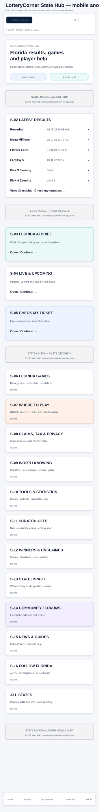

# LotteryCorner State Page Blueprint

**Document:** `04-lotterycorner-state-page-blueprint.md`  
**Internal codename:** LuckReGenerator  
**Product:** LotteryCorner.com  
**Blueprint package:** BP-03 — State Template  
**Page family:** PF-02 — State Hub  
**Version:** 1.1  
**Status:** Final approved and frozen State Page blueprint  
**Approved date:** July 24, 2026  
**Delivery class:** Core rebuild  
**Primary authority:**  
- `00A-v2.1-luckregenerator-product-constitution-FROZEN.md`  
- `01-lotterycorner-experience-architecture-FINAL-APPROVED.md`  
- `02-global-shell-and-section-library-blueprint-FINAL-APPROVED.md`  
- `03-lotterycorner-home-page-blueprint-FINAL-APPROVED.md`  

**Supporting inputs:**  
- `00B-lottery-player-behavior-engagement-and-ai-experience-research.md`  
- accepted SEO, AI-search/GEO, information-architecture, schema, lifecycle and technical-SEO research  
- `State_Lottery_Prposed_section_analysis.docx`  
- founder-supplied/exported State Page references for Florida, New York, Michigan, Massachusetts, Delaware, Connecticut, Colorado, California, Arkansas, Arizona and Virginia  
- current U.S. official state lottery experiences and high-traffic independent lottery products  

---

## 0. Blueprint Decision

The LotteryCorner State Page is the complete local lottery hub for one U.S. jurisdiction.

It must answer:

- What are the latest winning numbers in this state?
- Which games are available?
- What is drawing now or next?
- Can I check or save my numbers?
- Can I buy online or where can I play?
- How do claims, taxes and winner-identity rules work?
- What scratchers, unclaimed prizes and winner stories matter?
- What are people in this state discussing?
- What can LotteryCorner AI explain or help me do?

The State Page is not merely:

- a list of winning numbers;
- an encyclopedia article about the state lottery;
- a copied version of the state lottery operator’s homepage;
- one long claim/tax guide;
- an affiliate landing page;
- or a generic template with the state name inserted.

### 0.1 Template objective

One global State Page template must support:

- all active U.S. state lottery jurisdictions;
- jurisdictions with different game portfolios;
- retail-only and online-purchase environments;
- states with or without scratcher data;
- state-specific claim, tax and winner-publicity rules;
- states with strong Pick 3/Pick 4 community activity;
- and jurisdictions without an active state lottery.

The template is standardized at the experience level and conditional at the content level.

### 0.2 Visual-reference boundary

The supplied visuals illustrate:

- section order;
- state identity and context;
- results and game hierarchy;
- AI, community and commerce integration;
- anonymous versus signed-in transformation;
- ad zones;
- and mobile progression.

They do not approve final branding, exact copy, data density, result-ball styling or production advertisement sizes.

### 0.3 Existing State Page inputs

The previously generated eleven State Page references are useful evidence, not the final design.

Their strongest reusable ideas are:

- state title and update context;
- separation of multi-state and in-state results;
- schedule;
- claims;
- taxes;
- history;
- FAQs;
- check-ticket tools;
- scratchers;
- winners/news;
- state impact;
- anonymity;
- methodology.

Their main limitation is that they are long information documents. The new State Page reorganizes these capabilities into an intelligent, task-first, community-connected and revenue-aware state ecosystem.

### 0.4 Binding outcomes

This blueprint determines:

1. State Page section inventory and order.
2. State identity and state-context rules.
3. Multi-state versus state-only game presentation.
4. Current result, live draw and schedule behavior.
5. AI behavior inside the state ecosystem.
6. State-specific purchase and Where to Play behavior.
7. Claims, tax, anonymity and high-consequence treatment.
8. Scratchers, winners, unclaimed prizes and impact modules.
9. State community and news integration.
10. Anonymous, signed-in and Insider transformation.
11. Advertising preservation and placement rules.
12. SEO, metadata, schema and AI-discovery projection.
13. Content operations, freshness and correction propagation.
14. Desktop and mobile visual templates.
15. Adaptive priority rules and State Hub content budgets.
16. The governed State Content Manifest used by pages, agents, AI retrieval, monitoring and APIs.

---

# PART I — RESEARCH AND PRODUCT FINDINGS

## 1. State Page Benchmark Findings

### 1.1 LotteryCorner current/proposed State Pages

The supplied Florida, New York, Michigan, California and other State Page references consistently prioritize:

- current results;
- state game schedules;
- claim instructions;
- tax information;
- history;
- FAQ;
- and state-specific rules.

Conditional modules include ticket checking, scratchers, odds, winners, fund allocation and anonymity.

**Decision:** preserve this coverage but move from a background-first report to a task-first hub with clear canonical destinations.

### 1.2 Official state lottery products

Current state lottery experiences show substantial jurisdiction differences:

- Florida emphasizes winning numbers, draw games, scratch-offs, winner guidance and Where to Play.
- New York exposes draw games, scratch-offs, promotions, subscriptions, live drawings, claims and winner stories.
- California provides jackpots, winning numbers, scratchers and claim-office guidance.
- Michigan provides current numbers, online games, mobile ticket checking and account capabilities.
- Pennsylvania combines results, number-history tools, online play, scratchers/prizes remaining, claims, app and responsible-play access.

**Decision:** the template cannot assume one universal purchase, scratcher, claim or app model.

### 1.3 Independent state hubs

LotteryUSA-style state pages demonstrate the value of combining results with:

- claims;
- tax;
- anonymity;
- purchase limitations;
- contacts;
- and news.

Lotto.com-style state pages demonstrate demand for a concise all-results-in-one-place state view.

**Decision:** LotteryCorner State Pages should provide complete local orientation while routing deeper tasks to stable game, draw, guide, tool, news and community objects.

### 1.4 LotteryPost community evidence

LotteryPost Pick 3 and Pick 4 forums regularly contain long-running monthly threads organized by state, demonstrating that state identity is a durable community anchor.

**Decision:** every state with meaningful activity should have a state community hub, not only generic national forums.

## 2. State Page Principles

1. Results and current state utility appear before long guidance.
2. State-only and multi-state games remain distinguishable.
3. The page must state the exact jurisdiction, date/time context and selected state.
4. “Official” is not prefixed to every result. It is used only for source/service distinctions.
5. State rules, claims, taxes and purchase availability require source, effective date and owner.
6. AI must be embedded across useful sections and also available through a visible state-aware entry.
7. Purchase is a core task, but only after deterministic state/game/provider eligibility.
8. Community uses state identity and recurring game/draw contexts.
9. Scratchers and unclaimed prizes are conditional on sustainable data.
10. A signed-in State Page becomes “My [State] Lottery Home” without hiding broad state discovery.
11. Every conditional module records why it is shown or suppressed.
12. The template must support a no-lottery jurisdiction without fake results or commercial pressure.
13. The normal section sequence is adaptive: possible wins, material corrections and live/pending draws may outrank AI, ads and commerce.
14. The State Hub summarizes and routes; full schedules, claim procedures, odds matrices and archives belong to dedicated canonical pages.
15. State game comparisons remain neutral and factual; the page does not tell users which game they should play.
16. Missing state facts are omitted or marked unavailable rather than filled with generic state-name substitution.

---

# PART II — STATE TYPES AND CONDITIONAL ARCHITECTURE

## 3. State Template Types

### ST-01 — Standard active state lottery

Has:

- draw games;
- retail purchase;
- claim rules;
- state results;
- state news.

### ST-02 — Active state with official online play

Adds:

- official online purchase/account;
- app;
- online claim/account behavior;
- location/age verification.

### ST-03 — Active state with qualified courier/affiliate options

Adds:

- independent purchase option;
- compensation disclosure;
- provider verification;
- official/retail alternative.

### ST-04 — State with strong scratcher/instant-game data

Adds:

- active games;
- top prizes remaining;
- ending games;
- second-chance/promotions;
- snapshot caveat.

### ST-05 — State with specialized draw types

May add:

- Keno;
- Fast Play;
- Cash Pop;
- monitor games;
- daily draw variants;
- state-specific broadcasts.

### ST-06 — No active state lottery

The page may explain:

- current jurisdiction status;
- nearby/legal alternatives only when appropriate and sourced;
- national context;
- news;
- community;
- responsible-play information.

It must not fabricate state results, imply local sales or optimize aggressively for affiliate purchase.

### ST-07 — Territory or special jurisdiction

Uses the same governance but its legal, game and source model is explicitly configured.

## 4. Conditional Module Rules

| Module | Default | Condition |
|---|---|---|
| State results | Required | Active state games exist |
| Multi-state results | Conditional-required | State participates in game |
| Live draws | Conditional | Reliable status/schedule exists |
| Check ticket | Required at experience level | Supported game/rule data exists |
| Online purchase | Conditional | Verified state/provider option |
| Retailer finder | Conditional-required | Source/tool exists |
| Scratchers | Conditional | Sustainable snapshot |
| Unclaimed prizes | Conditional | Reliable current source |
| Winners | Conditional | Published state data/editorial |
| Fund allocation | Conditional | Current sourced information |
| Anonymity | Required summary | Reliable rule and effective date |
| Tax | Required summary | Governed assumptions |
| State community | Required hub | Activity may begin with Q&A/draw threads |
| State news | Required hub | Content may be initially sparse but real |
| FAQs | Conditional | Visible questions with maintained answers |

“Conditional” never means “add later without an owner.” A module is displayed only after data, lifecycle and review responsibility are approved.

---

# PART III — PAGE PURPOSE, PERSONAS AND ENTRY POINTS

## 5. Primary Page Purpose

Create the best single local entry point for a state lottery player.

## 6. Primary Personas

| Persona | State Page job |
|---|---|
| State result checker | See current in-state and multi-state results |
| Daily-game player | Find Pick 2/3/4/5 results, schedule and discussion |
| Jackpot player | See state-offered national games and Where to Play |
| First-time local player | Understand games and purchase options |
| Scratch-ticket player | Find active/ending games and prizes remaining |
| Winner/claim seeker | Understand immediate next steps |
| Number/system user | Reach history, statistics and generators |
| Local community regular | Enter state/game threads |
| Online buyer | Confirm state and provider eligibility |
| News visitor | Understand state rule, winner or unclaimed-prize story |
| Signed-in regular | See followed games, saved matches and alerts |

## 7. Entry Points

- Google state-result query;
- direct `/state-code` navigation;
- Home state selection;
- state result notification;
- state article;
- state forum thread;
- game page;
- saved number set;
- purchase eligibility flow;
- app launch;
- AI answer link.

The State Page is a strong entry point but not the canonical owner of every fact.

## 8. Completion Signals

- result opened/checked;
- state game selected;
- live/upcoming draw followed;
- claim/tax/purchase answer reached;
- ticket checked;
- state followed;
- AI answer completed;
- community joined;
- tool opened;
- qualified purchase path selected.

---

# PART IV — STATE CONTEXT AND NAVIGATION

## 9. State-Context Precedence

1. State Page’s canonical jurisdiction.
2. Explicit user selection if changing state.
3. Signed-in preferred state when entering from a non-state page.
4. Device location after permission.
5. Manual ZIP/city/state selection.
6. IP only as a suggestion requiring confirmation.

On a canonical Florida page, Florida remains the content context. A user may change state, but IP must not silently replace it.

## 10. State Page Context Navigation

Recommended working tabs/anchors:

- Results
- Games
- Live & Schedule
- How to Play
- Claims
- Taxes & Privacy
- Scratchers
- News
- Community / Forums
- Where to Play

Only tabs with real destinations appear. The mobile version uses a compact section menu, not a permanently sticky row that consumes excessive space.

## 11. State Follow Model

Following a state may include user-selected events:

- state game results;
- selected jackpot changes;
- schedule/rule changes;
- state news;
- unclaimed-prize deadlines;
- community replies/digest;
- purchase availability change.

No all-marketing default bundle.

---

# PART V — ANONYMOUS STATE PAGE ORDER

## 12. Section Sequence

| Order | ID | Section |
|---:|---|---|
| 1 | S-01 | State Identity and Task Header |
| 2 | AD-S00 | Top State Advertisement |
| 3 | S-02 | Latest State Results |
| 4 | S-03 | State AI Brief |
| 5 | AD-S01 | Post-Results Advertisement |
| 6 | S-04 | Live and Upcoming Draws |
| 7 | S-05 | Check My State Ticket |
| 8 | S-06 | State Game Portfolio |
| 9 | AD-S02 | Post-Games Advertisement |
| 10 | S-07 | Where to Play / Buy Online |
| 11 | S-08 | Claims, Taxes, Anonymity and Player Help |
| 12 | S-08A | State Essentials |
| 13 | S-09 | Worth Knowing in This State |
| 14 | S-10 | State Tools, History and Statistics |
| 15 | AD-S03 | Lower Utility Advertisement |
| 16 | S-11 | Scratchers / Instant Games |
| 17 | S-12 | Winners and Unclaimed Prizes |
| 18 | S-13 | State Lottery Impact / Fund Allocation |
| 19 | S-14 | State Community / Forums |
| 20 | S-15 | State News, Blog and Guides |
| 21 | S-16 | Follow State / My LotteryCorner |
| 22 | S-17 | State Sources, Responsible Play and Support |
| 23 | S-18 | All States / Change State |
| 24 | AD-S04 | Pre-Footer Advertisement |
| 25 | Footer | Global Footer |

Conditional modules retain their position when present; absent modules collapse without leaving empty visual shells.

---

## 12.1 Adaptive Priority Override

The normal State Page order is the default, not an absolute rule. A verified high-priority state may temporarily change the visible sequence:

1. **Possible winning match or claim-sensitive outcome:** Check Ticket result and Claim Guidance move ahead of AI, advertising and purchase.
2. **Material correction:** the correction notice and corrected current fact appear before all continuation modules.
3. **Live, pending or newly completed draw:** Live Draws moves beside or immediately after Latest Results.
4. **Safety or responsible-play context:** high-protection guidance moves ahead of commerce and promotional content.
5. **Source outage or stale purchase rule:** affected facts or commercial actions are suppressed rather than shown in their normal position.

The page must record the trigger, start time and expiry of an override. Personalization cannot outrank a possible winning match, correction or safety state.

## 12.2 State Hub Content-Budget Contract

The State Hub must remain comprehensive without becoming a seven-page article. The initial visible budget is:

| Module | Initial State Hub budget | Deeper canonical destination |
|---|---:|---|
| Latest results | controlled set of current full cards | Results collection, game and stable draw pages |
| Daily variants | compact grouped rows/cards | Game-variant pages and history |
| Claims/tax/anonymity | concise summary cards | Dedicated state guides |
| Scratchers | 3–6 preview items | State scratcher collection and ticket details |
| Winners/unclaimed | up to 3 current items per class | News, winner and unclaimed-prize collections |
| Community | up to 3 relevant discussions | State community hub and threads |
| News/Blog/Guides | 3–5 selected items | State editorial archives |
| Tools | selected state-relevant tools | Tool home and game-specific tools |
| Schedules | live/next summaries | Full schedule page |
| Odds/prize matrices | short comparison only | Game prize/odds guides |

Long tables, full claim instructions, full game rules, historical archives and complete FAQs must not be duplicated on the State Hub merely for page length or keyword coverage. Important links remain crawlable and server-visible.

---

# PART VI — SECTION SPECIFICATIONS

## 13. S-01 — State Identity and Task Header

### User job

Know exactly which state page this is and choose a high-value action.

### Required content

- state name;
- state lottery context;
- concise value statement;
- updated/verification context;
- Change State;
- Follow State;
- Ask State AI;
- key actions.

### Working H1

`Latest [State] Lottery Results, Winning Numbers and Jackpots`

The supporting sentence may mention games, claims, tools, AI, community and Where to Play. Alternative wording may be tested, but the H1 must preserve dominant results intent without keyword stuffing.

### AI

Suggested state question based on:

- draw calendar;
- recent material change;
- selected state;
- current result status.

### Ads

No ad inside the header. AD-S00 may follow.

### Source language

Do not say “official [State] numbers” by default. Show source/verification metadata separately.

## 14. AD-S00 — Top State Advertisement

The current/proposed State Page references include a top leaderboard area.

Binding implementation rule:

- audit existing State Page production slot ID and size;
- retain its configured desktop/mobile mapping during initial rebuild;
- reserve space;
- no overlay;
- no result-like creative.

## 15. S-02 — Latest State Results

### User job

See the latest results offered in the jurisdiction.

### Required grouping

1. Multi-state games offered by the state.
2. State-only draw games.
3. Daily game variants.
4. Specialized games where applicable.

### Card fields

- game and variant;
- draw date/time;
- winning values;
- jackpot/top prize where relevant;
- result status;
- stable/current result link;
- Check Numbers;
- **Buy Tickets** or **Play Online** when legal eligibility is already confirmed; otherwise **Where to Play**.

### Ordering

- recent/pending first;
- followed games first for signed-in users;
- high-demand national games remain visible;
- do not mix variants ambiguously.

### AI and facts

- one section-level insight;
- optional card-specific insight only for materially useful facts;
- no repetitive generated text.

### Ads

No advertisement inside the result grid.

### Operations

Event-driven, correction-aware and versioned by game/rule.

## 16. S-03 — State AI Brief

### Purpose

Demonstrate specialized state-aware AI and summarize what changed.

### Inputs

- results;
- jackpots;
- schedule;
- rules;
- claims;
- purchase availability;
- news;
- community;
- scratchers/unclaimed prizes where governed.

### Anonymous behavior

One complete answer before sign-in.

### Suggested questions

- What games draw tonight in [State]?
- Can I buy tickets online in [State]?
- How do I claim a prize?
- What changed recently?
- Explain the latest [State game] draw.
- What are players discussing?

### Guardrail

This section does not replace AI/intelligence evaluation inside every other section. AI-generated summaries cannot be the page’s only state-specific unique content; governed state facts, current data and maintained editorial/community objects must remain visible.

## 17. S-04 — Live and Upcoming Draws

### States

- drawing soon;
- live/stream available;
- awaiting result;
- result available;
- verified;
- delayed;
- cancelled;
- corrected.

### Content

- game/variant;
- time/timezone;
- current status;
- result link;
- follow/alert;
- Where to Play before cutoff if eligible;
- discussion.

### AI

Can explain status or schedule change, never invent a live state.

## 18. S-05 — Check My State Ticket

### Flow

1. Select state game.
2. Select draw/date/variant.
3. Enter numbers or scan later in app-supported flow.
4. Deterministic comparison.
5. Explain match/prize from governed rules.
6. Save/follow after output.
7. High-consequence claim path for possible win.

### Registration

Only when preserving the set/history.

### Purchase

A next-draw option may appear after result, without loss-based wording.

### Ads

No ad between input and output.

## 19. S-06 — State Game Portfolio

### Grouping

- state draw games;
- multi-state games;
- daily number games;
- scratchers/instant;
- fast play/keno/specialized;
- online games if applicable;
- announced/retired separately.

### Card fields

- game;
- state offering/variant;
- next draw;
- price where governed;
- top prize/jackpot;
- how to play;
- latest result;
- tools;
- Where to Play.

### Intelligence

- “Which games draw tonight?”
- beginner-friendly comparison;
- related tools;
- community activity.

### Neutral comparison contract

State game comparisons may compare:

- ticket price;
- draw frequency;
- game format;
- jackpot or top-prize structure;
- published overall and top-prize odds;
- purchase channel;
- and schedule.

Use headings such as **Compare [State] Lottery Games**. Do not use “Which game should you play?”, “Best for frequent wins”, “best odds to play”, or language recommending one game as a superior betting strategy.

### Avoid

- a giant undifferentiated logo grid;
- prescriptive game recommendations;
- implying that frequent smaller prizes are financially preferable;
- or converting neutral game facts into personalized betting advice.

## 20. S-07 — Where to Play / Buy Online

### User job

Find the legal/practical path for this state and game.

### Option hierarchy

1. Official state online service/app/subscription.
2. Qualified licensed/authorized courier or affiliate.
3. Retailer finder.
4. Online unavailable.
5. Unknown/unverified — suppress.

### Required information

- option type;
- provider;
- eligible game;
- state and physical-location requirements;
- age;
- geolocation;
- cutoff;
- fees/material terms;
- last verified;
- LotteryCorner compensation;
- official/retail alternative.

### Action-label contract

- Use **Buy Tickets** or **Play Online** only when state, game, provider and any required physical-location eligibility are already confirmed.
- Use **Where to Play** when eligibility is unresolved or the user needs to choose among official, independent and retail options.
- Use **Find a Retailer** for retail-only or location-specific intent.
- Never expose **Buy Tickets** solely from IP inference.

### Primary action

Qualified outbound or retailer search.

### Pre-click continuity

- save selected numbers;
- follow game;
- result alert.

### Rule

IP location alone never authorizes the option.

## 21. S-08 — Claims, Taxes, Anonymity and Player Help

This is a summary-and-routing area, not one enormous legal section.

### Claims card

- immediate first step;
- claim thresholds;
- deadline;
- claim methods;
- source/effective date;
- deeper guide.

### Tax card

- federal/state scope;
- withholding versus final liability;
- calculator;
- effective date;
- limitation.

### Winner identity/privacy card

- can the winner remain anonymous?
- published information;
- applicable threshold/exception;
- source/effective date.

### Locator and state-contact card

- official state lottery website;
- customer-service phone;
- claim office or claim-center link;
- mailing address where appropriate;
- office hours or appointment status when reliably available;
- retailer;
- claim center;
- mail/online claim where applicable;
- source and last verified date.

Claim-related journeys elevate this card automatically.

### High-protection rules

- no affiliate CTA;
- low/no ads;
- source-first AI;
- human/professional escalation.

## 21A. S-08A — State Essentials

### Purpose

Provide a compact, scannable state-fact block without placing a large “Quick Facts” table above results.

### Required facts when available

- minimum purchase age;
- primary time zone;
- standard draw-game claim deadline;
- state-tax status;
- winner-anonymity/publicity summary;
- online-play status;
- official state lottery help/contact link;
- effective date and last verified date.

### Behavior

- Each fact links to the maintained guide or source context.
- Values come from the governed State Content Manifest.
- A fact that cannot be verified is omitted or marked **Currently unavailable**.
- The compact block may sit inside S-08 on narrow layouts, but it remains a separately governed section.
- No affiliate or advertisement appears inside State Essentials.

## 22. S-09 — Worth Knowing in This State

Maximum three state-relevant highlights:

- result/jackpot milestone;
- rule/schedule change;
- unclaimed-prize deadline;
- winner story;
- scratcher status;
- purchase change;
- active factual question;
- state impact update.

Every highlight links to evidence.

## 23. S-10 — State Tools, History and Statistics

Potential tools:

- result history;
- number history;
- hot/cold;
- frequency;
- generator;
- systems/wheels;
- jackpot history;
- tax calculator;
- schedule;
- dataset/methodology.

The module prioritizes tools available for the selected state/game.

## 24. S-11 — Scratchers / Instant Games

### Conditional content

- new/featured;
- top prizes remaining;
- ending/sales ended;
- claim deadline;
- price;
- odds;
- second chance;
- app scanning;
- dedicated collection.

### Freshness

Show snapshot date and caveat that remaining prizes may include sold/unclaimed tickets.

### AI

Can compare or explain. It must not claim a guaranteed best ticket.

## 25. S-12 — Winners and Unclaimed Prizes

### Winner stories

- amount;
- game;
- location/identity only as published;
- date;
- claim context;
- source;
- discussion/news.

### Unclaimed prizes

- amount;
- game/draw;
- sale location where published;
- deadline;
- current status;
- alert/follow.

### Commerce

No purchase CTA inside claim/winner modules.

## 26. S-13 — State Lottery Impact / Fund Allocation

### Conditional

Use only where current sourced information explains:

- education;
- senior programs;
- parks;
- veterans;
- or other state beneficiaries.

### Content

- simple current summary;
- period;
- amount or percentage only when governed;
- source;
- related state story.

Avoid becoming promotional copy for the operator.

## 27. S-14 — State Community / Forums

### State hub content

- state discussion home;
- Pick 3/Pick 4 recurring threads;
- current draw reactions;
- game/system discussions;
- unanswered questions;
- helpful contributors.

### AI

- factual Research Note;
- thread summary after participation;
- current-fact banner;
- question assistance.

### Cold start

Start with:

- latest draw discussion;
- state Q&A;
- daily-game monthly threads;
- systems/tool question;
- news discussion.

Never fabricate users or replies.

## 28. S-15 — State News, Blog and Guides

### News

- rule/game change;
- winner/unclaimed prize;
- state lottery announcement;
- purchase/app change;
- investigation or industry event.

### Blog/guides

- claim walkthrough;
- state game explanation;
- systems analysis;
- state history;
- practical player guide.

### AI

- Quick Take;
- why it matters;
- current fact;
- historical context;
- related community/tool.

## 29. S-16 — Follow State / My LotteryCorner

### Anonymous value

- follow state/game;
- save numbers;
- receive results;
- reply alerts;
- state AI continuity;
- purchase-change alerts.

### Registration

Triggered by selected value, not generic membership promotion.

## 30. S-17 — State Sources, Responsible Play and Support

Contains:

- state lottery organization/source links;
- LotteryCorner independent-publisher role;
- methodology/corrections;
- contact;
- state/national responsible-play help;
- state-specific age;
- AI/affiliate disclosure links.

Keep compact and usable.

## 31. S-18 — All States / Change State

A stable state directory and change-state action.

It prevents the state page from becoming a dead end and supports U.S. search discovery.

---

# PART VII — SIGNED-IN AND INSIDER STATE PAGE

## 32. Signed-In Sequence

| Order | ID | Section |
|---:|---|---|
| 1 | S-01S | My [State] Lottery Home |
| 2 | AD-SS00 | Inherited Top Slot |
| 3 | S-02S | Followed State Results |
| 4 | S-03S | Personal State Next Action |
| 5 | S-04S | Live and Upcoming Followed Draws |
| 6 | S-05S | My State Matches |
| 7 | S-06S | State Alerts |
| 8 | AD-SS01 | Post-Personal-Utility Ad / Insider Offer |
| 9 | S-07S | Continue My State Tools and Systems |
| 10 | S-08S | Following and State Community |
| 11 | S-09S | State News, Winners and Guides |
| 12 | S-10S | Where to Play |
| 13 | S-11S | Followed Scratchers |
| 14 | S-12S | My Controls |
| 15 | Broad State Discovery | All public modules remain available |
| 16 | AD-SS02 | Lower Slot |
| 17 | Footer | Trust and account controls |

## 33. S-01S — My State Lottery Home

Shows only meaningful changes:

- saved sets checked;
- followed results;
- pending/live draws;
- replies;
- jackpot threshold;
- rule/purchase update;
- personal AI brief.

## 34. S-02S — Followed State Results

Followed games are prioritized, but all current state results remain reachable.

## 35. S-03S — Personal State Next Action

One primary action ranked from:

1. possible winning match/claim;
2. pending followed result;
3. upcoming followed draw;
4. reply/question;
5. meaningful state change;
6. saved tool;
7. qualified purchase.

## 36. S-04S — Live and Upcoming Followed Draws

Shows:

- current status;
- followed schedule;
- cutoff;
- alert;
- discussion;
- eligible purchase.

## 37. S-05S — My State Matches

Exact outcomes only.

No near-miss celebration or immediate play pressure.

## 38. S-06S — State Alerts

User controls:

- result;
- jackpot;
- schedule/rule;
- scratcher;
- unclaimed prize;
- news;
- replies;
- purchase availability.

## 39. S-07S — Continue My State Tools and Systems

Recent/saved state configurations, number sets and AI history.

## 40. S-08S — Following and State Community

Replies, followed threads, state members/topics and unanswered relevant questions.

## 41. S-09S — State News, Winners and Guides

Personal relevance supplements but does not hide major state news.

## 42. S-10S — Where to Play

Uses confirmed state and current provider rules. Physical-location confirmation is requested when required.

## 43. S-11S — Followed Scratchers

Only if supported:

- followed game;
- top prize change;
- ending/claim deadline;
- second chance.

## 44. S-12S — My Controls

- state preference;
- notification settings;
- AI memory;
- saved data;
- privacy;
- Responsible Play controls;
- change state.
- review State Essentials and last-verified dates.

## 45. Insider Enhancements

- advanced state systems;
- longer state AI memory;
- personal state timeline;
- saved methodology;
- advanced statistics;
- configurable modules;
- ad-supported unless a later tier changes it.

---

# PART VIII — MOBILE STATE EXPERIENCE

## 46. Anonymous Mobile Order

1. State shell and identity.
2. top mobile ad if inherited.
3. latest results.
4. post-results ad.
5. state AI.
6. live/upcoming.
7. check ticket.
8. post-live/check ad.
9. games.
10. Where to Play.
11. claims/tax/privacy.
12. State Essentials.
13. Worth Knowing.
14. tools/statistics.
15. scratchers.
16. winners/unclaimed.
17. state impact.
18. community.
19. news/guides.
20. follow state.
21. all states.
22. lower ad/footer.

## 47. Signed-In Mobile Order

1. My State summary.
2. followed results.
3. primary next action.
4. live/upcoming.
5. matches.
6. ad/Insider offer.
7. state AI.
8. alerts.
9. tools/systems.
10. community.
11. news/winners.
12. Where to Play.
13. scratchers.
14. controls.
15. broad state discovery.
16. footer.

## 48. Mobile Rules

- latest results do not depend on horizontal swipe;
- state/game names and draw variants remain visible;
- state section menu is compact;
- AI and ticket-check keyboards do not hide actions;
- sticky ad and sticky purchase never coexist;
- state change is always accessible;
- claim and Responsible Play pathways are not hidden in menus only.

---

# PART IX — VISUAL REFERENCES

## 49. Desktop Anonymous

## 50. Desktop Signed-In / Insider

## 51. Mobile Anonymous

## 52. Mobile Signed-In

---

# PART X — SECTION INTELLIGENCE MATRIX

## 53. Anonymous State Matrix

| Section | Immediate job | Source/owner | Update | State context | Deterministic intelligence | AI role | Interesting fact | Primary action | Signed-in change | Affiliate | Ad tier | Stale rule |
|---|---|---|---|---|---|---|---|---|---|---|---|---|
| S-01 Identity | orient | Product/State registry | release/source | canonical | context | suggested prompt | none | result/state/AI | My State summary | no | 0 | registry |
| S-02 Results | numbers | Result Ops | event | canonical | result/status | explain | draw fact | exact result | saved matches | next draw | 0 | pending/corrected |
| S-03 AI | state answer | AI/Data/Editorial | event/cache | canonical | valid candidate selection | core | selected | cited destination | personal state AI | contextual | 0 | fallback |
| S-04 Live | current/next | Schedule/Result Ops | near real-time | canonical | status/cutoff | explain | after result | draw/alert | followed status | eligible | 0 inside | status expiry |
| S-05 Check | compare | Tool/Data | request | canonical game | match | explain | history | check/save | automatic | after output | 1 after | rule version |
| S-06 Games | discover | Game registry | source/release | canonical | grouping/availability | compare/explain | optional | game | followed priority | eligible | 1 | offering lifecycle |
| S-07 Play | purchase | Commerce Ops | daily/event | mandatory | eligibility | explain | none | qualified option | saved continuity | core | 1 | suppress stale |
| S-08 Help | claims/tax/privacy | Trust/Editorial | review/source | canonical | rules | constrained explain | none | guide/locator | personal context | prohibited | 0-1 | effective date |
| S-08A Essentials | quick state facts | State Content Ops | scheduled/change-alert | canonical | verified fact projection | explain on request | none | guide/source | preferred-state shortcut | prohibited | 0 | effective/verified date |
| S-09 Highlights | discover | Data/Editorial/AI | event/hourly | canonical | validate/rank | summarize | core | evidence | personal relevance | contextual | 0 | event expiry |
| S-10 Tools | utility | Tool owners | data/release | canonical game | calculations | configure/explain | data example | tool | recent/saved | eligible generator | 1 | tool-specific |
| S-11 Scratchers | instant-game status | Scratcher Ops | source/daily | canonical | filter/compare | explain | game context | collection/detail | followed | state option | 2 | snapshot |
| S-12 Winners | stories/deadlines | Editorial/Source Ops | publish/update | canonical | entity/status | summarize | story | article/claim | relevance | prohibited inside claim | 2 | dated/status |
| S-13 Impact | beneficiaries | Editorial/Source Ops | periodic | canonical | period/amount | explain | milestone | detail | unchanged | no | 2 | period |
| S-14 Community | participate | Community Ops | near real-time | canonical | activity ranking | pulse/research | human context | thread/hub | replies/following | minimal | 2 | timestamp |
| S-15 News | current/help | Editorial | publish/update | canonical | entity match | Quick Take | history | article/guide | relevant news | contextual | 2-3 | dated |
| S-16 Follow | invest | Product/Lifecycle | real-time | canonical | trigger | explain value | none | follow/sign in | controls | contextual | 1 | config |
| S-17 Trust | support | Trust/Policy | review | canonical | suppression | policy explain | none | support | account controls | disclosures | 0 | effective date |
| S-18 States | change | IA/Registry | release | explicit | alphabetical/recent | none | none | state hub | preference | no | 1 | registry |

## 54. Signed-In Additions

| Section | Personal value | AI | Commerce | Safety |
|---|---|---|---|---|
| S-01S My State | what changed | personal brief | not dominant | no feed manipulation |
| S-02S Results | saved relationship | explain | eligible next draw | facts stable |
| S-03S Next Action | priority | explain why | only if appropriate | claim outranks play |
| S-04S Live | followed status | explain delay | before cutoff | status-first |
| S-05S Matches | exact outcomes | rule explain | delayed | no near miss |
| S-06S Alerts | return control | assistant manage | optional | easy pause |
| S-07S Tools | investment | configure | eligible | non-predictive |
| S-08S Community | replies/identity | summarize | minimal | humans primary |
| S-09S News | relevance | Quick Take | contextual | major news retained |
| S-10S Play | confirmed option | explain | core | state/location |
| S-11S Scratchers | followed status | explain | contextual | snapshot caveat |
| S-12S Controls | privacy/control | memory | n/a | Responsible Play |

---

# PART XI — CONTENT OPERATIONS

## 55. Ownership Table

| Capability | Owner | Required source/lifecycle |
|---|---|---|
| State identity/operator | State Content Ops | governed State Content Manifest, source and effective date |
| Game portfolio | Lottery Data Ops | offering lifecycle |
| Results/jackpots | Lottery Data Ops | event-driven verification |
| Schedule/cutoff | Schedule Ops | rule/version changes |
| Check ticket | Tool/Data | current game rules |
| Claims | Trust/Editorial | review calendar |
| Taxes/anonymity | Trust/Editorial | effective date and legal review |
| Purchase | Commerce Ops | daily/event verification |
| Retailer/claim centers | Location Ops | source refresh |
| Scratchers | Scratcher Ops | snapshot/freshness |
| Winners/unclaimed | Editorial/Source Ops | publication and status |
| Fund allocation | Editorial | reporting period |
| Community | Community Ops | moderation/activity |
| News/guides | Editorial | publish/update |
| AI | AI Product | governed inputs and invalidation |
| Ads | Monetization | current production slot map |
| State Content Manifest | State Content Ops / Data Governance | versioned fields, sources, owners, freshness and correction status |

## 56. Monitoring and Freshness Requirements

| Information | Minimum review requirement | Stale behavior |
|---|---|---|
| Results and jackpots | event-driven | pending/stale label; never imply old draw is current |
| Draw schedule and live status | event-driven plus daily validation | suppress cutoff/live claim when uncertain |
| Purchase availability | daily and event-triggered | suppress Buy Tickets/Play Online |
| Game portfolio | weekly plus launch, suspension and retirement monitoring | mark lifecycle status; remove invalid actions |
| Scratchers/prizes remaining | daily or source-dependent | show snapshot date or suppress ranking |
| Unclaimed prizes | daily/weekly based on source | show status date; remove expired open claim |
| Claims, age, tax and anonymity | monthly plus source-change alerts | mark under review; route to current source |
| Operator contacts and claim centers | quarterly plus source-change alert | mark unverified; avoid outdated office instructions |
| Fund allocation/impact | annually or after new published report | retain reporting period; do not imply current-year figure |
| News and community | continuous editorial/community lifecycle | show publication/activity dates |
| AI summaries and retrieval index | after every material source correction plus scheduled cache review | invalidate affected answer/cache |

Every field’s approved freshness threshold is stored in the State Content Manifest. Once the threshold expires, the page must label, suppress or route to a current source; it must not silently display the value as current.

## 56A. State Content Manifest

Every state/territory is governed by a versioned manifest used by rendering, agents, monitoring, AI retrieval, metadata and APIs. The manifest is a content/data contract, not the final database or API implementation.

### Minimum manifest fields

- state code, canonical name and aliases;
- jurisdiction type and lottery status;
- primary time zone and supported local display zones;
- state lottery operator identity and official/source URLs;
- minimum purchase age;
- active game offerings, variants and lifecycle status;
- draw schedules, time zones and verified cutoff rules;
- purchase-option classifications and provider eligibility;
- claim thresholds, methods and deadlines;
- tax and winner-anonymity/publicity rules;
- scratcher, second-chance and ticket-scanning capabilities;
- retailer, claim-center and customer-support information;
- responsible-play contacts;
- effective date and last verified date for each governed rule group;
- review cadence and freshness threshold;
- source URL, source type and trust tier;
- content/data owner;
- current freshness status;
- correction/version history;
- module enablement/suppression reason;
- canonical route and stable entity identifiers.

### Required consumers

The manifest powers:

- visible State Page facts and conditional sections;
- SEO titles, descriptions and structured-data projections;
- state-aware AI retrieval and source citations;
- agents and monitoring jobs;
- result, purchase and policy alerts;
- eligibility decisions;
- internal APIs and future app surfaces.

The implementation architecture may choose database tables, XML, JSON, CMS records or APIs, but it must preserve this governed contract and field-level provenance.

## 57. Correction Propagation

A state result/rule/purchase correction updates:

- State Page;
- game/current result;
- stable draw;
- AI;
- saved checks;
- alerts;
- article current-fact cards;
- community banners;
- metadata/schema;
- sitemap `lastmod`;
- commercial eligibility.

---

# PART XII — ADVERTISING AND AFFILIATE CONTRACT

## 58. State Ad Tier

**Tier 2 — Moderate.**

Results, live status, check-ticket output and claims remain protected.

## 59. State Ad Position Map

| Slot | Position | Rule |
|---|---|---|
| AD-S00 | after State identity | inherit current top state slot |
| AD-S01 | after results | first normal inline ad |
| AD-S02 | after games/check/live | no task interruption |
| AD-S03 | after tools/highlights | lower utility inventory |
| AD-S04 | before footer | clearly labeled |
| AD-SR01 | optional desktop rail | never inside result/claim facts |
| AD-SM01 | mobile inline/sticky mapping | inherit production configuration |

Exact slot IDs, dimensions, breakpoints, lazy-loading and refresh behavior must be audited from the current State Page implementation before coding.

## 60. Prohibited Placements

- inside result cards;
- between ticket input and output;
- inside AI answer;
- between live status and result;
- inside claim/tax/anonymity;
- disguised as state game/news/community;
- over mobile bottom navigation;
- simultaneous sticky ad and purchase action.

## 61. Affiliate Requirements

Required purchase-action evaluation on:

- state header quick action where appropriate;
- eligible national/state game cards;
- live/upcoming draws before cutoff;
- generator/saved numbers;
- purchase module.

When eligibility is confirmed, label the action **Buy Tickets** or **Play Online**; otherwise use **Where to Play**. Disclose compensation near every affiliate recommendation.

---

# PART XIII — BEHIND-THE-SCREEN PAGE CONTRACT

## 62. Canonical and Route

Use the approved existing state route from the migration/canonical inventory, such as the established state-code pattern where applicable.

The blueprint does not authorize changing an established state URL without a separate migration decision.

## 63. Search Identity

### Title pattern

`[State] Lottery Results, Winning Numbers & Games | LotteryCorner`

Alternative title may include jackpots or today only if it remains accurate and not repetitive.

### Meta description pattern

`Check the latest [State] lottery results, jackpots, draw schedules, games, claims, taxes, news and where to play. Ask LotteryCorner AI and check your numbers.`

### H1

`Latest [State] Lottery Results, Winning Numbers and Jackpots`

### Indexability

- index/follow for active useful state hubs;
- noindex or specialized handling for unsupported/duplicate variants;
- no private signed-in data in public HTML;
- stable canonical state route.

## 64. Structured Data

Conceptual graph:

- `CollectionPage` as the preferred State Hub page type, with `WebPage` as the broader fallback;
- `BreadcrumbList`;
- `Place`/`AdministrativeArea` or appropriate jurisdiction identity;
- `Organization` for LotteryCorner publisher;
- separate official state lottery organization identity where represented;
- stable `@id` values for the State Hub, jurisdiction, LotteryCorner publisher, state lottery organization, games and key collections;
- `mainEntity`, `about`, `mentions` and `isPartOf` relationships where semantically appropriate;
- visible `ItemList` for meaningful game/result lists only where useful;
- linked Article/NewsArticle and DiscussionForumPosting remain on their own pages.

Do not:

- mark LotteryCorner as the state lottery operator;
- use FAQ markup merely because an accordion exists;
- mark result cards as Products/Offers;
- create unsupported lottery-specific schema types.

## 64A. Stable Section Identifiers

Major State Hub sections use stable fragment identifiers when present:

- `#latest-results`
- `#live-draws`
- `#games`
- `#check-ticket`
- `#where-to-play`
- `#claim-prize`
- `#taxes`
- `#state-essentials`
- `#scratchers`
- `#community`
- `#news`

These identifiers support direct links, accessibility, analytics, AI citations and future app deep links.

## 64B. State-Specific Content Integrity

- AI-generated summaries cannot be the only unique state content.
- State-specific facts must come from governed sources or maintained editorial/community objects, not generic state-name substitution.
- Missing information is omitted or visibly marked unavailable.
- Generic spun paragraphs, repetitive “official results” wording and unsupported FAQs are prohibited.
- A state page must have enough verified local utility to justify indexability.

## 65. Primary Entity Distinction

The page must separately model:

- jurisdiction/state;
- state lottery organization;
- LotteryCorner;
- game brand;
- state game offering;
- draw;
- result;
- rule;
- purchase option;
- article/community objects.

## 66. Server-Visible Content

Required in reliable initial HTML:

- state identity/H1;
- current results;
- active game links;
- state navigation;
- claim/tax/purchase summaries when displayed;
- state news/community links;
- source/effective dates;
- all-state/change-state links.

May enhance client-side:

- personal matches;
- AI interaction;
- live counts;
- temporary ticket input;
- geolocation-confirmed purchase;
- notification state.

## 67. Open Graph and X/Twitter

State share defaults:

- state name and LotteryCorner brand;
- concise state-result/game description;
- evergreen state template image or generated current-result image only with reliable correction process;
- no private data;
- canonical state URL.

## 68. Sitemap and `lastmod`

State page belongs in primary sitemap.

Meaningful `lastmod` may change for:

- verified current result;
- material game portfolio change;
- claim/tax/purchase rule update;
- major state content update.

Do not update for ad rotation or user personalization.

## 69. AI Discovery

Visible content must clearly distinguish:

- state result fact;
- state rule;
- AI explanation;
- editorial story;
- community opinion;
- commercial recommendation.

The page should provide concise answer blocks for high-value state tasks and stable links to deeper canonical owners. State-aware AI answers must retrieve from the State Content Manifest and governed current objects, with source/effective-date context available for rules and commercial eligibility.

---

# PART XIV — LIFECYCLE AND ERROR STATES

## 70. State-Level States

High-priority lifecycle states activate the Adaptive Priority Override and may reorder visible modules until resolved.

- active state;
- no active lottery;
- operator renamed/restructured;
- source outage;
- state data delayed;
- game announced;
- game suspended;
- game retired;
- purchase changed;
- claim/tax guide under review.

## 71. Section States

### Results

pending, verified, corrected, delayed, unavailable.

### Live

upcoming, live, awaiting result, verified, delayed, cancelled.

### Purchase

official online, official app, subscription, affiliate/courier, retail-only, cutoff passed, location required, unavailable, stale.

### Scratchers

active, ending, ended, snapshot stale, incomplete.

### Winners/unclaimed

open, claimed, expired, status unknown.

### Community

active, no human reply, AI research available, locked, archived.

## 72. No-Lottery State Experience

Show:

- clear jurisdiction status;
- current source/effective date;
- relevant local news/history;
- nearby-state information only when useful and legal;
- national-game availability only if genuinely applicable;
- community;
- responsible-play resources.

Suppress:

- fake result grid;
- state Buy Online;
- unsupported claim/tax modules;
- empty scratcher/game shells.

---

# PART XV — ACCESSIBILITY AND MOBILE

## 73. Requirements

- WCAG 2.2 AA target;
- one H1;
- logical headings;
- skip link;
- visible state context;
- result numbers as text;
- bonus-ball text equivalent;
- accessible tables and accordions;
- no horizontal-swipe-only result access;
- exact dates and timezones;
- keyboard state selector/search/AI;
- map locator with list alternative;
- focus-safe sticky elements;
- clear ad labels.

## 74. Cognitive Accessibility

- result and task sections before dense rules;
- plain U.S. lottery language;
- claims/taxes broken into cards;
- exact state/game/variant;
- no unexplained acronyms;
- AI summaries expandable;
- advanced statistics separated from core tasks.

---

# PART XVI — MEASUREMENT

## 75. Core Metrics

- time to first state result;
- correct-state confidence/change rate;
- result click/check completion;
- live status engagement;
- state AI answer completion;
- game discovery;
- claim/tax guide completion;
- state follow;
- community entry/return;
- news/tool continuation;
- purchase eligibility and qualified outbound;
- ad revenue/viewability by slot;
- state draw-cycle retention.

## 76. Guardrails

- no wrong-state purchase;
- no stale claim/tax presented as current;
- no result delay from AI/ads;
- no “official” over-labeling;
- no AI replacing canonical facts;
- no fabricated community;
- no scratcher strategy claim;
- no near-miss manipulation;
- no private data in public markup;
- no revenue loss from accidental ad-slot removal without review.
- no prescriptive “which game should you play” recommendation.
- no generic state-name substitution presented as local expertise.
- no stale State Essentials fact presented without an effective/verified date.

---

# PART XVII — EXPERIMENT REGISTER

## 77. Experiments

1. Results and AI side-by-side versus sequential.
2. State game grouping, density and neutral comparison format.
3. Check-ticket position.
4. Live Draws prominence.
5. State tab/anchor labels.
6. Community versus News order.
7. Claims/tax combined card versus separate section.
8. Scratchers preview depth.
9. State impact visibility.
10. purchase CTA wording and placement.
11. Follow State value proposition.
12. Community versus Forums wording.
13. anonymous AI session length.
14. ad density versus current state-page revenue.
15. signed-in State Page module order.
16. State Essentials placement and density.
17. Adaptive Live Draws/possible-win priority behavior.
18. Buy Tickets versus Play Online wording after confirmed eligibility.

---

# PART XVIII — APPROVAL AND FREEZE RECORD

## 78. Founder-Approved State Page Decisions

The founder approves the State Page Blueprint with these binding clarifications:

1. The State Page is a complete local lottery ecosystem, not a result-only page or long-form article.
2. Results remain the dominant search and first-task focus.
3. Live/pending draws, possible winning matches, corrections and safety states may override the normal order.
4. State Hub content is budgeted; long procedures, complete tables and archives route to dedicated canonical pages.
5. A compact State Essentials block exposes age, time zone, claim deadline, tax, anonymity, online-play and contact status.
6. **Buy Tickets** or **Play Online** appears only after confirmed legal eligibility; otherwise the action is **Where to Play**.
7. Game comparison is neutral and factual; LotteryCorner does not tell a user which state game they should play.
8. All state content, monitoring, AI retrieval, metadata and conditional modules are governed through the State Content Manifest.
9. Results, schedules, purchase, scratchers, rules, contacts and editorial/community information follow the approved monitoring frequencies and stale-data behavior.
10. The State Hub uses CollectionPage-oriented semantics, stable entity identifiers and stable section fragments.
11. AI cannot be the only unique state content; generic state-name substitution and filler are prohibited.
12. Official state lottery contacts, claim locations and last-verified dates are explicit in Player Help.
13. The existing URL route remains unchanged unless separately approved through migration governance.
14. Existing production ad slots, sizes and mappings remain the implementation baseline until individually reviewed.
15. The desktop/mobile visuals are approved as structural references, not final visual design.

## 79. Freeze Status

This State Page Blueprint is accepted and frozen as Version 1.1.

Before State Page implementation begins, the team must populate or migrate the State Content Manifest for the initial launch states and audit the existing desktop/mobile State Page ad configuration. These are implementation dependencies and do not reopen the approved experience architecture.

---

# APPENDIX A — STATE-SPECIFIC MODULE MATRIX

| State capability | Template behavior |
|---|---|
| Midday/evening variants | explicit variant cards and schedule |
| State online purchase | official option first |
| Courier affiliate | disclosed independent option |
| Retail-only | retailer finder |
| Subscription | separate option classification |
| Ticket scanner | app/device enhancement |
| Scratchers prizes remaining | snapshot date and caveat |
| Second chance | conditional scratcher/promotions module |
| Keno/Fast Play | specialized game group |
| Public winner identity | anonymity card |
| Winner anonymity | privacy card with source |
| Education/fund impact | conditional impact module |
| No state tax | tax summary still explains federal scope |
| No lottery | dedicated no-lottery experience |
| Strong Pick 3/4 community | monthly/state threads prioritized |
| State Essentials | compact verified facts from State Content Manifest |
| Missing state fact | omit or mark currently unavailable; never generic-fill |
| Confirmed online eligibility | Buy Tickets or Play Online |
| Unresolved eligibility | Where to Play |
| Unclaimed prizes | state deadline/status module |

---

# APPENDIX B — SOURCE REGISTER

## Internal inputs

**[INT-01]** Frozen Product Constitution v2.1.  
**[INT-02]** Final Approved Experience Architecture v1.1.  
**[INT-03]** Final Approved Global Shell Blueprint v1.1.  
**[INT-04]** Final Approved Home Blueprint v1.1.  
**[INT-05]** Player Behavior, Engagement and AI Research.  
**[INT-06]** State Lottery Pages Audit Report and eleven exported State Page references.  
**[INT-07]** Accepted SEO, IA, schema, lifecycle and technical-SEO research.

## External U.S. sources reviewed

**[EXT-01]** Florida Lottery home, games, winning numbers, scratch-offs, claims and Where to Play.  
`https://floridalottery.com/`  
`https://floridalottery.com/games`  
`https://floridalottery.com/games/winning-numbers`  
`https://floridalottery.com/games/scratch-offs`  
`https://floridalottery.com/where-to-play`

**[EXT-02]** New York Lottery home, playing and scratch-off experiences.  
`https://nylottery.ny.gov/`  
`https://nylottery.ny.gov/playing`  
`https://nylottery.ny.gov/scratch-off-game/`

**[EXT-03]** California Lottery home, scratchers and claim guidance.  
`https://www.calottery.com/`  
`https://www.calottery.com/en/scratchers`  
`https://www.calottery.com/en/claim-a-prize`

**[EXT-04]** Michigan Lottery home, app, online play, claims and prizes remaining.  
`https://www.michiganlottery.com/`  
`https://www.michiganlottery.com/resources/mobile-app`  
`https://www.michiganlottery.com/resources/how-to-claim-prizes`  
`https://www.michiganlottery.com/resources/instant-games-prizes-remaining`

**[EXT-05]** Pennsylvania Lottery results, online play, app, scratchers/prizes remaining and claims.  
`https://www.palottery.pa.gov/`  
`https://www.palottery.pa.gov/scratch-offs/active-games.aspx`  
`https://www.palottery.pa.gov/scratch-offs/prizes-remaining.aspx`  
`https://www.palottery.pa.gov/about-pa-lottery/how-to-claim-your-prize.aspx`

**[EXT-06]** LotteryUSA state information and Where to Play patterns.  
`https://www.lotteryusa.com/`

**[EXT-07]** LotteryPost Pick 3/Pick 4 and state-centered forum activity.  
`https://www.lotterypost.com/forum/3`  
`https://www.lotterypost.com/forum/4`

**[EXT-08]** Current LotteryCorner Florida state page.  
`https://lotterycorner.com/fl`

---

# APPENDIX C — STATE CONTENT MANIFEST SUMMARY

The manifest is the single governed state-profile contract. It is not a duplicate content page. It stores field-level provenance, lifecycle and enablement decisions so the visible State Hub, agents, scrapers, AI, alerts, SEO projections and APIs use the same current facts.

# APPENDIX D — FINAL STATE EXPERIENCE STATEMENT

A State Page succeeds when a player can arrive from search, a notification, a forum thread or the app and immediately understand:

> What happened in my state, what draws next, which games exist, how LotteryCorner AI can help, how I check or save my numbers, what people are discussing, how claims and taxes work, and where I can legally play.

The page must feel local without becoming isolated.

Every state result should connect to a game, history, insight, tool, community, saved action, notification or qualified purchase path—while high-consequence guidance remains calm, sourced and protected.
